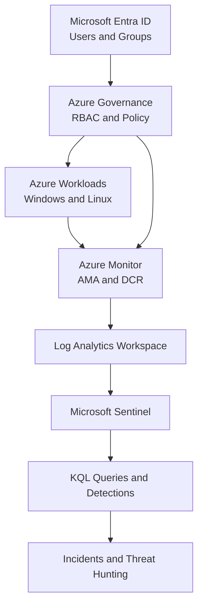

# Azure Security Operations Lab

## Overview

This repository documents the design, deployment, monitoring, and investigation of a Microsoft Azure security lab.

The project follows a structured **25-day hands-on learning path composed of 18 labs**, beginning with cloud governance and identity fundamentals and progressing toward Microsoft Sentinel, KQL, security detections, incident investigation, threat hunting, and a final Mini SOC capstone.

The primary focus is developing practical skills for **Microsoft SC-200 Security Operations Analyst**, while also building foundational knowledge relevant to:

* Microsoft AZ-104 Azure Administrator
* Microsoft cloud security and governance
* Microsoft Entra ID
* Azure Policy and RBAC
* Security monitoring and incident response
* Future Microsoft security certifications

This is not intended to be a collection of portal screenshots. Each lab follows a practical cycle:

> Configure → Understand → Test → Validate → Troubleshoot → Document

---

## Why I Built This Project

I created this project to bridge the gap between certification study and practical cloud security experience.

My professional background includes systems analysis, project management, SAP ERP implementation, process automation, software development, data analysis, and technical troubleshooting. After completing my cybersecurity studies and earning the **Microsoft Certified Azure Fundamentals AZ-900** certification, I wanted to build a practical Azure environment where I could apply security operations concepts directly.

The project is designed to help me develop and demonstrate experience with:

* Cloud identity and access management
* Least-privilege authorization
* Azure governance
* Network security
* Virtual machine administration
* Log collection and analysis
* Security monitoring
* KQL query development
* Detection engineering
* Incident investigation
* Threat hunting
* Security documentation

My primary goal is to prepare for an entry-level or junior position in security operations, cloud security, or cybersecurity analysis while continuing to develop toward penetration testing and red-team roles.

---

## Project Objectives

The main objectives of this project are to:

1. Build a structured Azure lab environment using consistent naming and tagging standards.
2. Implement cost monitoring before deploying billable resources.
3. Create users, groups, managers, and administrative structures in Microsoft Entra ID.
4. Apply Azure RBAC following the principle of least privilege.
5. Use Azure Policy to audit and enforce governance requirements.
6. Deploy and secure Azure networking and virtual machines.
7. Collect Windows, Linux, Azure, and identity telemetry.
8. Centralize security logs in a Log Analytics workspace.
9. Enable Microsoft Sentinel as the cloud-native SIEM.
10. Develop and document KQL queries.
11. Create analytics rules and security detections.
12. Generate controlled security events.
13. Investigate incidents using a repeatable triage process.
14. Perform threat hunting across collected telemetry.
15. Document technical decisions, results, failures, and lessons learned.
16. Produce a public portfolio without exposing credentials or sensitive Azure identifiers.

---

## Learning Path

The lab progresses through four main phases.

### Phase 1 Identity and Governance

This phase establishes the administrative foundation of the environment.

Topics include:

* Azure subscriptions and resource groups
* Cost Management and budgets
* Naming and tagging standards
* Microsoft Entra ID users and groups
* Manager relationships
* Administrative Units
* Azure RBAC
* Least privilege
* Azure Policy
* Activity Log auditing

### Phase 2 Infrastructure and Monitoring

This phase creates the workloads and telemetry sources used throughout the project.

Topics include:

* Azure Virtual Networks
* Subnets
* Network Security Groups
* Windows and Linux virtual machines
* Secure virtual machine administration
* Log Analytics workspaces
* Azure Monitor Agent
* Data Collection Rules
* Windows Security Events
* Linux Syslog
* Azure Activity Logs

### Phase 3 Security Operations

This phase introduces SIEM operations and security analysis.

Topics include:

* Microsoft Sentinel
* Data connectors
* KQL fundamentals
* Authentication analysis
* Azure administrative activity
* Security analytics rules
* Detection engineering
* Incident generation
* Incident triage
* Entity investigation
* Threat hunting

### Phase 4 Governance Validation and Capstone

The final phase combines the project components into a small security operations workflow.

Topics include:

* Conditional Access
* Azure Policy compliance
* Governance validation
* Mini SOC investigation
* Incident documentation
* Architecture documentation
* Cost review
* Resource cleanup
* Portfolio preparation

---

## Architecture

The following diagram represents the target security operations flow. Components through Log Analytics were implemented by Lab 08; Microsoft Sentinel, detections, incidents, and threat hunting remain later phases.

The [current-state architecture](architecture/azure-secops-current-architecture.md) documents only the components already validated.



The project separates resources into different Azure Resource Groups to support governance, lifecycle management, cost analysis, and future RBAC testing.

| Resource Group                    | Purpose                                      |
| --------------------------------- | -------------------------------------------- |
| `rg-secops-core-canadacentral`    | Core networking and shared resources         |
| `rg-secops-compute-canadacentral` | Windows and Linux virtual machines           |
| `rg-secops-monitorcanadacentral`  | Monitoring and security operations resources |

The primary deployment region is:

```text
Canada Central
```

---

## Lab Roadmap

| Lab | Topic                              | Primary Skills                               | Status    |
| --: | ---------------------------------- | -------------------------------------------- | --------- |
|  [00](labs/lab-00-baseline/README.md) | Azure Baseline and Cost Governance | Budgets, resource groups, tags, Activity Log | Completed |
|  [01](labs/lab01-entra-users-groups/README.md) | Entra ID Users Managers and Groups | Users, manager relationships, security groups, audit logs | Completed |
|  [02](labs/lab02-administrative-units/README.md) | Administrative Units and Entra Role Scope | Scoped administration, least privilege, licensing validation | Completed |
|  [03](labs/lab03-azure-rbac/README.md) | Azure RBAC | Resource-group roles, scopes, inheritance, least privilege | Completed |
|  [04](labs/lab-04-azure-policy/README.md) | Azure Policy | Audit, deny, tagging, compliance | Completed |
|  [05](labs/lab-05-vnet-nsg/README.md) | Virtual Network and NSG | VNet design, subnet segmentation, NSG rules | Completed |
|  [06](labs/lab-06-virtual-machines/README.md) | Windows and Linux Virtual Machines | Secure deployment, Bastion access, segmentation testing | Completed |
|  [07](labs/lab-07-vm-administration/README.md) | Virtual Machine Administration | VM lifecycle, managed disks, Run Command | Completed |
|  [08](labs/lab-08-log-analytics-ama-dcr/README-lab-08.md) | Log Analytics, AMA, and DCR | Log ingestion, DCR, XPath filtering, and KQL validation | Completed |
|  09 | Microsoft Sentinel                 | SIEM deployment and data connectors          | Planned   |
|  10 | KQL Fundamentals                   | Log analysis and query development           | Planned   |
|  11 | Detection Rule                     | Analytics rules and detection engineering    | Planned   |
|  12 | Incident Investigation             | Triage, entities, evidence and remediation   | Planned   |
|  13 | Threat Hunting                     | Hypothesis-based security investigation      | Planned   |
|  14 | Conditional Access                 | Identity protection and access controls      | Planned   |
|  15 | Policy Compliance                  | Governance assessment and remediation        | Planned   |
|  16 | Mini SOC Capstone                  | End-to-end detection and investigation       | Planned   |
|  17 | Cleanup and Portfolio Review       | Cost validation, cleanup and documentation   | Planned   |

---

## Repository Structure

```text
azure-security-operations-lab/
│
├── README.md
│
├── architecture/
│   ├── azure-secops-current-architecture.md
│   └── architecture-decisions.md
│
├── labs/
│   ├── lab-00-baseline/
│   │   ├── README-lab-00.md
│   │   └── screenshots/
│   │
│   ├── lab01-entra-users-groups/
│   │   ├── README-lab-01.md
│   │   └── screenshots/
│   ├── lab02-administrative-units/
│   │   ├── README-lab-02.md
│   │   └── screenshots/
│   ├── lab03-azure-rbac/
│   │   ├── README-lab-03.md
│   │   └── screenshots/
│   ├── lab-04-azure-policy/
│   │   ├── README-lab-04.md
│   │   └── screenshots/
│   ├── lab-05-vnet-nsg/
│   │   ├── README-lab-05.md
│   │   └── screenshots/
│   ├── lab-06-virtual-machines/
│   │   ├── README-lab-06.md
│   │   └── screenshots/
│   ├── lab-07-vm-administration/
│   │   ├── README-lab-07.md
│   │   └── screenshots/
│   ├── lab-08-log-analytics-ama-dcr/
│   │   ├── README-lab-08.md
│   │   └── screenshots/
│   ├── lab-09-microsoft-sentinel/
│   ├── lab-10-kql/
│   ├── lab-11-detection-rule/
│   ├── lab-12-incident-investigation/
│   ├── lab-13-threat-hunting/
│   ├── lab-14-conditional-access/
│   ├── lab-15-policy-compliance/
│   ├── lab-16-mini-soc-capstone/
│   └── lab-17-cleanup/
│
├── kql/
│   ├── ama-heartbeat-validation.kql
│   ├── windows-security-account-lifecycle.kql
│   ├── windows-security-account-lifecycle-summary.kql
│   └── windows-system-dcr-validation.kql
│
├── detections/ (populated when validated detections are created)
│
├── incidents/ (populated when Sentinel incidents are investigated)
│
└── docs/
    ├── rbac-matrix.md
    ├── cost-tracking.md
    ├── naming-and-tagging-standards.md
    ├── evidence-register.md
    └── lessons-learned.md
```

Each lab directory contains its own README explaining:

* The objective of the lab
* The technical concepts involved
* The resources created
* The configuration decisions
* The validation process
* Troubleshooting performed
* Sanitized screenshots
* Key takeaways
* Skills practiced

---

## Lab Methodology

Each lab follows the same documentation process.

### 1. Configure

Deploy or configure the required Azure service.

### 2. Understand

Explain the technical reason for each configuration rather than documenting only the portal navigation.

### 3. Test

Perform a controlled test to verify the expected behavior.

Examples include:

* Attempting an unauthorized action
* Creating a noncompliant resource
* Modifying a resource tag
* Generating failed authentication events
* Triggering a detection rule

### 4. Validate

Confirm the result using Azure telemetry, logs, policy compliance, or access-control testing.

### 5. Troubleshoot

Document unexpected behavior, configuration errors, permission issues, and the steps used to resolve them.

### 6. Document

Capture sanitized evidence and record the technical outcome in the lab README.

---

## Cost Governance

Cost governance was implemented before deploying compute or monitoring resources.

The initial configuration includes:

* Monthly Azure budget: **US$175**
* Actual-cost alert at 50%
* Actual-cost alert at 75%
* Actual-cost alert at 90%
* Actual-cost alert at 100%
* Day 0 Cost Analysis baseline
* Expiration tags on lab resources
* Planned resource cleanup

Azure budgets provide cost visibility and notifications, but they do not automatically stop resources when a threshold is reached.

Resources such as virtual machines will be stopped, deallocated, or removed when they are not required.

---

## Naming and Tagging Standards

The project uses descriptive names to make resources easier to identify during administration and incident investigation.

General naming pattern:

```text
<resource-type>-<workload>-<environment>-<region>-<instance>
```

Example resource names:

```text
rg-secops-core-canadacentral
vm-winclient-lab-cac-001
vm-linux-lab-cac-001
vnet-secops-lab-cac-001
nsg-workstations-lab-001
law-secops-lab-cac-001
dcr-security-events-lab-cac-001
```

Baseline tags include:

| Tag           | Purpose                                                    |
| ------------- | ---------------------------------------------------------- |
| `Environment` | Identifies the resource as part of the lab                 |
| `Owner`       | Identifies the resource owner                              |
| `Project`     | Associates the resource with this project                  |
| `CostCenter`  | Supports cost classification                               |
| `Expiry`      | Identifies when the resource should be reviewed or removed |

---

## Security Operations Workflow

The final environment is designed to demonstrate the following workflow:

```text
Azure or identity activity
        ↓
Telemetry generation
        ↓
Azure Monitor Agent or data connector
        ↓
Log Analytics Workspace
        ↓
Microsoft Sentinel
        ↓
KQL query or analytics rule
        ↓
Alert
        ↓
Incident
        ↓
Triage and investigation
        ↓
Containment or remediation recommendation
        ↓
Incident documentation
```

This workflow represents the relationship between cloud administration, telemetry collection, SIEM monitoring, detection engineering, and incident response.

---

## KQL Coverage

The project will include queries related to:

* Azure administrative activity
* Resource creation and modification
* Authentication activity
* Successful and failed logons
* Windows Security Events
* Linux Syslog
* Suspicious account behavior
* Repeated authentication failures
* Privileged operations
* Security incident investigation
* Threat hunting

Example Azure Activity query:

```kusto
AzureActivity
| where TimeGenerated > ago(24h)
| project
    TimeGenerated,
    Caller,
    OperationNameValue,
    ActivityStatusValue,
    ResourceGroup
| order by TimeGenerated desc
```

Reusable queries are stored in the `kql/` directory and referenced by the relevant lab documentation.

---

## Detection Engineering

The detection phase will document more than the final KQL query.

Each detection document will include:

* Detection objective
* Threat scenario
* Required data source
* KQL query
* Query time range
* Trigger threshold
* Entity mappings
* Expected false positives
* Validation procedure
* Investigation steps
* Recommended response
* MITRE ATT&CK mapping when applicable

This approach demonstrates the full lifecycle of a security detection rather than only showing a successful alert.

---

## Incident Investigation

Incident documentation will follow a consistent investigation structure:

1. Incident summary
2. Alert source
3. Detection logic
4. Affected user or host
5. Timeline of events
6. Evidence reviewed
7. KQL queries used
8. True-positive or false-positive assessment
9. Scope and impact
10. Containment recommendations
11. Remediation recommendations
12. Lessons learned

The goal is to demonstrate a repeatable analytical process that can be explained during a technical interview.

---

## Skills Demonstrated

This project is designed to demonstrate practical experience with:

### Microsoft Azure

* Azure Resource Manager
* Resource Groups
* Azure Cost Management
* Azure Virtual Networks
* Network Security Groups
* Azure Virtual Machines
* Azure Monitor
* Log Analytics
* Azure Activity Log

### Identity and Governance

* Microsoft Entra ID
* Users and security groups
* Administrative Units
* Azure RBAC
* Least privilege
* Azure Policy
* Conditional Access
* Resource tagging
* Policy compliance

### Security Operations

* Microsoft Sentinel
* Kusto Query Language
* Security monitoring
* Alert triage
* Incident investigation
* Threat hunting
* Detection engineering
* Security reporting
* Evidence preservation

### Professional Practices

* Technical documentation
* Cost awareness
* Structured troubleshooting
* Security-focused decision-making
* Privacy-conscious portfolio development

---

## Certifications and Career Alignment

This project primarily supports preparation for:

### SC-200 Security Operations Analyst

Focus areas include:

* Microsoft Sentinel
* Security monitoring
* KQL
* Analytics rules
* Incident investigation
* Threat hunting

### AZ-104 Azure Administrator

Foundational areas include:

* Subscriptions and resource groups
* Identity and governance
* RBAC
* Azure Policy
* Virtual networking
* Virtual machines
* Monitoring

### Microsoft Cloud Security

The project also builds foundational experience in:

* Identity security
* Access governance
* Cloud security posture
* Policy enforcement
* Administrative boundaries
* Security telemetry

---

## Security and Privacy

This project uses only resources created in my own authorized Azure environment.

No production systems, third-party systems, or unauthorized targets are used.

Before evidence is published, screenshots and documentation are reviewed to remove:

* Personal email addresses
* Subscription IDs
* Tenant IDs
* Billing identifiers
* Access tokens
* Passwords
* API keys
* Secrets
* Private IP information when unnecessary
* Other tenant-sensitive identifiers

Resource names, sanitized logs, KQL queries, policy names, configuration decisions, and controlled test results may remain visible when they provide useful technical evidence.

No credentials or secrets should ever be committed to this repository.

---

## Current Progress

The project is being developed one lab at a time.

### Completed

* Lab 00 — Azure Baseline and Cost Governance
* Azure monthly budget and alerts
* Resource group baseline
* Naming and tagging standards
* Day 0 cost baseline
* Azure Activity Log validation
* Screenshot sanitization
* Initial portfolio structure
* Lab 01 — Microsoft Entra ID Users, Managers and Groups
* Five cloud-only lab users with job and department information
* Grace Manager configured as manager of Alice Analyst and Bob Analyst
* `SG-SecOps-Analysts` with Grace as owner and Alice and Bob as members
* `SG-SecOps-Readers` with Victor Viewer as a member
* Empty `SG-Cloud-Admins` group reserved for future least-privilege testing
* Microsoft Entra user and group-management audit logs validated
* Twelve sanitized evidence screenshots documented in the Lab 01 README
* Dynamic membership documented but not executed because the tenant uses Microsoft Entra ID Free

* Lab 02 — Administrative Units and Microsoft Entra Role Scope
* `AU-Security-Lab` administrative unit created with assigned membership
* Alice Analyst, Bob Analyst, and Grace Manager added as direct members
* Restricted management kept disabled for the lab
* Scoped `User Administrator` assignment to Ian IT evaluated but not executed because Microsoft Entra ID P1 or P2 is required
* Least privilege preserved without activating a trial or assigning a broader tenant-wide role
* Three sanitized evidence screenshots documented in the Lab 02 README

* Lab 03 — Azure RBAC: Subscription vs Resource Permissions
* `SG-SecOps-Readers` assigned the Reader role at the compute resource-group scope
* `SG-SecOps-Analysts` assigned the Virtual Machine Contributor role at the same scope
* Direct resource-group assignments compared with inherited subscription permissions
* Least privilege applied through group-based access and resource-group scoping
* Differences between Reader, Virtual Machine Contributor, Contributor, Owner, and User Access Administrator documented
* Four sanitized evidence screenshots documented in the Lab 03 README
* End-user permission testing deferred until virtual machines are deployed in a later lab

* Lab 04 — Azure Policy: Audit, Deny, and Compliance
* Custom policy definition created to audit resource groups missing the `Environment` tag
* Audit assignment applied at subscription scope and non-compliant resources identified
* Built-in deny policy assigned to require the `Environment` tag on new resource groups
* Requests without the required tag blocked while `Environment=Lab` passed validation
* Compliance dashboard reviewed with three of five resource groups compliant
* Eight sanitized evidence screenshots documented in the Lab 04 README

* Lab 05 — Virtual Network Segmentation and Network Security Groups
* `vnet-secops-cc-01` created with the `10.20.0.0/16` address space
* Server and management workloads separated into `snet-servers` (`10.20.1.0/24`) and `snet-management` (`10.20.2.0/24`)
* `nsg-secops-servers` configured to allow RDP and SSH from the management subnet and deny other management-subnet inbound traffic
* Network Security Group associated only with the server subnet
* Five sanitized evidence screenshots documented in the Lab 05 README
* Effective connectivity testing deferred until virtual machines and network interfaces are deployed

* Lab 06 — Windows and Linux Virtual Machines
* Windows Server 2022 and Ubuntu Server 24.04 LTS deployed into the server and management subnets
* Trusted Launch, Secure Boot, vTPM, managed disks, SSH key authentication, and automatic shutdown configured
* Windows RDP and Linux SSH administration validated through Azure Bastion Developer without public inbound rules
* Subnet segmentation tested from Linux: TCP/3389 reached the Windows server while TCP/445, TCP/80, and TCP/22 were not reachable during testing
* Compute provider registration, subscription quota restrictions, Microsoft support escalation, regional allocation failure, and VM resizing documented
* Both virtual machines confirmed as stopped and deallocated after validation
* Twenty sanitized evidence screenshots documented in the Lab 06 README

* Lab 07 — Virtual Machine Administration and Managed Disks
* Windows and Linux VM lifecycle managed and validated with Azure CLI
* Difference between stopped and deallocated states tested and documented
* 4 GiB Standard SSD managed disk attached, formatted as `ext4`, and mounted persistently on Linux using its UUID
* Disk persistence confirmed after restart despite the Linux device name changing
* Linux and Windows guest diagnostics executed remotely with Azure Run Command
* Windows RDP listener, Secure Boot, and vTPM validated
* Both virtual machines deallocated after testing for cost control
* Ten sanitized evidence screenshots documented in the Lab 07 README

* Lab 08 — Log Analytics, Azure Monitor Agent, Data Collection Rules, and KQL
* Log Analytics workspace configured with 30-day retention and cost review
* Windows VM onboarded through AMA and a scoped Data Collection Rule
* Selected Security and System events collected through narrow XPath filters
* DCR provisioning, VM association, AMA health, and data ingestion validated
* Controlled account-lifecycle and System Warning events investigated with KQL
* Four reusable KQL queries stored in the root `kql/` directory
* Windows VM deallocated after testing for cost control
* Nineteen sanitized evidence screenshots documented in the Lab 08 README

### Next

* Lab 09 — Microsoft Sentinel
* Onboard the existing Log Analytics workspace and begin SIEM configuration

---

## Expected Final Deliverables

By the end of the project, this repository will contain:

* Complete documentation for all 18 labs
* Azure security architecture diagram
* Identity and RBAC matrix
* Azure Policy assignments and validation results
* Network security documentation
* Log Analytics and data collection configuration
* Microsoft Sentinel deployment evidence
* Reusable KQL queries
* Detection engineering documentation
* Incident investigation report
* Threat-hunting queries
* Cost analysis and cleanup report
* Lessons learned
* Mini SOC capstone

---

## Key Principle

The purpose of this project is not simply to show that Azure resources were created.

The purpose is to demonstrate that I can:

* Explain why a security control is required
* Configure the control
* Test whether it works
* Analyze the resulting telemetry
* Identify failures or misconfigurations
* Document the outcome clearly
* Connect technical implementation to security operations

---

## Disclaimer

This repository is intended for education, certification preparation, and professional portfolio development.

All activities are performed in an authorized personal lab environment. The configurations are designed for learning and may require additional controls, architecture review, availability planning, and organizational approval before being used in a production environment.
