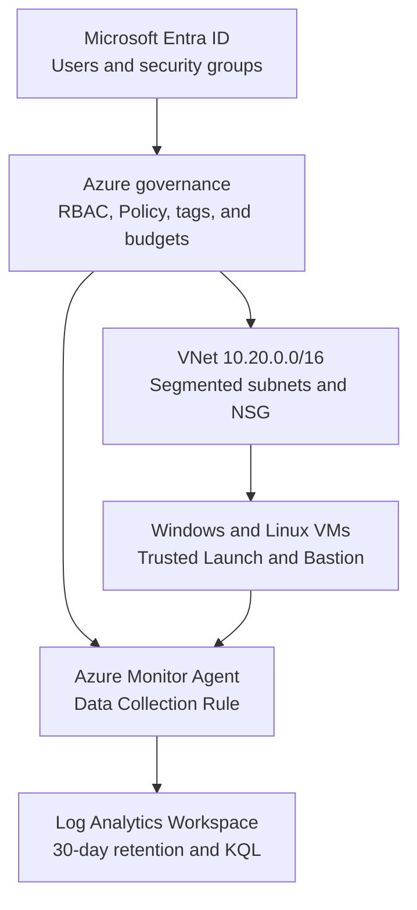

# Azure Security Operations Architecture — Current State

This document represents the architecture implemented and validated through Lab 08. Microsoft Sentinel, detections, incidents, and threat hunting are excluded until their respective labs are completed.

## Implemented boundaries

| Layer | Validated implementation |
|---|---|
| Identity | Cloud users, managers, security groups, and an Administrative Unit |
| Authorization | Group-based Azure RBAC scoped to the compute resource group |
| Governance | Custom audit policy, built-in deny policy, required tags, and budget alerts |
| Network | Server and management subnets with NSG-based traffic control |
| Compute | Windows Server and Ubuntu VMs accessed through Azure Bastion |
| Storage | Managed data disk formatted as `ext4` and mounted persistently on Linux |
| Monitoring | AMA, a VM-scoped DCR, selective XPath collection, and Log Analytics |
| Analytics | Four reusable KQL queries validating heartbeat and Windows events |

## Resource placement

| Resource group | Responsibility |
|---|---|
| `rg-secops-core-canadacentral` | Shared networking and core resources |
| `rg-secops-compute-canadacentral` | Windows and Linux compute resources |
| `rg-secops-monitorcanadacentral` | Log Analytics and monitoring resources |

This separation supports lifecycle operations, access scoping, cost review, and troubleshooting. Detailed evidence remains in each lab's `screenshots/` directory and is mapped in [`docs/evidence-register.md`](../docs/evidence-register.md).
