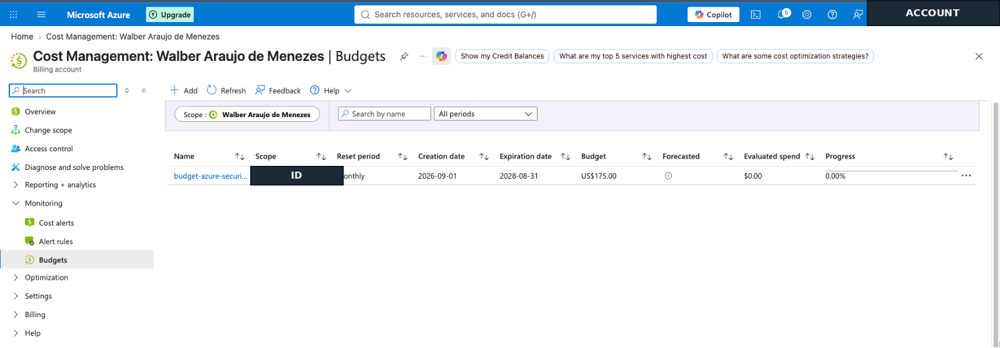
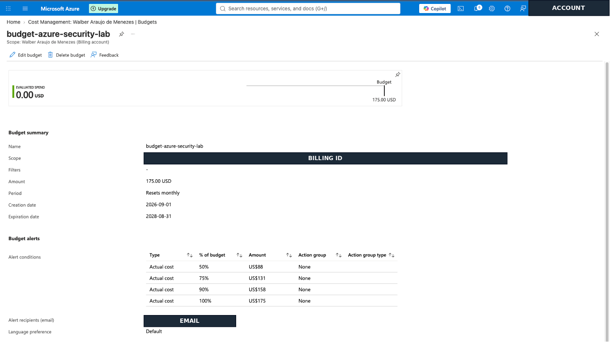
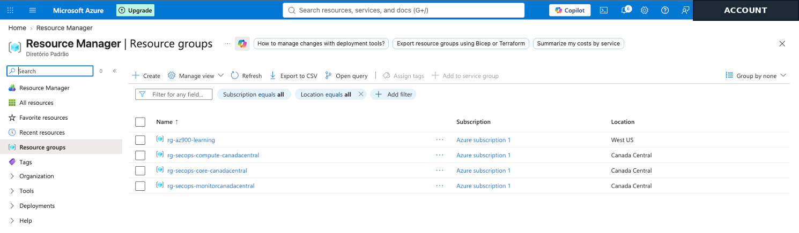
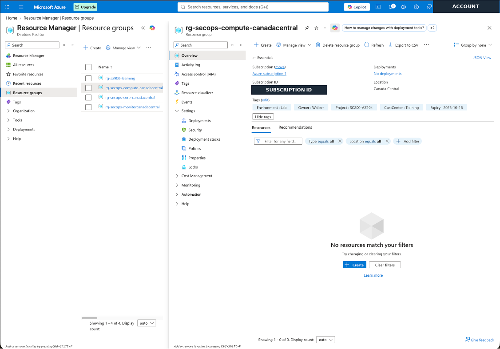
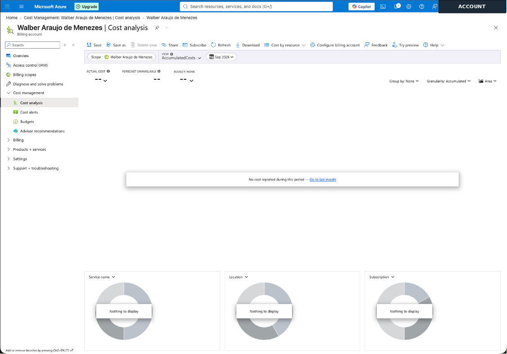
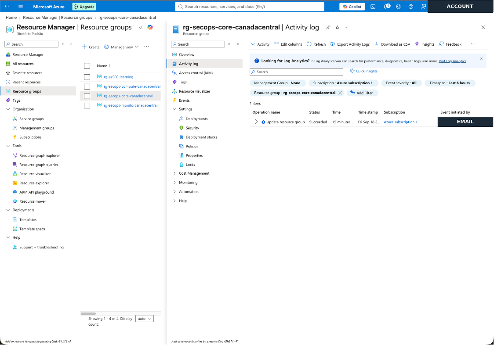
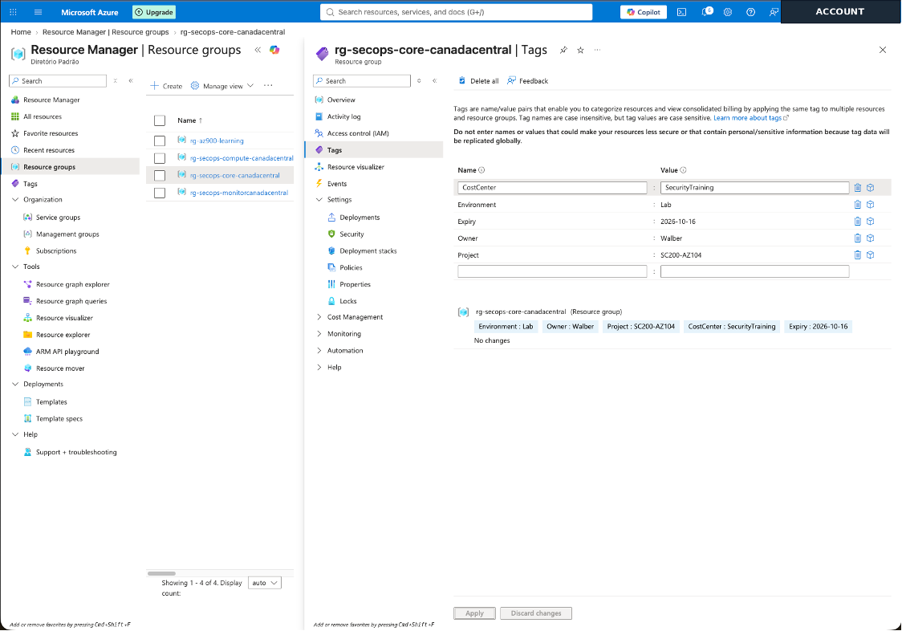
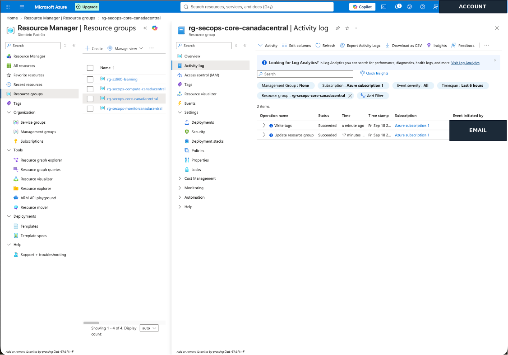

# Lab 00 - Azure Lab Baseline and Cost Governance

## Objective

Establish a controlled Microsoft Azure lab environment before deploying billable infrastructure and security services. This lab implements cost monitoring, resource organization, naming and tagging standards, and an initial control-plane audit trail.

## Environment

- Cloud platform: Microsoft Azure
- Primary region: Canada Central
- Environment: Lab
- Project tag: SC200-AZ104
- Lab date: September 18, 2026

## Resource Organization

| Resource group | Purpose |
|---|---|
| `rg-secops-core-canadacentral` | Core networking and shared resources |
| `rg-secops-compute-canadacentral` | Virtual machines and compute resources |
| `rg-secops-monitorcanadacentral` | Monitoring and security operations resources |

Resource groups are Azure Resource Manager scopes. They support lifecycle management, RBAC assignments, Azure Policy evaluation, resource locks, and cost analysis; they are not merely folders.

## Cost Management

A monthly Azure Cost Management budget of **US$175** was configured with actual-cost alerts at:

- 50%
- 75%
- 90%
- 100%

Azure budgets provide monitoring and notifications. Reaching a threshold does not automatically stop running resources or prevent additional charges.

The Day 0 Cost Analysis baseline showed no reported cost before compute, monitoring, or Microsoft Sentinel resources were deployed.

## Tagging Strategy

The following baseline metadata was applied to the lab resource groups:

| Tag | Value |
|---|---|
| `Environment` | `Lab` |
| `Owner` | `Walber` |
| `Project` | `SC200-AZ104` |
| `CostCenter` | `Training` |
| `Expiry` | `2026-10-16` |

Tags improve resource discovery, governance, cost attribution, reporting, and automation. They do not provide access control and should never contain secrets or sensitive personal information.

## Activity Log Validation

The `CostCenter` tag on `rg-secops-core-canadacentral` was changed from `Training` to `SecurityTraining` as a controlled test. Azure Activity Log recorded a successful **Write tags** operation, demonstrating the relationship between an administrative action, Azure Resource Manager, a resource change, and control-plane telemetry.

After validating the event, the intended baseline value for `CostCenter` is `Training`.

## Evidence

### 1. Budget overview

The budget inventory confirms the monthly US$175 lab budget and the initial evaluated spend.

### 2. Budget alerts

The budget details confirm the configured alert thresholds at 50%, 75%, 90%, and 100%.

### 3. Resource group baseline

The inventory confirms the core, compute, and monitoring resource groups in Canada Central.

### 4. Resource group tags

The compute resource group displays the baseline governance tags used throughout the lab.

### 5. Day 0 cost baseline

Cost Analysis shows that no cost had been reported before deploying billable lab workloads.

### 6. Initial Activity Log event

The Activity Log confirms a successful resource group update and the availability of administrative audit telemetry.

### 7. Controlled tag change

The `CostCenter` tag was changed to generate a controlled and auditable administrative event.

### 8. Activity Log Write tags event

The resulting **Write tags** operation was recorded successfully in Azure Activity Log.

## Validation Results

- [x] Monthly budget created
- [x] Progressive cost alerts configured
- [x] Three resource groups created in Canada Central
- [x] Baseline tags applied
- [x] Day 0 cost baseline captured
- [x] Controlled resource change performed
- [x] Activity Log event verified
- [x] Portfolio screenshots sanitized
- [x] Confirm `CostCenter=Training` was restored after the controlled test

## Skills Practiced

- Azure Cost Management
- Azure Resource Manager
- Azure Resource Groups
- Azure naming and tagging conventions
- Cloud governance and cost attribution
- Azure Activity Log
- Control-plane telemetry
- Evidence sanitization for a public portfolio

## Key Takeaways

1. Azure budgets provide visibility and notifications but are not automatic spending limits.
2. Resource groups are management scopes used for governance, access control, policy, lifecycle, and cost analysis.
3. Consistent tags support resource organization, reporting, automation, and cost attribution.
4. Administrative actions generate control-plane telemetry that can later be sent to Log Analytics and investigated with Microsoft Sentinel and KQL.

## Security and Privacy

The screenshots in this repository were sanitized before publication. Personal email addresses, subscription identifiers, and billing-scope identifiers were removed. No passwords, tokens, secrets, credentials, or tenant-sensitive identifiers are included.
