# Lab 01 - Microsoft Entra Users, Managers and Groups

## Objective

Build a realistic identity model in Microsoft Entra ID and validate the relationship between user attributes, manager assignments, security-group ownership, group membership, audit logs, and least privilege.

## Environment

- Identity platform: Microsoft Entra ID
- Tenant type: Cloud-only training tenant
- License: Microsoft Entra ID Free
- Group membership model: Assigned
- Lab date: September 19, 2026

## Identity Model

Five cloud-only member accounts were created without privileged directory roles:

| Display name | Job title | Department | Manager or purpose |
|---|---|---|---|
| Alice Analyst | SOC Analyst | Security Operations | Managed by Grace; analyst persona |
| Bob Analyst | SOC Analyst | Security Operations | Managed by Grace; analyst persona |
| Grace Manager | SOC Manager | Security Operations | Team manager and security-group owner |
| Ian IT | IT Support Specialist | IT | IT support persona |
| Victor Viewer | Security Viewer | Audit | Read-only and audit persona |

The accounts were kept enabled for the lab but were not assigned privileged Microsoft Entra roles.

## Manager Relationships

Grace Manager was configured as the manager of:

- Alice Analyst
- Bob Analyst

The manager attribute models an organizational reporting relationship. It does not grant Grace administrative access to the users, the tenant, or Azure resources.

## Security Groups

| Security group | Owner | Members | Purpose |
|---|---|---|---|
| `SG-SecOps-Analysts` | Grace Manager | Alice Analyst, Bob Analyst | Security operations analyst access |
| `SG-SecOps-Readers` | None | Victor Viewer | Read-only security and audit access |
| `SG-Cloud-Admins` | None | None | Reserved for future privileged-access testing |

All three groups use **Assigned** membership. Membership is therefore managed explicitly rather than calculated from user attributes.

`SG-Cloud-Admins` was intentionally left empty. This establishes a safer initial state for a group intended to receive elevated permissions later and avoids standing administrative access before it is required.

## Group Ownership and Least Privilege

Grace owns `SG-SecOps-Analysts`, allowing responsibility for that group to be delegated without granting a tenant-wide Microsoft Entra directory role.

At this stage, membership in these groups does not provide access to Azure subscriptions, resource groups, or resources. Azure RBAC assignments will be introduced in a later lab.

## Audit Validation

Microsoft Entra audit logs recorded the identity and group-management operations, including:

- `Set user manager`
- `Add group`
- `Add member to group`
- `Add owner to group`

The observed events completed with a **Success** status. These records demonstrate that Microsoft Entra maintains an audit trail for administrative changes to directory objects.

## Dynamic Membership Limitation

The optional `DG-SecurityOperations` dynamic group was not created because the tenant uses Microsoft Entra ID Free. Dynamic user membership requires Microsoft Entra ID P1, P2, or another qualifying license.

The planned rule was:

```text
(user.department -eq "Security Operations")
```

In a licensed tenant, the rule would evaluate user attributes and automatically add or remove users when their department changes. Because dynamic membership was unavailable, the design was documented and the lab continued with assigned security groups.

## Validation Questions

### What is the difference between a group owner and a Microsoft Entra directory role?

A group owner manages a specific group and, subject to tenant policies, its membership. A Microsoft Entra directory role grants administrative permissions over directory services and objects. Owning a group does not make the owner a tenant administrator.

### Does being Alice's or Bob's manager grant Grace administrative permissions?

No. The manager attribute represents organizational structure. It does not automatically grant access to the managed user's account, applications, groups, directory roles, or Azure resources.

### Why are group-based assignments preferable to many direct assignments?

Group-based assignments centralize access management, simplify onboarding and offboarding, improve consistency, make reviews easier, and create a clearer audit trail. A user's effective access can be changed by updating group membership instead of maintaining many independent assignments.

## Evidence

### 1. Lab user inventory

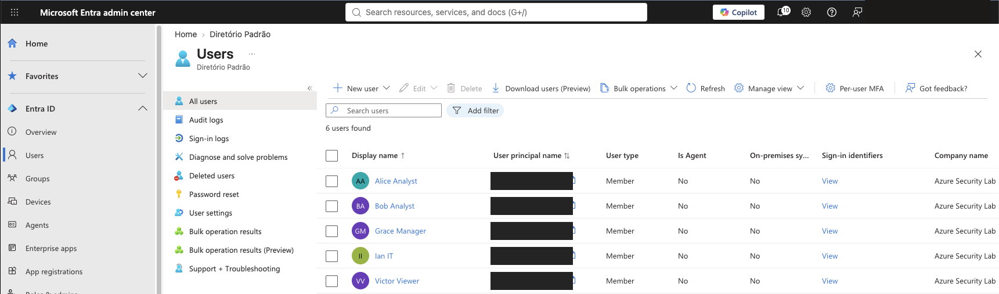

The user inventory confirms the five lab personas as cloud-only Microsoft Entra member accounts.

### 2. Enabled account status

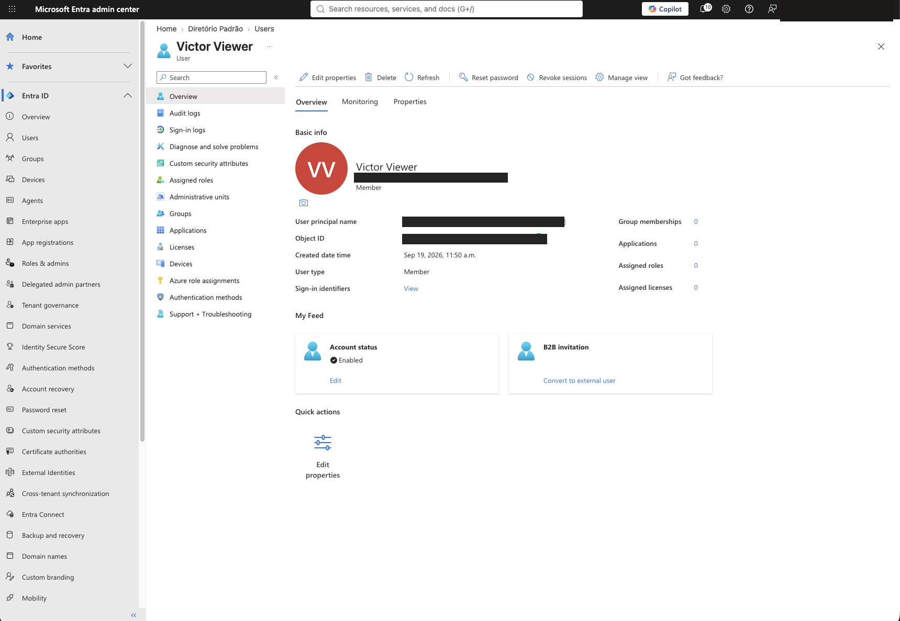

The selected lab account is enabled and has no licenses, applications, groups, or directory roles assigned at this point in the exercise.

### 3. Alice managed by Grace

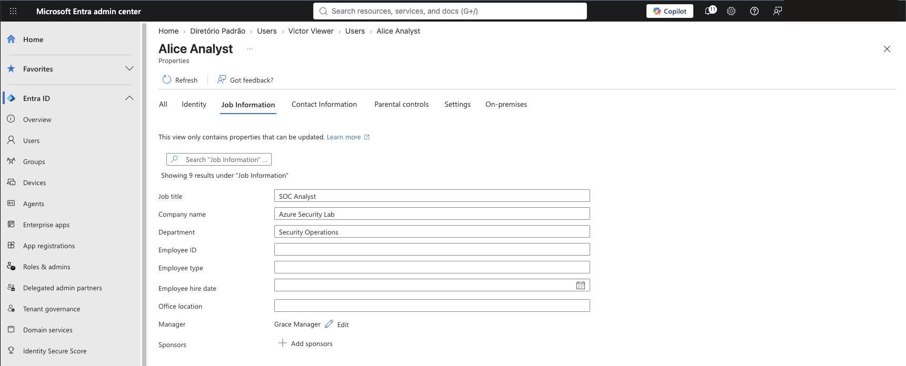

Alice's job information confirms Grace Manager as her manager.

### 4. Bob manager audit event

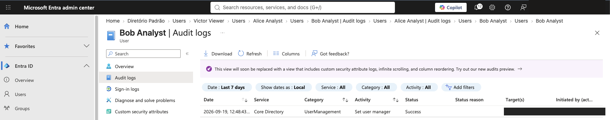

The audit log records a successful `Set user manager` operation for Bob.

### 5. Security-group inventory

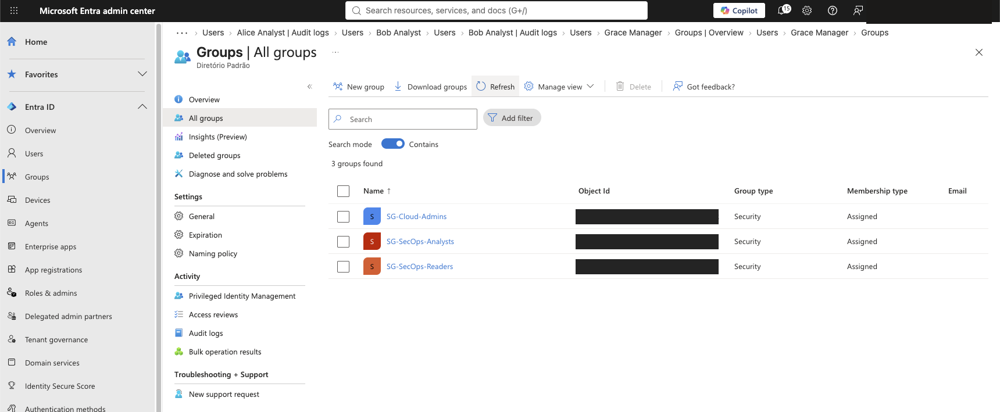

The inventory confirms the three cloud security groups with assigned membership.

### 6. Analyst group overview

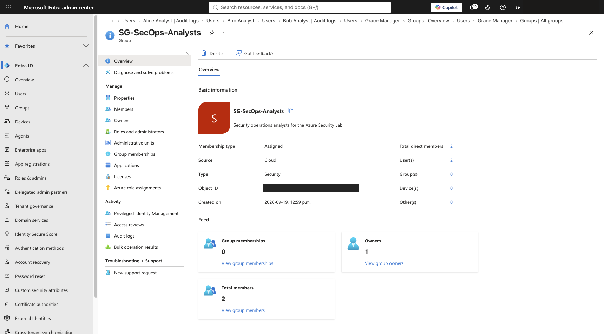

The group overview confirms two direct members and one owner for `SG-SecOps-Analysts`.

### 7. Reader group overview

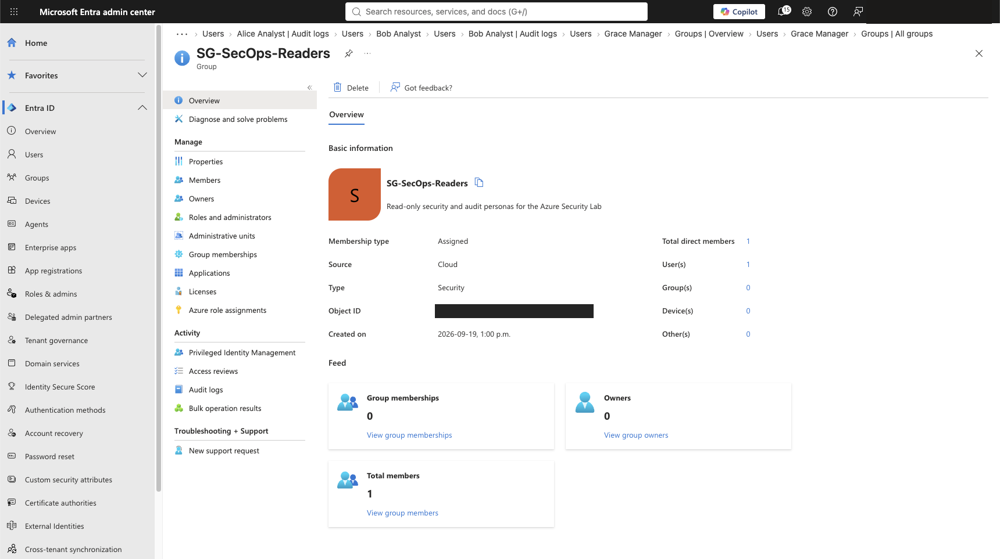

The group overview confirms one direct member for `SG-SecOps-Readers`.

### 8. Empty cloud administrator group

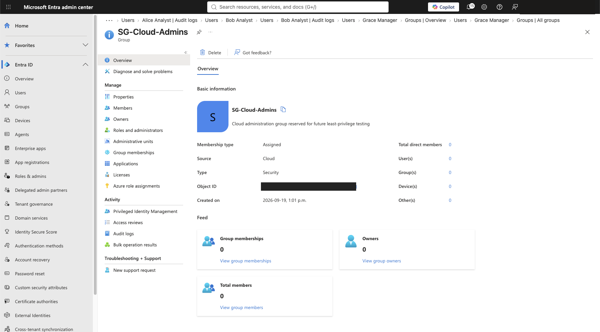

`SG-Cloud-Admins` contains no owner or member and is reserved for later least-privilege testing.

### 9. Group-management audit log

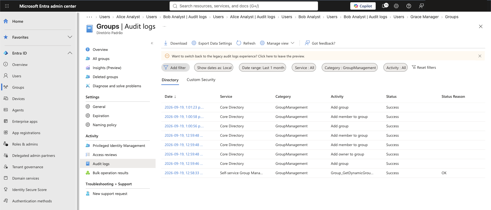

The audit log records successful group creation, membership, and ownership operations.

### 10. Analyst group owner

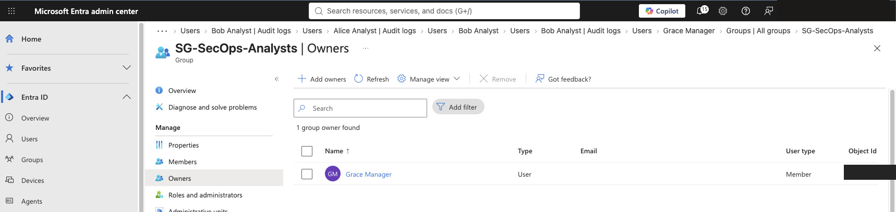

Grace Manager is the owner of `SG-SecOps-Analysts`.

### 11. Analyst group members

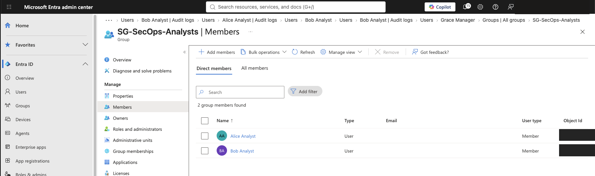

Alice Analyst and Bob Analyst are direct members of `SG-SecOps-Analysts`.

### 12. Reader group member

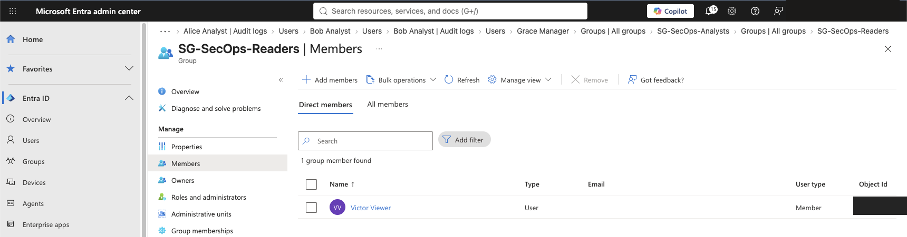

Victor Viewer is the direct member of `SG-SecOps-Readers`.

## Validation Results

- [x] Five lab users created
- [x] Job information and departments populated
- [x] Accounts confirmed as enabled
- [x] No privileged directory roles assigned during user creation
- [x] Grace configured as manager of Alice and Bob
- [x] Three security groups created
- [x] Grace configured as owner of `SG-SecOps-Analysts`
- [x] Alice and Bob added to `SG-SecOps-Analysts`
- [x] Victor added to `SG-SecOps-Readers`
- [x] `SG-Cloud-Admins` left empty
- [x] User and group audit events validated
- [x] Premium licensing limitation documented
- [x] Portfolio screenshots sanitized
- [ ] Dynamic membership test — not available with Microsoft Entra ID Free

## Skills Practiced

- Microsoft Entra ID user administration
- Identity attribute management
- Manager and direct-report relationships
- Microsoft Entra security groups
- Group ownership and delegated administration
- Assigned group membership
- Least-privilege design
- Directory audit-log validation
- Identity licensing awareness
- Evidence sanitization for a public portfolio

## Key Takeaways

1. Organizational relationships and administrative permissions are separate concepts.
2. Group ownership delegates management of a group without automatically granting a directory role.
3. Security groups provide a scalable foundation for role-based access assignments.
4. An empty privileged group is safer than assigning standing administrative access before it is needed.
5. Audit logs provide evidence of who changed directory objects and whether the operation succeeded.
6. Licensing affects which identity controls can be implemented, so unavailable controls should be documented rather than silently omitted.

## Security and Privacy

The screenshots were sanitized before publication. The signed-in administrator email address, tenant-specific user principal names, tenant domain, user object IDs, and group object IDs were removed. Fictional lab personas, group names, configuration states, and audit outcomes remain visible as technical evidence. No passwords, tokens, secrets, credentials, subscription identifiers, or billing information are included.

