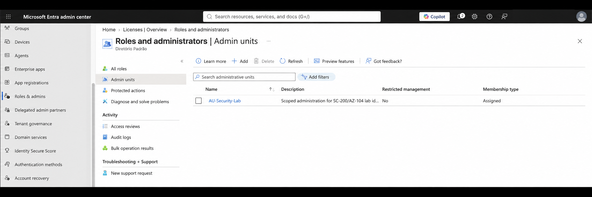
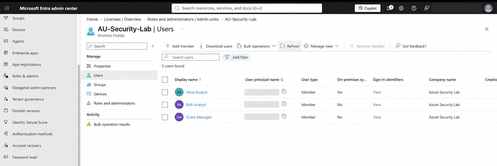
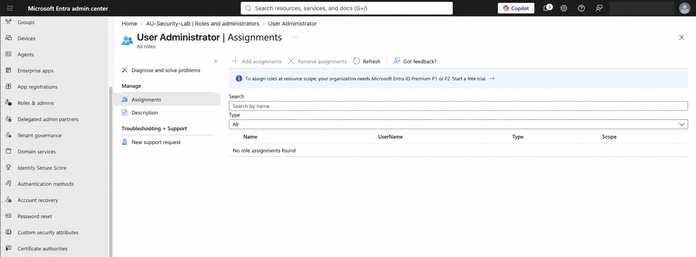

# Lab 02 — Administrative Units and Microsoft Entra Role Scope

## Overview

This lab demonstrates how Microsoft Entra administrative units can be used to organize directory objects and define a limited administrative scope. An administrative unit was created for the security lab identities, and selected users were added as direct members.

The lab also evaluates a scoped `User Administrator` assignment. The assignment could not be completed because the tenant uses Microsoft Entra ID Free, while administrative-unit-scoped role assignments require Microsoft Entra ID P1 or P2 for the delegated administrator. The limitation was documented without activating a trial or granting broader privileges.

## Objectives

- Create an administrative unit in Microsoft Entra ID.
- Add selected lab identities as members.
- Review administrative roles supported at administrative-unit scope.
- Apply the principle of least privilege.
- Identify and document licensing constraints.
- Distinguish Microsoft Entra RBAC from Azure RBAC.

## Environment

- Microsoft Entra admin center
- Microsoft Entra ID Free tenant
- Administrative unit: `AU-Security-Lab`
- Membership type: `Assigned`
- Restricted management: `Disabled`

## Administrative Unit Configuration

| Setting | Configuration |
|---|---|
| Name | `AU-Security-Lab` |
| Description | `Scoped administration for SC-200/AZ-104 lab identities` |
| Membership type | Assigned |
| Restricted management | No |

## Members

The following lab identities were added directly to the administrative unit:

| User | Lab function |
|---|---|
| Alice Analyst | SOC analyst persona |
| Bob Analyst | SOC analyst persona |
| Grace Manager | Security operations manager persona |

Adding users to an administrative unit does not grant permissions by itself. It only places the directory objects inside a scope that supported Microsoft Entra roles can target.

## Scoped Role Assignment Evaluation

The intended delegated administrator was `Ian IT`. A scoped assignment of `User Administrator` was evaluated so that Ian could manage only the users contained in `AU-Security-Lab`, rather than users across the entire tenant.

The assignment was not performed because the portal confirmed that role assignments at administrative-unit scope require Microsoft Entra ID Premium P1 or P2. The tenant uses Microsoft Entra ID Free.

### Intended configuration

| Principal | Intended role | Intended scope | Result |
|---|---|---|---|
| Ian IT | User Administrator | `AU-Security-Lab` | Not assigned — P1/P2 required |

No free trial was activated and no tenant-wide administrative role was assigned as a workaround. This preserves least privilege and avoids changing the lab's licensing baseline solely to complete one exercise.

## Security Concepts Demonstrated

### Administrative units are management scopes

Administrative units limit where supported Microsoft Entra administrative permissions apply. They are not network boundaries, authentication boundaries, or isolation mechanisms.

### Membership does not grant access

Alice, Bob, and Grace receive no administrative privileges merely by being members of `AU-Security-Lab`.

### Least privilege includes scope

Least privilege is not only about selecting a limited role. The role should also be assigned at the narrowest practical scope. A scoped role would be preferable to a tenant-wide `User Administrator` assignment.

### Microsoft Entra RBAC and Azure RBAC are different

- **Microsoft Entra RBAC** controls administration of directory objects such as users, groups, applications, and devices.
- **Azure RBAC** controls access to Azure resources such as subscriptions, resource groups, virtual machines, networks, and Log Analytics workspaces.

A user can have directory administration permissions without access to Azure resources, or Azure resource permissions without an administrative role in Microsoft Entra ID.

## Validation Results

- `AU-Security-Lab` was created successfully.
- Restricted management remained disabled as required by the lab guide.
- Alice, Bob, and Grace were added as assigned members.
- Administrative roles available at the unit scope were reviewed.
- The P1/P2 licensing requirement was confirmed in the portal.
- No excessive role or tenant-wide permission was granted.

## Licensing Limitation

Microsoft Entra ID Free supports creating administrative units and adding members. However, each administrator assigned a directory role at administrative-unit scope requires Microsoft Entra ID P1 or P2. Because the lab tenant uses the Free edition, the delegated role assignment and sign-in test with Ian IT were documented but not executed.

## Evidence

| File | Evidence |
|---|---|
| `01-administrative-unit-created.png` | Administrative unit configuration and assigned membership type |
| `02-administrative-unit-members.png` | Alice, Bob, and Grace as direct members |
| `03-role-assignment-requires-entra-premium.png` | Premium licensing requirement and absence of scoped assignments |

## Conclusion

This lab established a directory management scope for the security lab identities and demonstrated how administrative units support delegated administration. It also showed that licensing is part of access-control design: when scoped delegation was unavailable, the configuration was documented rather than bypassed with broader permissions.

The next lab applies Azure RBAC at resource-group scope and compares direct and inherited permissions for Azure resources.
