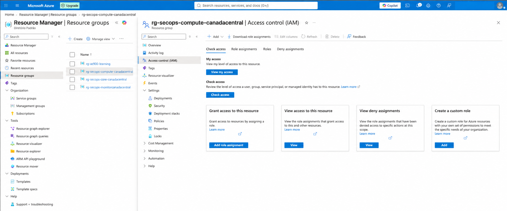
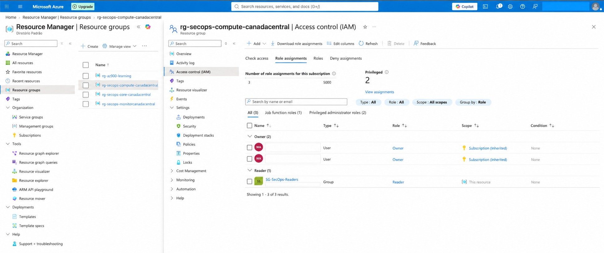
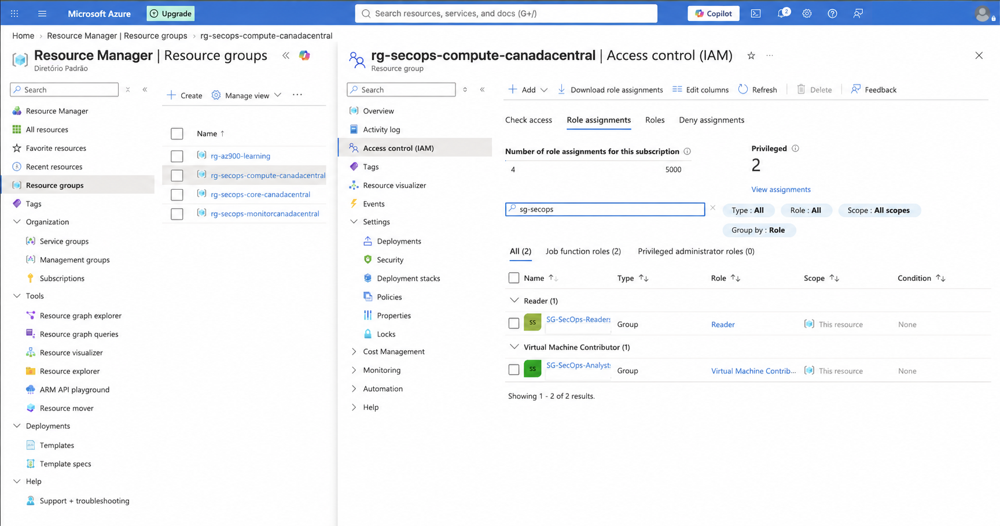

# Lab 03 — Azure RBAC: Resource Group Permissions

## Overview

This lab implements Azure role-based access control (RBAC) at the resource-group scope. Microsoft Entra ID security groups created in Lab 01 are used as security principals, allowing permissions to be managed by group membership instead of individual user assignments.

The configuration separates read-only access from virtual-machine administration and demonstrates the difference between direct and inherited role assignments.

## Objectives

- Review Access control (IAM) on an Azure resource group.
- Assign the **Reader** role to the SecOps readers group.
- Assign the **Virtual Machine Contributor** role to the SecOps analysts group.
- Apply permissions at the narrowest scope required for the lab.
- Verify direct resource-group assignments and inherited subscription permissions.
- Document the configuration without exposing tenant or account identifiers.

## Environment

| Component | Value |
| --- | --- |
| Azure resource group | `rg-secops-compute-canadacentral` |
| Reader security group | `SG-SecOps-Readers` |
| Analyst security group | `SG-SecOps-Analysts` |
| Reader role | `Reader` |
| Analyst role | `Virtual Machine Contributor` |
| Assignment scope | Resource group |

## RBAC Assignment Model

An Azure RBAC assignment combines three elements:

1. **Security principal** — the user, group, service principal, or managed identity receiving access.
2. **Role definition** — the permitted actions.
3. **Scope** — where those permissions apply, such as a subscription, resource group, or individual resource.

In this lab, both assignments are made to Microsoft Entra ID security groups at the resource-group scope.

## Configuration Summary

| Security principal | Role | Scope | Purpose |
| --- | --- | --- | --- |
| `SG-SecOps-Readers` | Reader | `rg-secops-compute-canadacentral` | View resources and configuration without making changes |
| `SG-SecOps-Analysts` | Virtual Machine Contributor | `rg-secops-compute-canadacentral` | Manage virtual machines without receiving general RBAC administration rights |

## Implementation and Evidence

### 1. Open the resource group's IAM page

The **Access control (IAM)** page was opened for the compute resource group. This is the control plane used to review and assign Azure roles at this scope.

### 2. Assign Reader to the readers group

The `SG-SecOps-Readers` group was assigned the **Reader** role directly on the resource group. Members can inspect resources and settings but cannot modify them.

The role-assignment view also shows an existing **Owner** assignment inherited from the subscription. The scope column distinguishes the direct assignment (`This resource`) from the inherited assignment (`Subscription (Inherited)`).

### 3. Assign Virtual Machine Contributor to the analysts group

The `SG-SecOps-Analysts` group was assigned the **Virtual Machine Contributor** role directly on the same resource group. This grants operational control of virtual machines while avoiding broader resource or access-management privileges.

### 4. Verify the final role assignments

The role-assignment list was filtered to show the two SecOps groups. Both assignments appear with the scope **This resource**, confirming that they were applied directly to the selected resource group.

## Direct and Inherited Permissions

| Scope indicator | Meaning |
| --- | --- |
| `This resource` | The role was assigned directly at the selected resource-group scope. |
| `Subscription (Inherited)` | The role was assigned at the parent subscription and inherited by the resource group. |

Azure evaluates applicable role assignments across the scope hierarchy. A principal can therefore receive permissions from both direct assignments and assignments inherited from a parent scope.

## Role Comparison

| Role | Primary capability | Can manage Azure RBAC? |
| --- | --- | --- |
| Reader | View resources and configuration | No |
| Virtual Machine Contributor | Manage virtual machines and related VM operations | No |
| Contributor | Manage resources, but not grant Azure roles | No |
| Owner | Manage resources and grant Azure roles | Yes |
| User Access Administrator | Manage user access to Azure resources | Yes |

## Least-Privilege Decisions

- Permissions were assigned to groups rather than directly to individual users.
- Assignments were limited to the compute resource group instead of the entire subscription.
- Readers received view-only access.
- Analysts received VM-focused permissions rather than the broader Contributor or Owner roles.
- No unnecessary RBAC administration rights were granted to the lab groups.

## Validation Results

- `SG-SecOps-Readers` appears with the **Reader** role.
- `SG-SecOps-Analysts` appears with the **Virtual Machine Contributor** role.
- Both group assignments use the resource-group scope shown as **This resource**.
- The existing Owner access is visibly inherited from the subscription and is not part of the two lab assignments.

End-user validation will be completed after virtual machines are deployed in a later lab. At that point, the expected behavior is:

- A reader-group member can view the resources but cannot modify them.
- An analyst-group member can perform permitted virtual-machine operations within the resource group.

## Evidence Index

| File | Evidence |
| --- | --- |
| `01-compute-resource-group-iam.png` | Resource group and IAM entry point |
| `02-readers-group-reader-role.png` | Reader assignment and direct-versus-inherited scope |
| `03-analysts-vm-contributor-role.png` | Virtual Machine Contributor assignment |
| `04-resource-group-role-assignments.png` | Final filtered list of both SecOps assignments |

## Conclusion

This lab established a least-privilege Azure RBAC model for the compute resource group. Access is managed through Microsoft Entra ID security groups, roles are aligned with operational responsibilities, and permissions are restricted to the required resource-group scope.

The resulting identity and authorization foundation can be reused by later labs that deploy compute resources, validate effective access, and apply governance controls.
