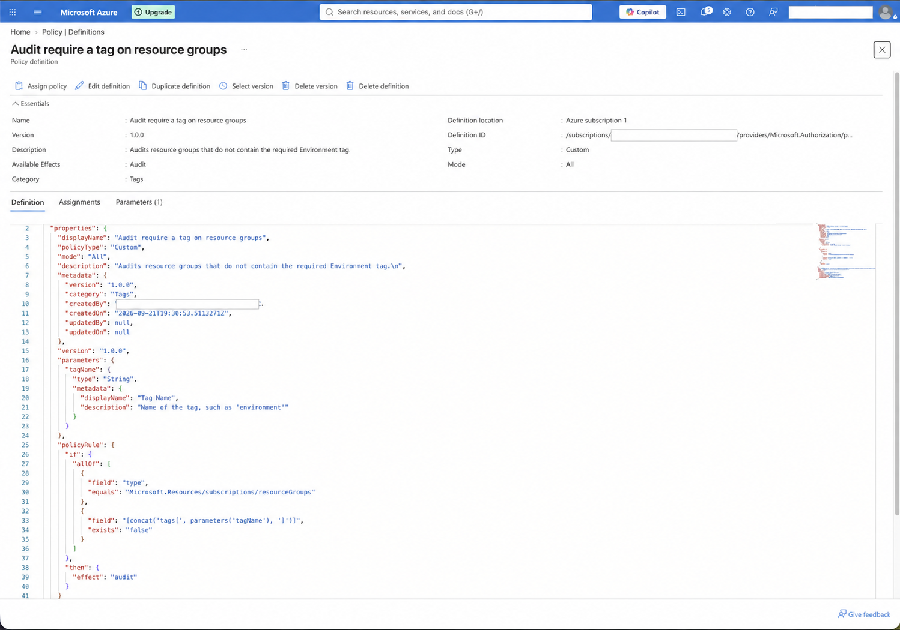
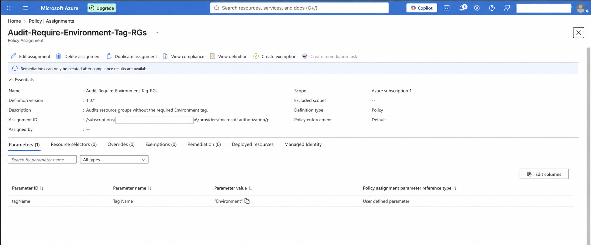
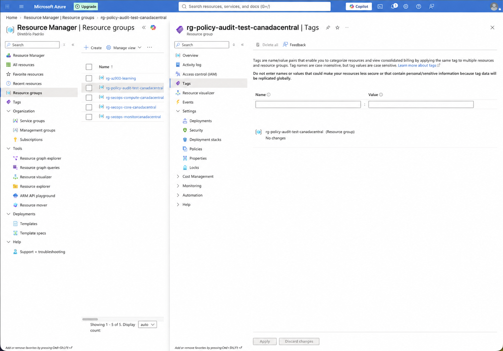
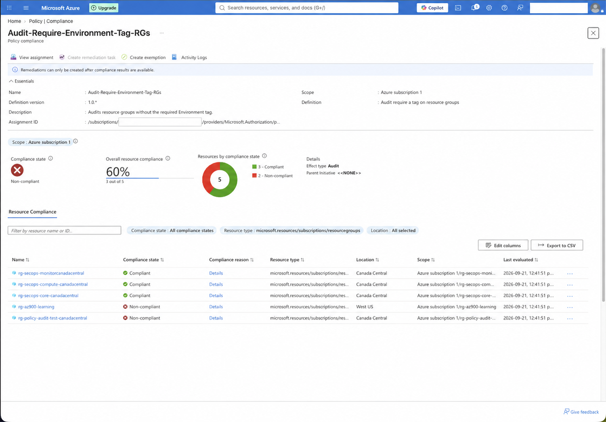
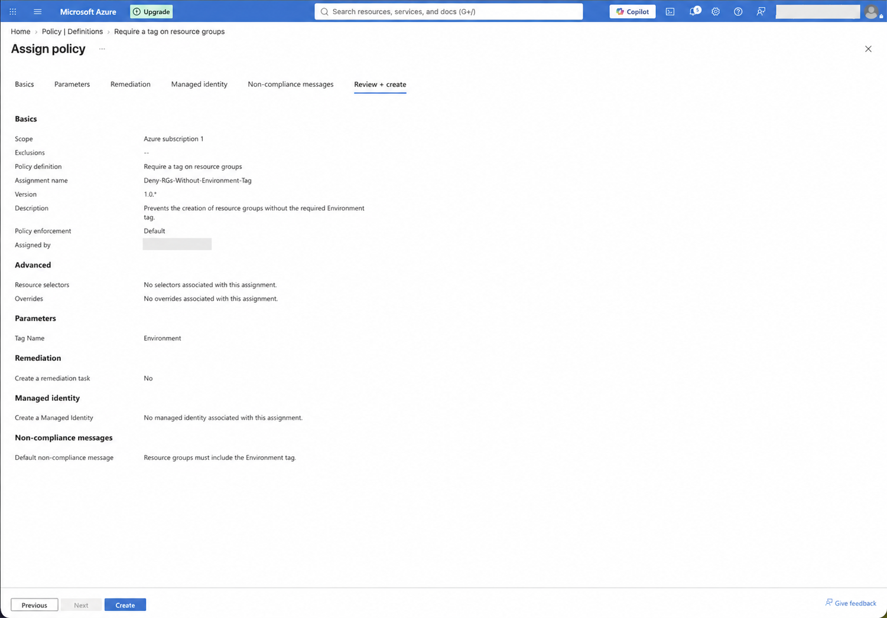
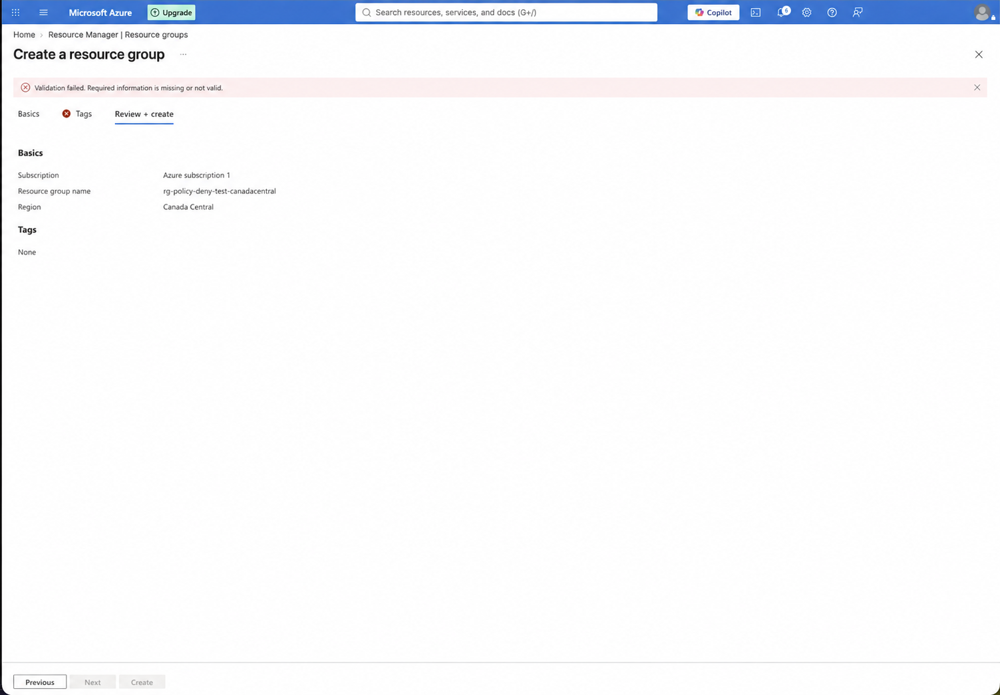
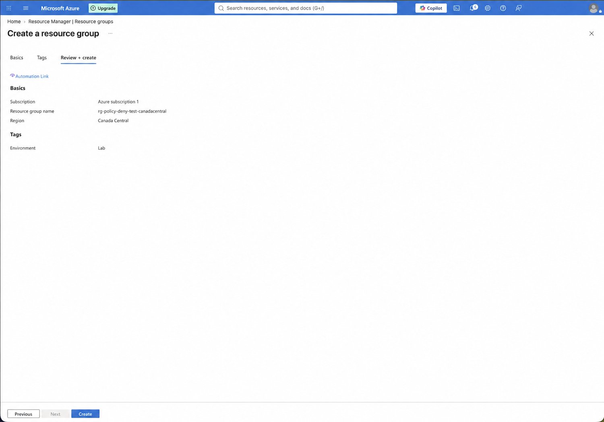
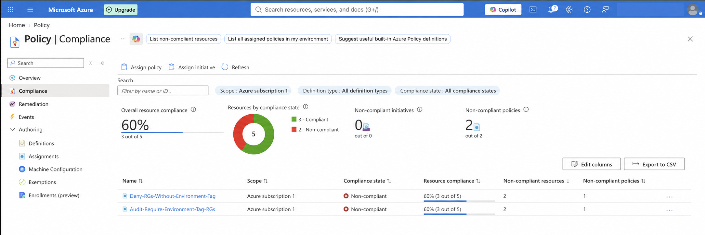

# Lab 04 — Azure Policy: Audit, Deny, and Compliance

## Overview

This lab demonstrates how Azure Policy can be used to evaluate and enforce governance requirements at subscription scope. The control selected for the exercise requires the `Environment` tag on Azure resource groups.

Two complementary policy effects were tested:

- `Audit`, to identify existing resource groups that do not contain the required tag.
- `Deny`, to prevent new resource groups from being submitted without the required tag.

The lab also validates a compliant request containing `Environment=Lab` and reviews the resulting compliance dashboard.

## Objectives

- Create a custom policy definition with the `Audit` effect.
- Assign the audit policy at subscription scope.
- Create a resource group without the required tag and observe its compliance state.
- Assign the built-in `Require a tag on resource groups` policy with the `Deny` effect.
- Test a resource-group request without the required tag.
- Validate a request containing the required `Environment` tag.
- Review the consolidated Azure Policy compliance results.

## Lab configuration

| Item | Configuration |
|---|---|
| Scope | `Azure subscription 1` |
| Required tag | `Environment` |
| Test tag value | `Lab` |
| Custom audit definition | `Audit require a tag on resource groups` |
| Audit assignment | `Audit-Require-Environment-Tag-RGs` |
| Built-in deny definition | `Require a tag on resource groups` |
| Deny assignment | `Deny-RGs-Without-Environment-Tag` |
| Region used for tests | `Canada Central` |

## Azure Policy and Azure RBAC

Azure RBAC determines **who** can perform an action. Azure Policy evaluates **what configuration** is allowed or compliant. A user may therefore have permission to create a resource group while Azure Policy still audits or blocks the request when it violates an organizational rule.

## Policy effects used

| Effect | Behavior in this lab |
|---|---|
| `Audit` | Allows the resource group to exist, then reports it as non-compliant when the `Environment` tag is missing. |
| `Deny` | Prevents a new resource-group request from passing validation when the required tag is absent. |

## Implementation and evidence

### 1. Custom audit policy definition

A custom definition was created to evaluate resource groups and return the `Audit` effect when the tag provided through `tagName` does not exist.

### 2. Audit policy assignment

The custom definition was assigned at subscription scope with `Environment` supplied as the required tag name.

### 3. Resource group without the tag

The resource group `rg-policy-audit-test-canadacentral` was created without tags. The `Audit` effect permitted creation because it reports policy violations without blocking the operation.

### 4. Audit compliance result

After policy evaluation, the test resource group appeared as non-compliant. The audit assignment reported 60% compliance: three of five evaluated resource groups were compliant and two were non-compliant.

### 5. Deny policy assignment

The built-in `Require a tag on resource groups` policy was assigned at the same scope. The assignment used default enforcement, required the `Environment` tag, and included a clear non-compliance message.

### 6. Request without the required tag

A request for `rg-policy-deny-test-canadacentral` was submitted without tags. Portal validation did not permit the request to proceed while the required tag was missing.

### 7. Compliant request with the required tag

The same request was prepared with `Environment=Lab`. The review page passed validation and made the **Create** action available.

### 8. Compliance summary

The Azure Policy dashboard displayed both assignments and the evaluated state of the resource groups. At capture time, three of five resources were compliant and two were non-compliant.

## Test results

| Test | Expected result | Observed result |
|---|---|---|
| Audit policy + missing tag | Resource is allowed but reported as non-compliant | Confirmed |
| Deny policy + missing tag | Request cannot pass validation | Confirmed |
| Deny policy + `Environment=Lab` | Request passes validation | Confirmed |

## Key observations

- `Audit` provides visibility without interrupting resource creation.
- `Deny` enforces the requirement for future requests.
- A deny assignment does not delete or automatically correct resources that already exist.
- Both assignments can display a non-compliant state while pre-existing resource groups remain without the required tag.
- Neither `Audit` nor `Deny` adds the missing tag automatically. Automated correction would require an appropriate `Modify`, `Append`, or `DeployIfNotExists` design with the required identity and remediation configuration.
- Azure Policy evaluation is not always immediate; compliance results may take time to appear after assignment or resource changes.

## Evidence index

| File | Evidence |
|---|---|
| `01-custom-audit-policy-definition.png` | Custom policy definition and audit rule |
| `02-audit-policy-assignment.png` | Audit assignment and `Environment` parameter |
| `03-audit-resource-group-without-tag.png` | Resource group without the required tag |
| `04-audit-non-compliant-resource-group.png` | Audit compliance evaluation |
| `05-deny-policy-assignment.png` | Deny assignment configuration |
| `06-deny-policy-blocked-resource-group.png` | Failed validation without the required tag |
| `07-compliant-resource-group-with-tag.png` | Valid request with `Environment=Lab` |
| `08-policy-compliance-summary.png` | Consolidated compliance dashboard |

## Conclusion

This lab implemented a basic governance lifecycle with Azure Policy: detect non-compliant resources through `Audit`, enforce the same requirement for new requests through `Deny`, and verify the results through the compliance dashboard. The exercise highlights how preventive and detective controls can work together to improve consistency across an Azure environment.
