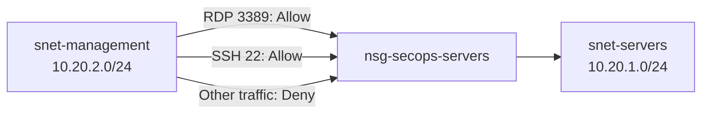
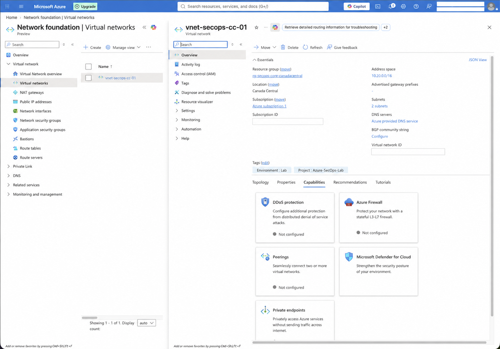
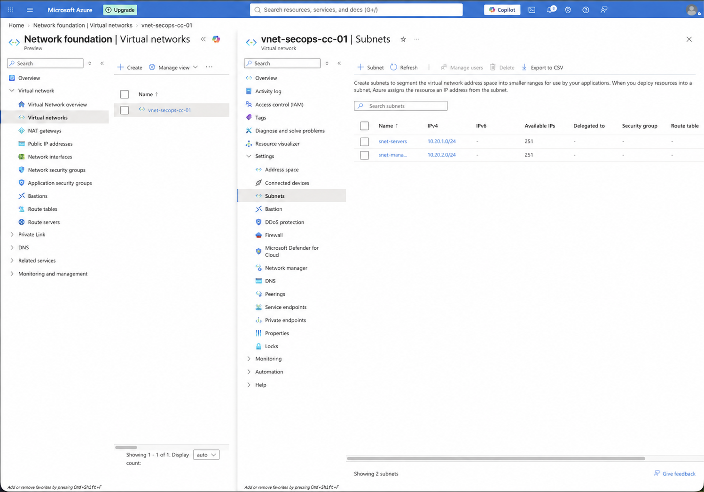
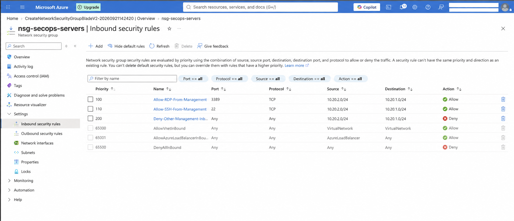
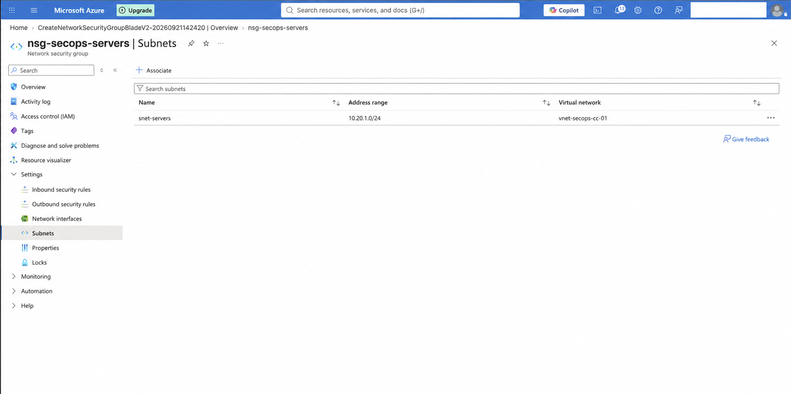
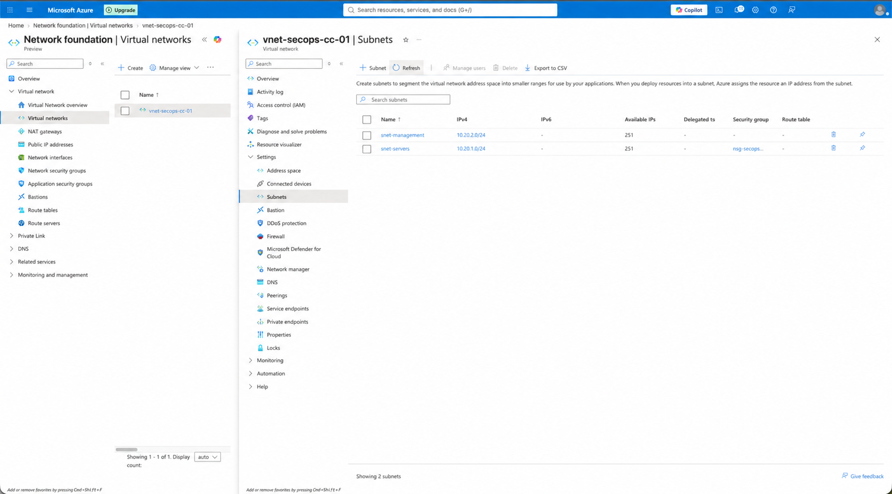

# Lab 05 — Azure Virtual Network and Network Security Groups

## Overview

This lab builds the network foundation for the Azure Security Operations environment. A virtual network was divided into dedicated server and management subnets, and a Network Security Group (NSG) was configured to control traffic from the management subnet to future server workloads.

The implementation applies network segmentation and rule ordering to permit only required administrative protocols while denying other management-to-server traffic.

## Objectives

- Create an Azure Virtual Network in the project core resource group.
- Define separate server and management subnets.
- Configure a Network Security Group for server workloads.
- Allow RDP and SSH only from the management subnet.
- Deny other traffic from the management subnet to the server subnet.
- Associate the NSG with the server subnet.
- Validate the final subnet-to-NSG association.
- Preserve sanitized implementation evidence for the public portfolio.

## Environment

| Component | Configuration |
|---|---|
| Resource group | `rg-secops-core-canadacentral` |
| Region | `Canada Central` |
| Virtual network | `vnet-secops-cc-01` |
| VNet address space | `10.20.0.0/16` |
| Server subnet | `snet-servers` — `10.20.1.0/24` |
| Management subnet | `snet-management` — `10.20.2.0/24` |
| Network Security Group | `nsg-secops-servers` |
| NSG association | `snet-servers` |
| Tags | `Environment=Lab`, `Project=Azure-SecOps-Lab` |

Both subnets were created as private subnets. Future workloads that require public endpoints will need an explicit outbound-connectivity method.

## Network design

The management subnet is the approved administrative source. The NSG protects the server subnet and evaluates its custom rules before Azure's lower-priority default rules.

## NSG rule set

| Priority | Rule | Protocol/port | Source | Destination | Action |
|---:|---|---|---|---|---|
| `100` | `Allow-RDP-From-Management` | TCP/3389 | `10.20.2.0/24` | `10.20.1.0/24` | Allow |
| `110` | `Allow-SSH-From-Management` | TCP/22 | `10.20.2.0/24` | `10.20.1.0/24` | Allow |
| `200` | `Deny-Other-Management-Inbound` | Any | `10.20.2.0/24` | `10.20.1.0/24` | Deny |

NSG rules are evaluated from the lowest priority number to the highest. The two required management protocols are therefore permitted before the broader deny rule is evaluated.

The priority-200 deny rule is necessary because Azure's default `AllowVNetInBound` rule would otherwise allow general traffic between addresses represented by the `VirtualNetwork` service tag.

## Implementation and evidence

### 1. Virtual network deployment

The `vnet-secops-cc-01` virtual network was deployed in Canada Central with the `10.20.0.0/16` address space. The resource was placed in the core resource group and tagged for environment and project identification.

### 2. Subnet segmentation

The address space was divided into two `/24` networks. `snet-servers` is reserved for Windows and Linux workloads, while `snet-management` represents the approved source for administrative traffic.

### 3. Inbound NSG rules

Three custom inbound rules were created. RDP and SSH are allowed from the management subnet, while other traffic from that subnet to the server subnet is denied. Azure's default inbound rules remain visible for comparison.

### 4. NSG subnet association

The `nsg-secops-servers` Network Security Group was associated with `snet-servers`. Applying the NSG at subnet scope provides a consistent control for future network interfaces deployed into that subnet.

### 5. Final network validation

The VNet subnet view confirms that `snet-servers` is protected by the NSG while `snet-management` remains without this server-specific policy.

## Validation results

- [x] VNet created in the expected resource group and region.
- [x] VNet address space configured as `10.20.0.0/16`.
- [x] Server and management subnets created without overlap.
- [x] RDP allowed from the management subnet at priority 100.
- [x] SSH allowed from the management subnet at priority 110.
- [x] Other management-to-server traffic denied at priority 200.
- [x] Default Azure NSG rules retained.
- [x] NSG associated only with `snet-servers`.
- [x] Final association confirmed from the VNet subnet view.
- [ ] Effective traffic validation deferred until virtual machines and network interfaces are deployed.

## Security decisions

### Subnet-level enforcement

Associating the NSG with the subnet ensures that the rule set applies consistently to future workloads placed in `snet-servers`, instead of relying on separate manual configuration for every network interface.

### Restricted administrative source

RDP and SSH are not allowed from `Internet` or `Any`. Their source is limited to the management subnet CIDR, reducing the exposed administrative surface.

### Explicit deny after specific allows

The explicit deny rule prevents the broader default virtual-network rule from allowing additional management-to-server protocols. This demonstrates ordered rule evaluation and a least-privilege approach to network access.

### Private subnet consideration

The subnets do not rely on implicit default outbound access. An explicit outbound method will be selected when future virtual machines require updates, package repositories, Azure agents, or other public endpoints. Cost and exposure will be considered before enabling that connectivity.

## Limitations and next validation

No virtual machines or network interfaces were deployed in this lab. The configuration and association are validated, but effective packet flow cannot yet be demonstrated.

After the Windows and Linux VMs are deployed, the environment should be tested to confirm:

- RDP connectivity from the approved management path.
- SSH connectivity from the approved management path.
- Blocking of unapproved ports between the two subnets.
- Effective security rules on each server network interface.
- The selected explicit outbound-connectivity method.

## Skills practiced

- Azure Virtual Network design
- IPv4 CIDR planning
- Subnet segmentation
- Network Security Groups
- Inbound security rules
- Rule priority and evaluation order
- Least-privilege network administration
- Subnet-level security enforcement
- Azure resource tagging
- Public evidence sanitization

## Evidence index

| File | Evidence |
|---|---|
| `01-virtual-network-overview.png` | VNet address space, region, tags, and subnet count |
| `02-virtual-network-subnets.png` | Server and management subnet ranges |
| `03-nsg-inbound-security-rules.png` | Custom allow/deny rules and Azure default rules |
| `04-nsg-associated-with-server-subnet.png` | NSG-to-subnet association |
| `05-subnet-network-security-association.png` | Final validation from the VNet subnet view |

## Conclusion

This lab established a segmented Azure network foundation for the security operations environment. Administrative protocols were explicitly allowed from the management subnet, broader traffic from that subnet was denied, and the control was applied consistently at the server-subnet scope. The resulting design is ready to host and test Windows and Linux virtual machines in the next phase of the project.
