# Lab 06 — Secure Windows and Linux Virtual Machines

## Overview

This lab deployed and validated two Azure virtual machines inside the segmented network created in Lab 05:

- a Windows Server workload in the server subnet;
- an Ubuntu management host in the management subnet.

The main objective was not simply to provision compute resources. The lab focused on secure administration, workload isolation, Trusted Launch, controlled network paths, cost management, and practical troubleshooting.

The deployment also exposed two real Azure operational challenges:

1. the selected B-series VM families were initially unavailable to the subscription and required provider registration, quota investigation, a subscription upgrade, and a Microsoft support request;
2. after deployment, the Windows VM encountered a regional capacity allocation failure and had to be resized to another available SKU.

The completed environment was tested from both Windows and Linux, including Secure Boot, virtual TPM, internet connectivity, RDP availability, and subnet-to-subnet traffic filtering.

> **Lab workflow:** Plan → Troubleshoot → Deploy → Harden → Connect → Validate → Test segmentation → Deallocate

---

## Objectives

- Deploy Windows Server 2022 and Ubuntu Server 24.04 LTS virtual machines.
- Place each workload in the correct subnet created in Lab 05.
- Apply Trusted Launch, Secure Boot, and virtual TPM protections.
- Avoid exposing RDP or SSH through public inbound rules.
- Use Azure Bastion Developer for administrative access.
- Validate the operating systems, private addressing, and security controls.
- Test NSG behavior between the management and server subnets.
- Troubleshoot subscription quota and regional allocation problems.
- Apply automatic shutdown and deallocate resources after testing.
- Produce sanitized evidence without exposing subscription IDs, public IPs, e-mail addresses, or session identifiers.

---

## Architecture

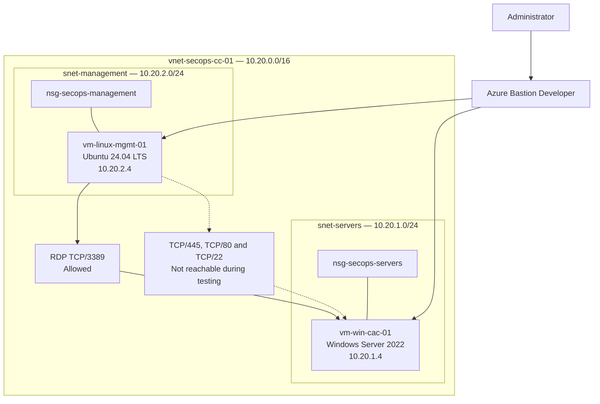
```mermaid
flowchart TB
    Admin["Administrator"] --> Bastion["Azure Bastion Developer"]

    subgraph VNet["vnet-secops-cc-01 — 10.20.0.0/16"]
        subgraph Mgmt["snet-management — 10.20.2.0/24"]
            Linux["vm-linux-mgmt-01<br/>Ubuntu 24.04 LTS<br/>10.20.2.4"]
            MgmtNSG["nsg-secops-management"]
        end

        subgraph Servers["snet-servers — 10.20.1.0/24"]
            Windows["vm-win-cac-01<br/>Windows Server 2022<br/>10.20.1.4"]
            ServerNSG["nsg-secops-servers"]
        end

        Linux --> Allowed["RDP TCP/3389<br/>Allowed"]
        Allowed --> Windows
        Linux -.-> Restricted["TCP/445, TCP/80 and TCP/22<br/>Not reachable during testing"]
        Restricted -.-> Windows
    end

    Bastion --> Linux
    Bastion --> Windows
    MgmtNSG --- Linux
    ServerNSG --- Windows
```

### Network security path

The server subnet inherited the NSG rules created in Lab 05:

| Priority | Rule | Protocol/port | Source | Destination | Action |
|---:|---|---|---|---|---|
| 100 | `Allow-RDP-From-Management` | TCP/3389 | `10.20.2.0/24` | `10.20.1.0/24` | Allow |
| 110 | `Allow-SSH-From-Management` | TCP/22 | `10.20.2.0/24` | `10.20.1.0/24` | Allow |
| 200 | `Deny-Other-Management-Inbound` | Any | `10.20.2.0/24` | `10.20.1.0/24` | Deny |

The allow rules use lower priority numbers and are therefore evaluated before the custom deny rule.

---

## Resources and Configuration

| Resource | Configuration | Purpose |
|---|---|---|
| Resource group | `rg-secops-compute-canadacentral` | Compute-resource lifecycle and cost separation |
| Virtual network | `vnet-secops-cc-01` | Segmented lab network from Lab 05 |
| Server subnet | `snet-servers` — `10.20.1.0/24` | Windows server workload |
| Management subnet | `snet-management` — `10.20.2.0/24` | Linux administration workload |
| Windows VM | `vm-win-cac-01` | Windows Server validation and RDP target |
| Linux VM | `vm-linux-mgmt-01` | Management host and network-testing source |
| Server NSG | `nsg-secops-servers` | Restricts traffic entering the server subnet |
| Management NSG | `nsg-secops-management` | Protects the management subnet |
| Remote access | Azure Bastion Developer | Browser-based RDP and SSH without public inbound rules |

### Windows virtual machine

| Setting | Value |
|---|---|
| Image | Windows Server 2022 Datacenter: Azure Edition |
| Original size | `Standard_B2als_v2` |
| Size after capacity troubleshooting | `Standard_B2ls_v2` — 2 vCPUs, 4 GiB RAM |
| Private IP | `10.20.1.4` |
| Subnet | `snet-servers` |
| Security type | Trusted Launch |
| Secure Boot | Enabled |
| vTPM | Enabled |
| OS disk | Standard SSD managed disk |
| Public inbound ports | None |
| Auto-shutdown | Enabled |

### Linux virtual machine

| Setting | Value |
|---|---|
| Image | Ubuntu Server 24.04 LTS |
| Size | `Standard_B2ats_v2` — 2 vCPUs, 1 GiB RAM |
| Private IP | `10.20.2.4` |
| Subnet | `snet-management` |
| Authentication | RSA SSH public key |
| Security type | Trusted Launch |
| Secure Boot | Enabled |
| vTPM | Enabled |
| OS disk | Standard SSD managed disk |
| Public inbound ports | None |
| Auto-shutdown | Enabled |

---

## Implementation and Troubleshooting Story

### 1. Compute provider and quota investigation

The first blocker appeared before either VM could be created. The Azure portal did not display usable compute quota information because the required resource provider was not registered.

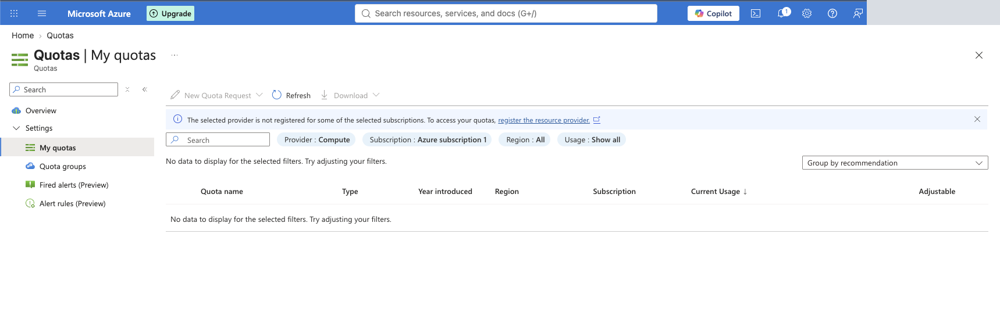

After registering the required providers, quota information became available. However, the economical B-series SKUs still appeared as unavailable for this subscription in Canada Central.

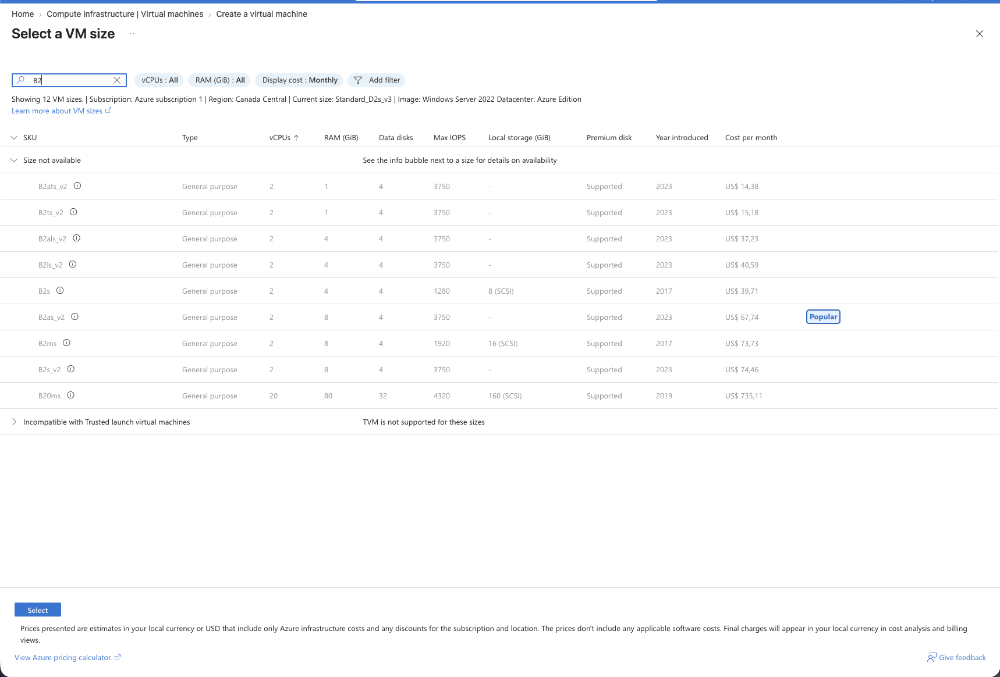

This was not a VM configuration error. The Azure CLI was used to compare regional SKU availability and architecture:

```bash
az vm list-skus \
  --location canadacentral \
  --resource-type virtualMachines \
  --all \
  --query '[?length(restrictions)==`0`].name' \
  --output tsv |
grep -E '^Standard_(B|A|D)' |
head -50
```

The command showed regional SKUs, but the portal continued returning `NotAvailableForSubscription`. This demonstrated that a SKU can exist in a region while still being restricted for a specific subscription.

The subscription was upgraded from the initial tier, and a quota/access request was submitted for the following Canada Central VM families:

- Basv2 Series — requested limit: 4 vCPUs;
- Bsv2 Series — requested limit: 4 vCPUs.

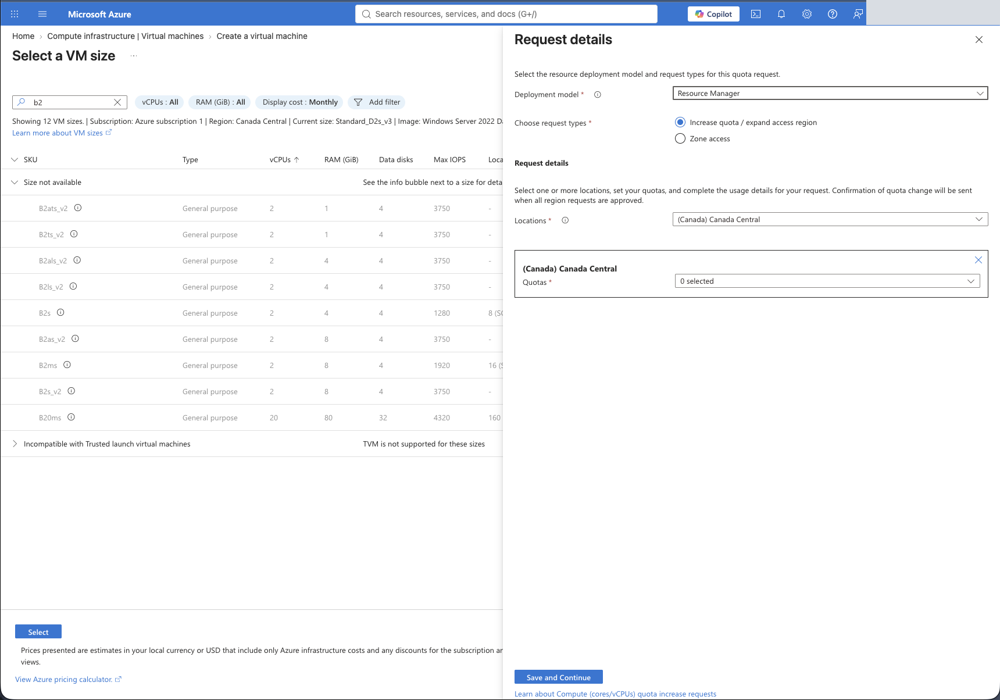

Microsoft Support approved the request, after which the required B2 and B4 sizes became selectable. Support request numbers, subscription IDs, and account details were intentionally omitted from the public documentation.

### 2. Windows Server deployment

The Windows VM was configured with Trusted Launch, Secure Boot, vTPM, a Standard SSD managed disk, no public inbound ports, and placement in `snet-servers`.

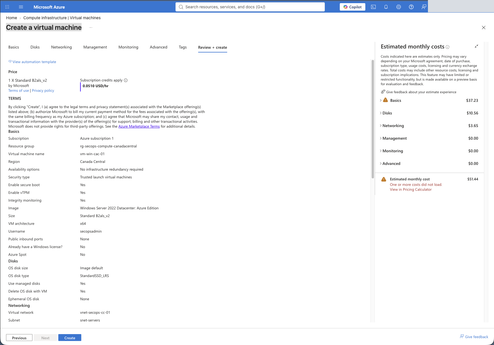

The deployment completed successfully in the compute resource group.

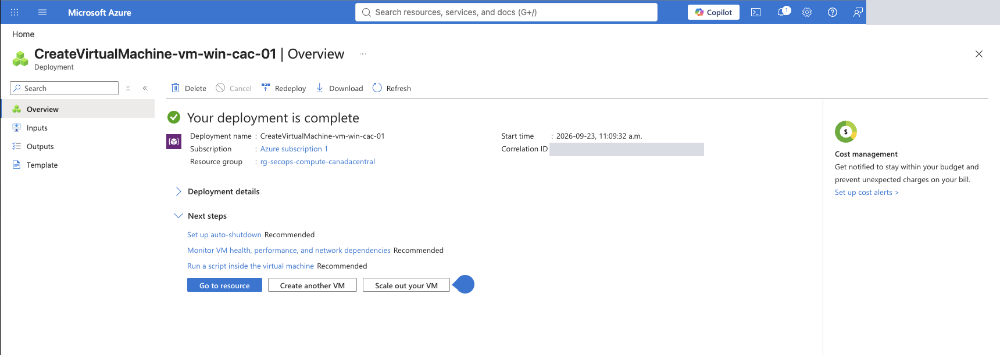

The resource overview confirmed the private address, server subnet, operating system, VM generation, and security-related properties.

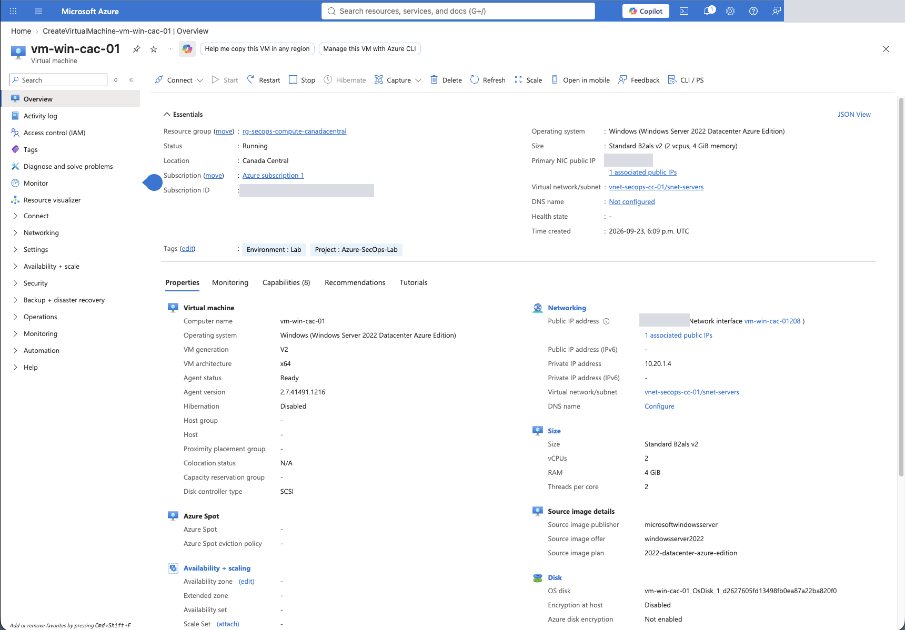

### 3. Secure administration with Azure Bastion

Azure Bastion Developer was selected for browser-based lab access. This avoided creating public NSG rules for TCP/3389 or TCP/22.

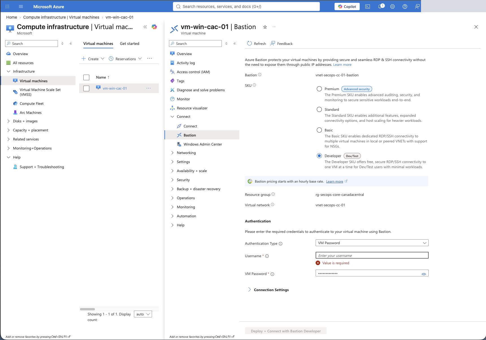

The Windows session was validated with PowerShell:

```powershell
hostname

Get-ComputerInfo |
  Select-Object WindowsProductName, WindowsVersion, OsBuildNumber

Get-NetIPConfiguration

Test-NetConnection www.microsoft.com -Port 443

Confirm-SecureBootUEFI

Get-Tpm
```

The results confirmed:

- Windows Server 2022 Datacenter Azure Edition;
- private address `10.20.1.4`;
- outbound HTTPS connectivity;
- Secure Boot enabled;
- TPM present, enabled, ready, and activated.

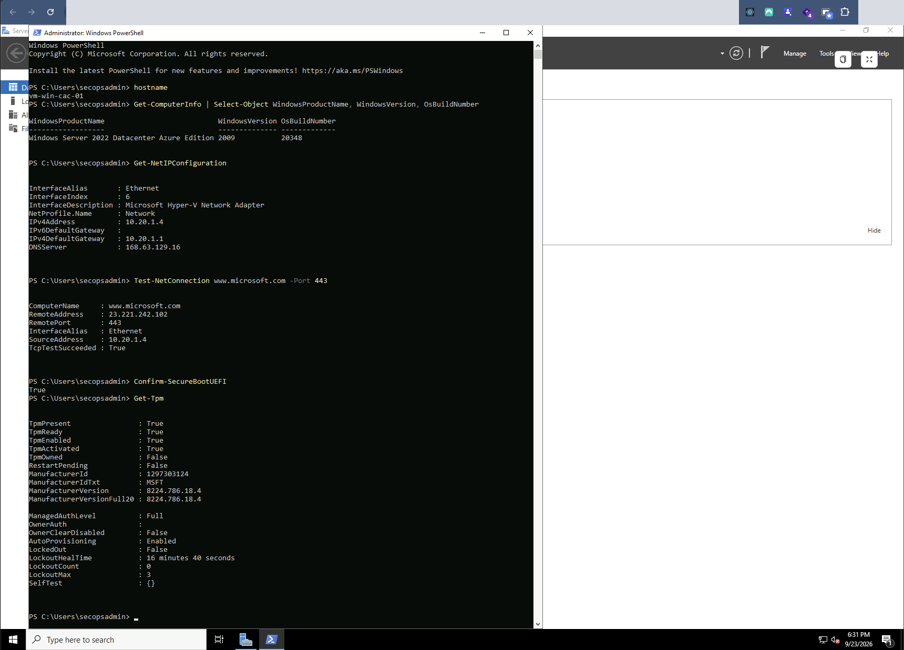

Automatic shutdown was enabled to reduce the risk of leaving the VM running unnecessarily.

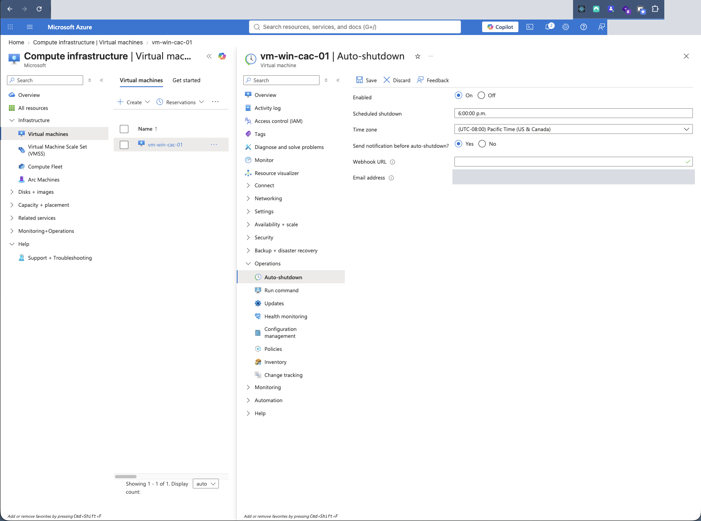

### 4. Network security validation

The Windows NIC had no directly attached NIC-level NSG. Security was applied at the subnet level through `nsg-secops-servers`, keeping enforcement consistent for workloads deployed into `snet-servers`.

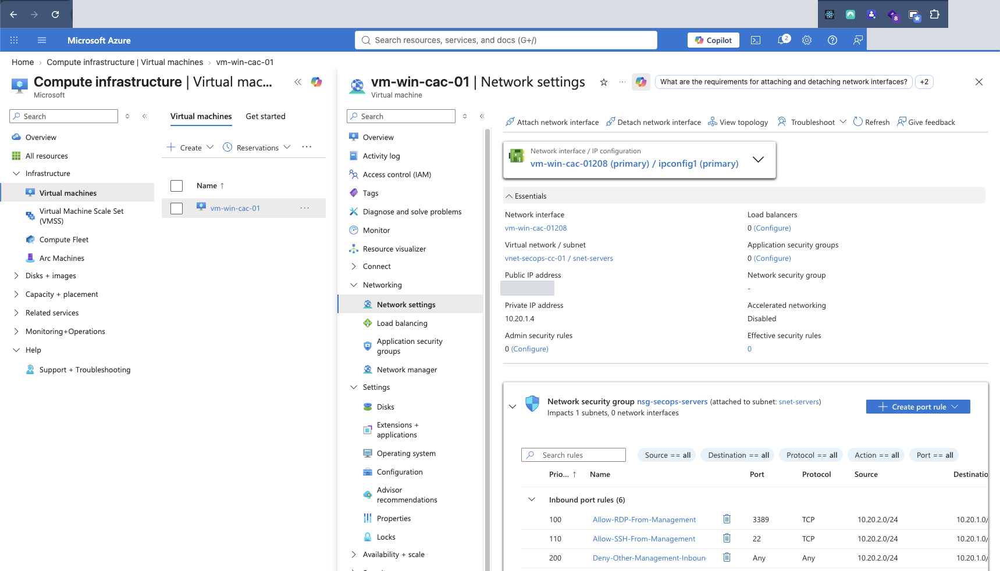

A separate NSG was associated with `snet-management`, preserving the separation between management and server workloads.

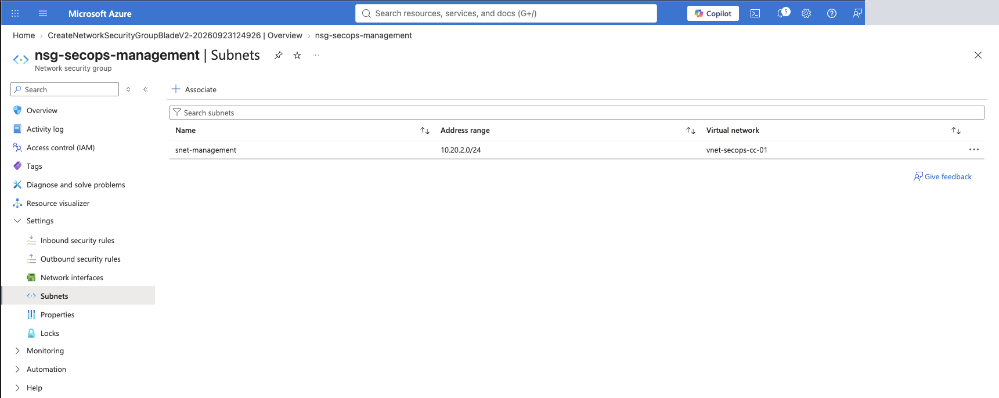

### 5. Linux management host deployment

The Linux VM was placed in `snet-management` and configured with SSH public-key authentication, Trusted Launch, Secure Boot, vTPM, no public inbound ports, and automatic shutdown.

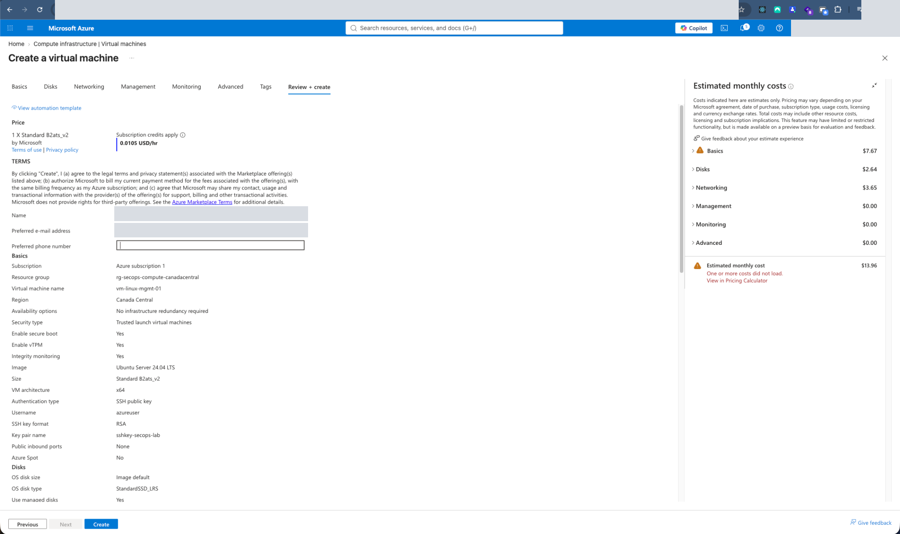

The deployment completed successfully.

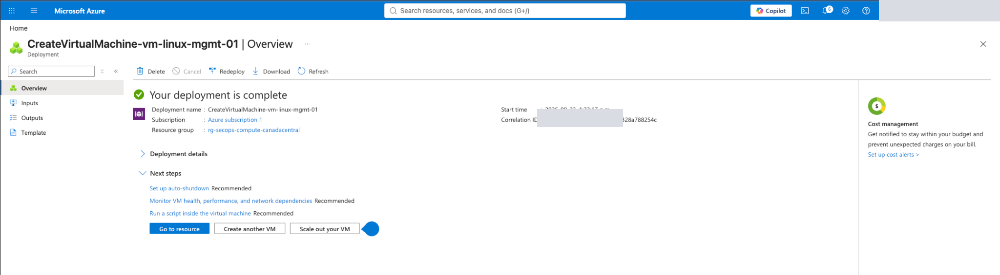

The overview confirmed Ubuntu 24.04, the B2ats_v2 size, the management subnet, and private address `10.20.2.4`.

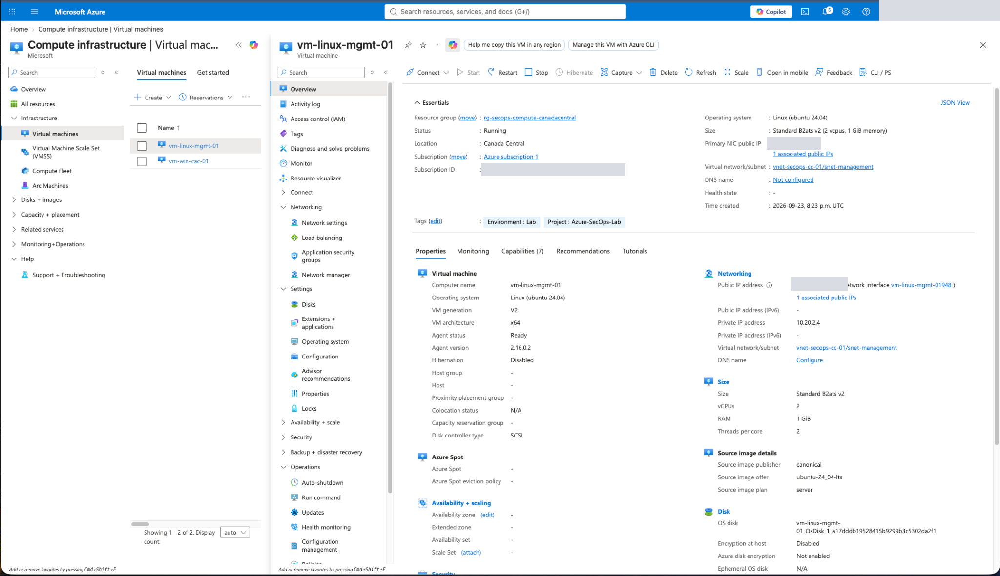

The Linux system was validated through the Bastion SSH session:

```bash
hostname
grep PRETTY_NAME /etc/os-release
ip -brief address
curl -sI https://www.microsoft.com | head -n 1
mokutil --sb-state
ls -l /dev/tpm*
```

The results confirmed:

- Ubuntu Server 24.04.4 LTS;
- private address `10.20.2.4/24`;
- outbound HTTPS connectivity;
- Secure Boot enabled;
- TPM devices exposed to the guest operating system.

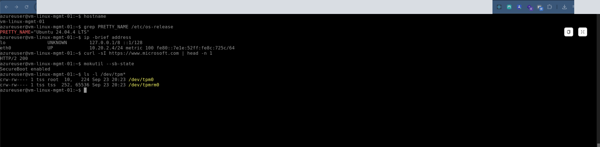

### 6. Regional allocation failure and resize

After the Windows VM had been stopped, a later start attempt returned an allocation error:

```text
AllocationFailed
We do not have sufficient capacity for the requested VM size in this region.
```

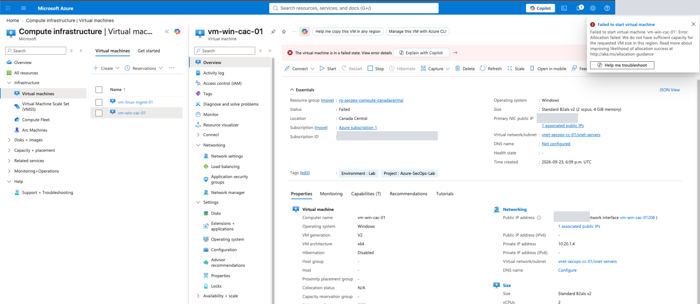

This issue was different from the original subscription restriction:

- `NotAvailableForSubscription` indicated subscription access or quota limitations;
- `AllocationFailed` indicated that Azure could not allocate capacity for that SKU in the region at that moment.

The VM was resized from `Standard_B2als_v2` to `Standard_B2ls_v2`, preserving the 2-vCPU/4-GiB requirement while selecting an available SKU. The VM then started successfully.

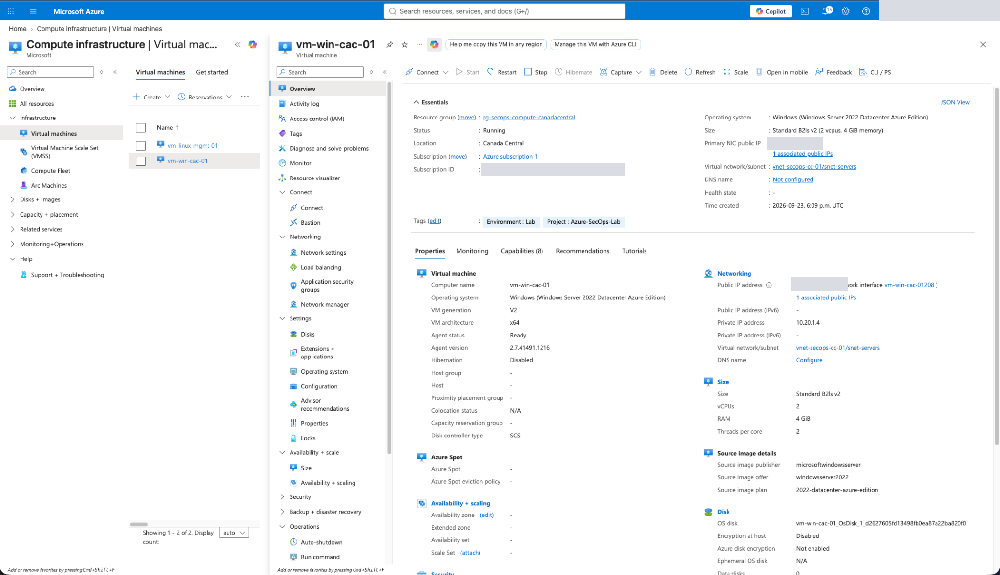

The operating system, private address, Secure Boot, vTPM, RDP listener, and outbound HTTPS connectivity were revalidated after the resize:

```powershell
hostname

Get-ComputerInfo |
  Select-Object WindowsProductName, WindowsVersion, OsBuildNumber

Get-NetIPAddress -AddressFamily IPv4 |
  Where-Object {$_.IPAddress -like "10.20.*"} |
  Select-Object InterfaceAlias, IPAddress, PrefixLength

Confirm-SecureBootUEFI

Get-Tpm |
  Select-Object TpmPresent, TpmReady, TpmEnabled, TpmActivated

Get-NetTCPConnection -LocalPort 3389 -State Listen |
  Select-Object LocalAddress, LocalPort, State

Test-NetConnection www.microsoft.com -Port 443 |
  Select-Object ComputerName, RemotePort, TcpTestSucceeded
```

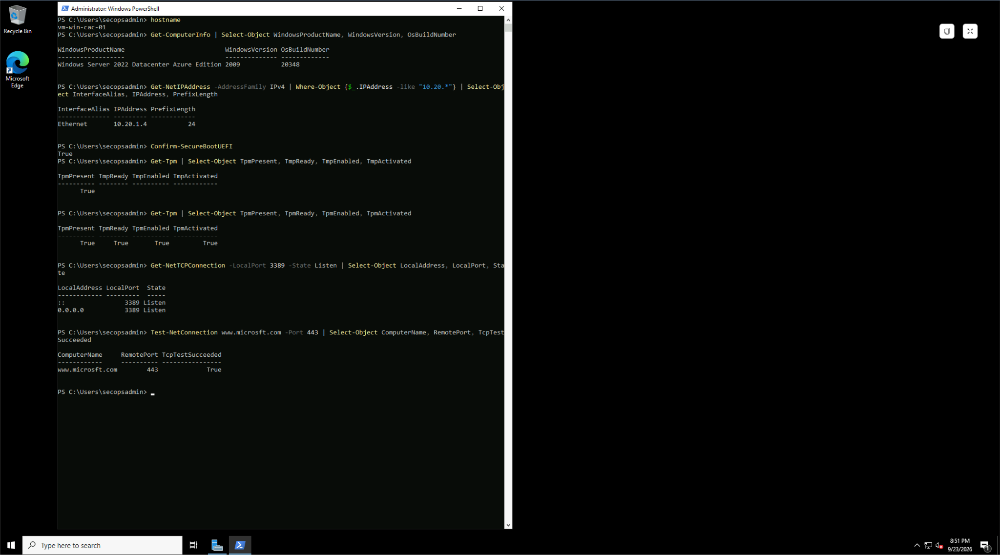

### 7. Subnet segmentation test

The Linux management host was used as the source of controlled TCP tests against the Windows server private address:

```bash
sudo apt update
sudo apt install -y netcat-openbsd

nc -vz -w 5 10.20.1.4 3389
nc -vz -w 5 10.20.1.4 445
nc -vz -w 5 10.20.1.4 80
nc -vz -w 5 10.20.1.4 22
```

| Destination port | Result | Interpretation |
|---:|---|---|
| TCP/3389 | Succeeded | RDP was reachable from the management subnet as intended |
| TCP/445 | Timed out | SMB was not reachable through the tested path |
| TCP/80 | Timed out | HTTP was not reachable through the tested path |
| TCP/22 | Timed out | SSH was not reachable on the Windows guest during the test |

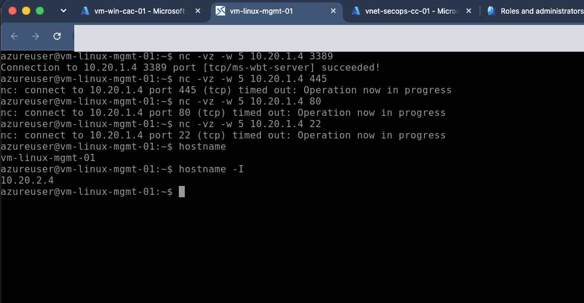

The RDP result directly confirmed the intended management path. A TCP timeout alone does not identify which individual control dropped the traffic: effective NSG rules, the guest firewall, and whether a service is listening must all be considered. For that reason, the results were interpreted together with the configured NSG rules and the Windows RDP listener validation.

### 8. Cost-control cleanup

Both virtual machines were stopped and confirmed as **Stopped (deallocated)** after testing. Deallocation releases compute allocation and stops compute charges, although attached disks and other retained resources may continue to incur costs.

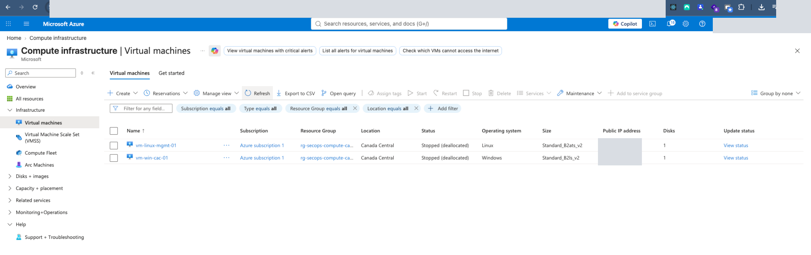

---

## Validation Summary

| Control | Validation | Result |
|---|---|---|
| Workload placement | Windows in `snet-servers`; Linux in `snet-management` | Passed |
| Private addressing | Windows `10.20.1.4`; Linux `10.20.2.4` | Passed |
| Trusted Launch | Secure Boot and vTPM validated in both guests | Passed |
| Public inbound exposure | No public inbound ports selected during deployment | Passed |
| Administrative access | Windows RDP and Linux SSH through Bastion | Passed |
| RDP segmentation | TCP/3389 reachable from management to server subnet | Passed |
| Other tested ports | TCP/445, 80, and 22 not reachable during test | Passed for observed test conditions |
| Outbound HTTPS | Windows and Linux reached Microsoft over TCP/443 | Passed |
| Capacity recovery | Windows VM started after resize to B2ls_v2 | Passed |
| Cost control | Both VMs deallocated after validation | Passed |

---

## Troubleshooting Summary

| Problem | Diagnosis | Resolution | Lesson |
|---|---|---|---|
| Compute quotas initially empty | Required provider was not registered | Registered the relevant resource provider and refreshed quota data | Provider registration can block visibility before quota analysis begins |
| B-series SKUs unavailable | `NotAvailableForSubscription` persisted across multiple regions | Upgraded the subscription and requested Basv2/Bsv2 access with 4 vCPUs | Regional SKU existence does not guarantee subscription access |
| Windows VM failed to restart | Azure returned `AllocationFailed` for the selected SKU | Resized to `Standard_B2ls_v2` and started the VM | Quota availability and physical regional capacity are separate concerns |
| TCP/22 did not respond on Windows | Network access alone does not create a listening service | Documented the result and validated RDP as the intended Windows management protocol | NSG permission, guest firewall, and service state must be evaluated together |

---

## Security Decisions

### No public inbound rules

Public IP resources were created by the portal workflow, but no public inbound RDP or SSH rules were enabled. Administration was performed through Azure Bastion. A future hardening improvement would be to remove unnecessary public IP resources entirely where the selected Bastion architecture and workload requirements permit it.

### Subnet-level NSGs

The server NSG was associated with the subnet rather than directly with a single NIC. This provides consistent policy enforcement for future workloads deployed to the server subnet.

### Trusted Launch

Trusted Launch was enabled to provide Secure Boot and virtual TPM protections. These controls were validated from inside each operating system instead of relying only on portal configuration.

### SSH key authentication

The Linux management VM used an RSA public key rather than password-based SSH authentication.

### Cost-aware operations

Automatic shutdown was enabled, and both virtual machines were manually confirmed as deallocated after the lab.

---

## Skills Practiced

- Azure virtual machine deployment
- Windows Server and Ubuntu administration
- Azure Bastion
- Virtual Networks and subnet segmentation
- Network Security Groups
- Trusted Launch, Secure Boot, and vTPM
- PowerShell and Bash validation
- TCP connectivity testing with Netcat
- Azure CLI SKU investigation
- Subscription quota and provider troubleshooting
- VM resizing and regional-capacity troubleshooting
- Secure remote administration
- Azure cost-control practices
- Technical evidence collection and sanitization

---

## Key Takeaways

1. **A successful deployment is not the end of validation.** Security settings were verified from inside the Windows and Linux guests.
2. **SKU availability has multiple layers.** Region support, subscription access, quota, architecture compatibility, and real-time capacity can each affect deployment.
3. **Network security is evaluated as a complete path.** NSGs, route behavior, guest firewalls, and listening services all influence the final result.
4. **Bastion reduces administrative exposure.** RDP and SSH did not require public inbound NSG rules.
5. **Segmentation must be tested with running workloads.** The Linux management host confirmed that the intended RDP path worked while other tested ports were unavailable.
6. **Cost management is part of cloud security operations.** Automatic shutdown and final deallocation reduce accidental spend and abandoned-resource risk.
7. **Troubleshooting is portfolio evidence.** The quota and allocation failures demonstrate practical cloud operations beyond a perfect-path deployment.

---

## Evidence Sanitization

The screenshots in this lab were reviewed and sanitized before publication. The following information was removed where present:

- account e-mail and tenant information;
- Azure subscription and correlation IDs;
- public IP addresses;
- Bastion session URLs;
- personal name and contact details.

Private RFC 1918 addresses, resource names, commands, VM sizes, security settings, and error messages were retained because they are part of the technical evidence.

---

## Next Step

Lab 07 will continue with virtual machine administration, lifecycle operations, and additional operational-security controls using the Windows and Linux workloads deployed here.
