# Lab 07 — Virtual Machine Administration and Managed Disks

## Overview

This lab focused on day-to-day administration of the Windows and Linux virtual machines deployed in Lab 06. The work covered VM power states, cost-aware deallocation, managed disk provisioning, persistent Linux storage, remote diagnostics through Azure Run Command, and final operational validation.

The goal was to move beyond deployment and practice the lifecycle tasks an Azure administrator or security analyst performs when maintaining cloud workloads.

> **Workflow:** Inventory → Start → Validate → Stop/Deallocate → Attach storage → Configure persistence → Diagnose remotely → Deallocate

---

## Objectives

- Inventory Windows and Linux VMs with Azure CLI.
- Start and validate both workloads.
- Compare the `Stopped` and `Deallocated` power states.
- Create and attach a 4 GiB Standard SSD managed data disk.
- Partition, format, label, and mount the disk on Linux.
- Configure persistent mounting with the filesystem UUID.
- Confirm storage persistence after a VM restart.
- Run Linux and Windows diagnostics through the Azure control plane.
- Validate Windows RDP, Secure Boot, and virtual TPM.
- Deallocate the VMs to reduce compute charges.

---

## Environment

| Component | Configuration |
| --- | --- |
| Region | Canada Central |
| Resource group | `rg-secops-compute-canadacentral` |
| Linux VM | `vm-linux-mgmt-01` — `Standard_B2ats_v2` |
| Windows VM | `vm-win-cac-01` — `Standard_B2ls_v2` |
| Linux private IP | `10.20.2.4` |
| Windows private IP | `10.20.1.4` |
| Managed data disk | `disk-linux-mgmt-data-01` |
| Disk tier and size | Standard SSD LRS — 4 GiB |
| Linux filesystem | `ext4`, label `secopsdata` |
| Persistent mount | `/mnt/secopsdata` |

---

## Architecture

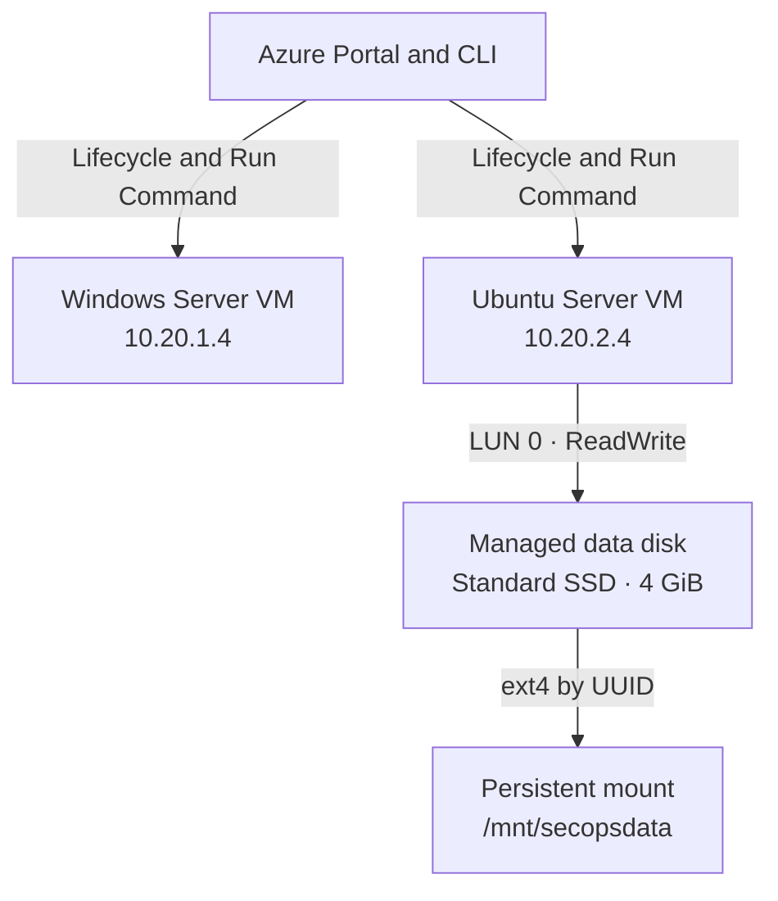

Azure Run Command provided an administrative path through the Azure control plane. It was used for validation and troubleshooting without requiring a new inbound management rule.

---

## Implementation

### 1. Inventory and lifecycle validation

The initial inventory confirmed that both VMs were deallocated. They were started with Azure CLI and validated by name, size, operating system, private IP address, location, and power state.

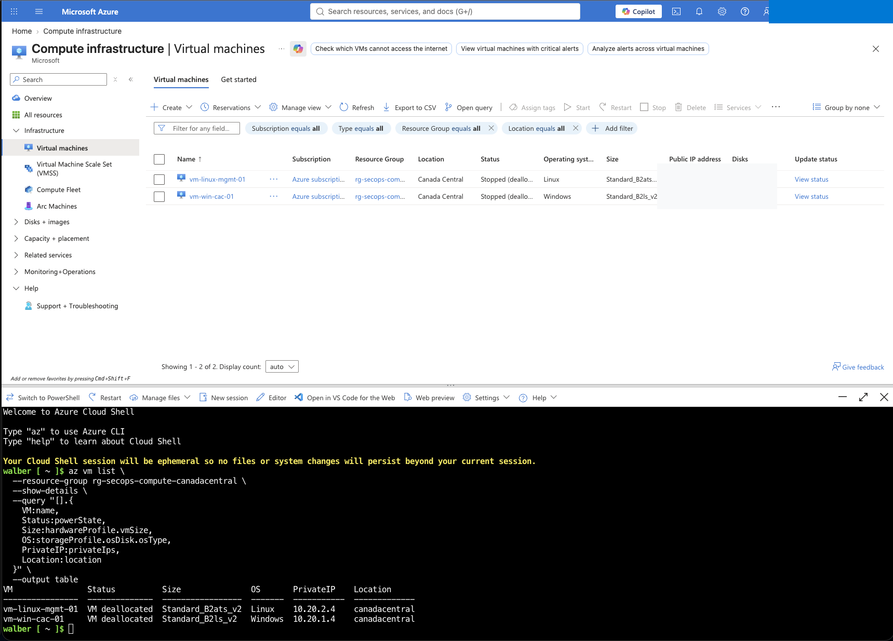

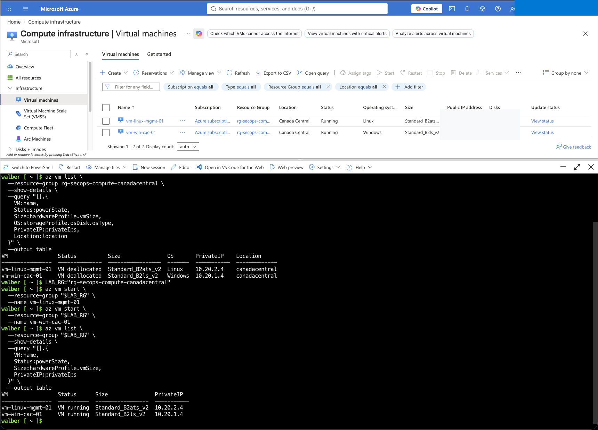

The Linux VM was then stopped to demonstrate the operational difference between the two inactive states:

- **Stopped:** the guest operating system is powered off, but compute resources remain allocated and may continue to incur compute charges.
- **Deallocated:** Azure releases the compute allocation, stopping VM compute charges while storage and other attached resources may still be billed.

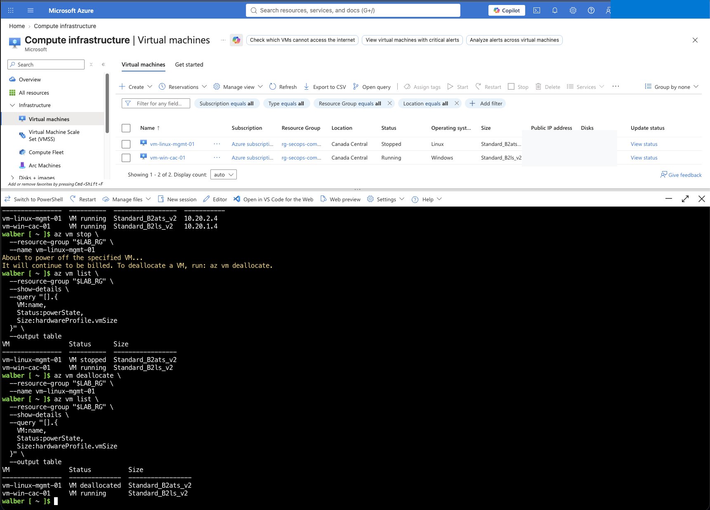

### 2. Managed disk provisioning

A 4 GiB Standard SSD LRS managed disk was created and attached to the Linux VM at LUN 0 with `ReadWrite` caching.

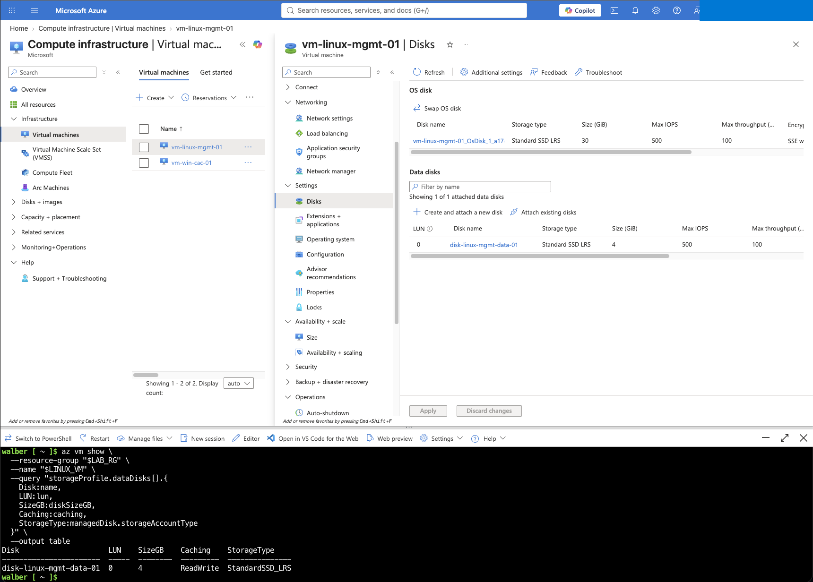

Inside Ubuntu, the disk was partitioned, formatted as `ext4`, assigned the label `secopsdata`, and mounted at `/mnt/secopsdata`. Its UUID was added to `/etc/fstab` with the `nofail` option, and a validation file was written to the new filesystem.

```text
UUID=<filesystem-uuid> /mnt/secopsdata ext4 defaults,nofail 0 2
```

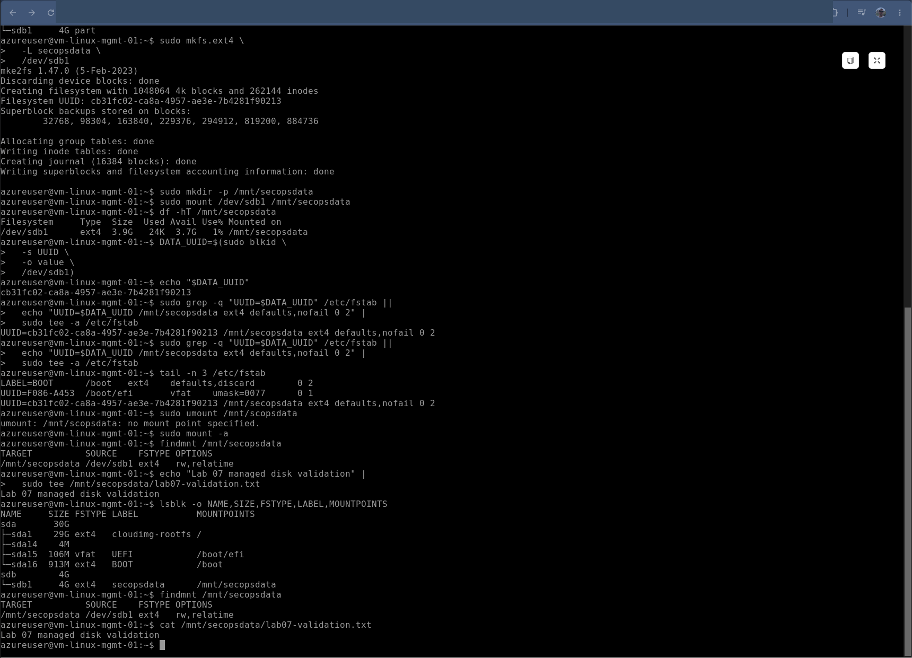

### 3. Persistence after restart

After restarting the VM, the mount point, filesystem label, and validation file remained available. This confirmed that the disk was mounted persistently through `/etc/fstab`.

An important observation was that the Linux device name changed after restart. The data partition appeared first as `/dev/sdb1` and later as `/dev/sda1`. The mount still succeeded because `/etc/fstab` referenced the filesystem UUID rather than a potentially unstable device name.

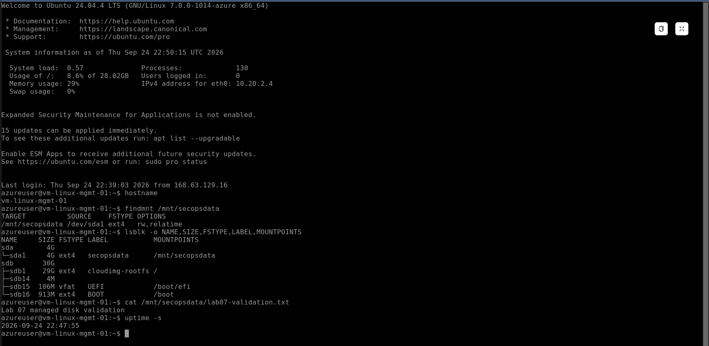

### 4. Remote diagnostics with Azure Run Command

Azure Run Command was executed from Cloud Shell against the Linux VM. It returned the hostname and uptime and confirmed the managed disk mount and the persistent validation file.

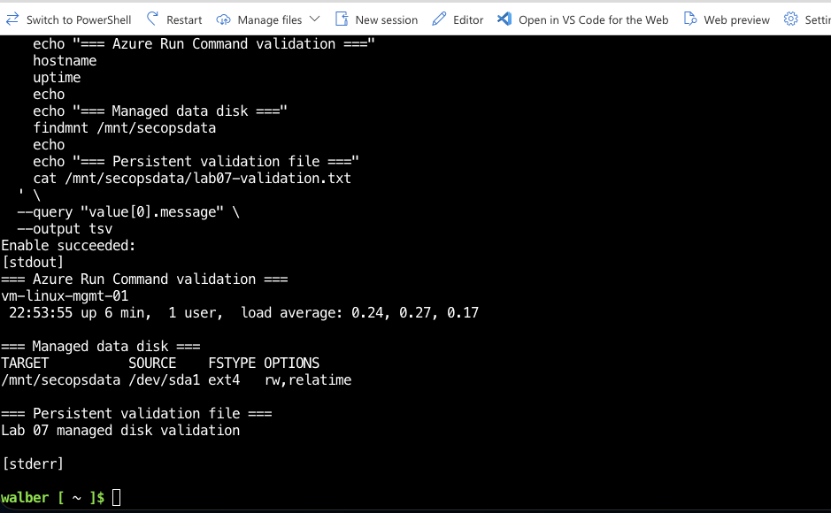

The Windows VM was also inspected remotely. The results confirmed:

- Windows Server 2022 Datacenter Azure Edition;
- TCP/3389 listening for RDP;
- Secure Boot enabled;
- virtual TPM present, ready, enabled, and activated.

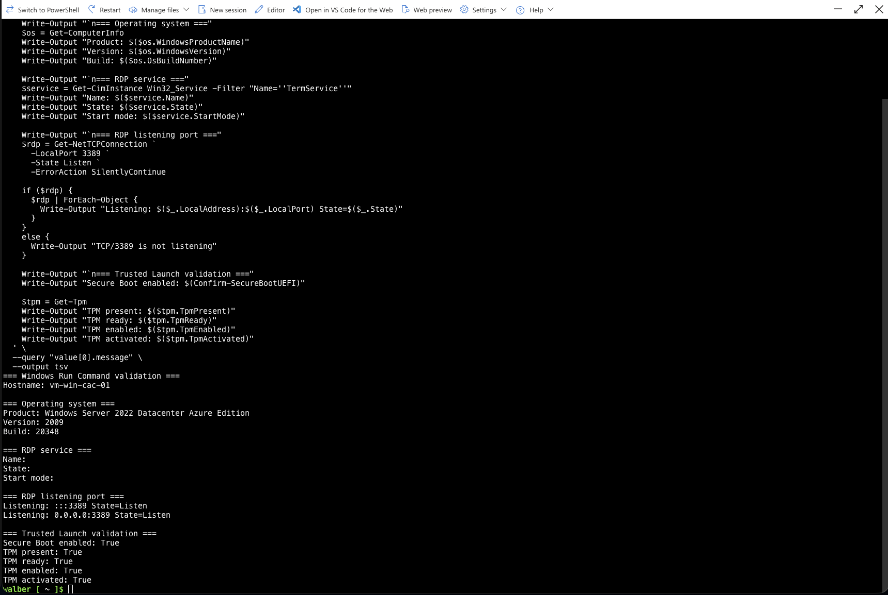

### 5. Final validation and cost control

The final inventory confirmed that both VMs were running and that the operating-system disks and managed data disk were attached to the expected workloads.

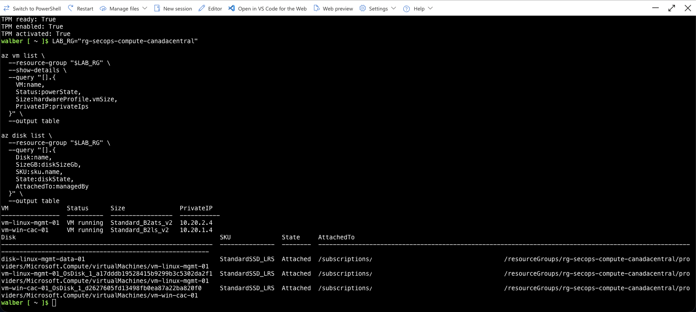

Both VMs were then deallocated. This preserved their disks and configuration while releasing the compute allocation.

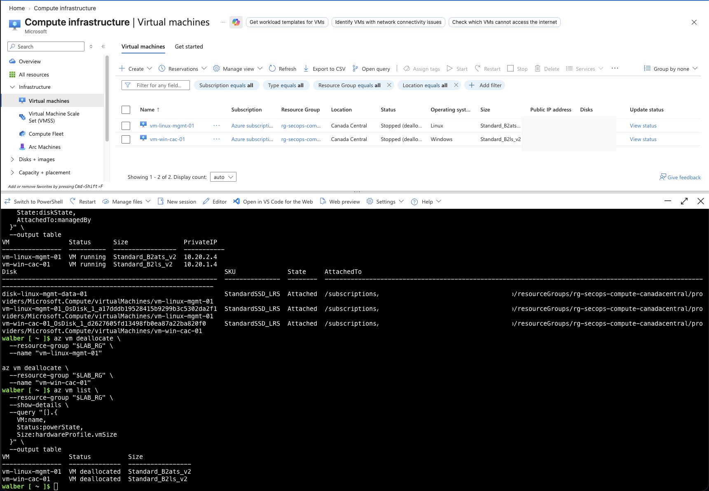

---

## Troubleshooting and Lessons Learned

### Cloud Shell is not the VM guest operating system

Running `lsblk` in Cloud Shell displayed the storage devices of the temporary Cloud Shell environment, not the disks attached to the Linux VM. Guest-level disk commands had to be executed through the VM's Bastion session.

### Azure CLI command support can vary

The installed CLI did not accept tags through `az disk update --tags`. The disk was tagged successfully by retrieving its resource ID and using `az tag update --operation Merge`.

### Device names are not reliable mount identifiers

The data disk changed from `/dev/sdb1` to `/dev/sda1` after restart. Mounting by UUID prevented this change from breaking persistent storage.

### Stopped and deallocated are not equivalent

Stopping a VM inside the operating system or with `az vm stop` does not release its Azure compute allocation. `az vm deallocate` is the correct operation when the objective is to stop compute billing.

### Deallocation does not remove every charge

Managed disks, public IP configurations, Bastion resources, and other retained services can continue to generate charges even when VM compute is deallocated.

---

## Security and Operational Relevance

This lab reinforced several practices relevant to Azure administration and security operations:

- maintaining an accurate workload inventory;
- understanding the cost and operational impact of resource states;
- using stable identifiers for persistent storage;
- validating guest security controls remotely;
- diagnosing workloads through the Azure control plane;
- avoiding unnecessary exposure of inbound management ports;
- documenting troubleshooting evidence and final resource state.

These skills support preparation for **AZ-104** administration topics and provide operational context for **SC-200** monitoring and investigation workflows used in later labs.

---

## Evidence Index

| # | Evidence | What it demonstrates |
| ---: | --- | --- |
| 01 | [Initial VM inventory](screenshots/01-vm-inventory-and-initial-power-state.png) | VM configuration and initial deallocated state |
| 02 | [VMs started](screenshots/02-vms-started-and-validated-with-azure-cli.png) | Azure CLI lifecycle control and running state |
| 03 | [Stopped vs. deallocated](screenshots/03-vm-stopped-versus-deallocated.png) | Difference between allocated and released compute |
| 04 | [Managed disk attached](screenshots/04-managed-data-disk-attached-to-linux-vm.png) | Disk size, tier, LUN, caching, and attachment |
| 05 | [Disk formatted and mounted](screenshots/05-linux-data-disk-formatted-and-mounted.png) | Partitioning, `ext4`, label, UUID, mount, and test file |
| 06 | [Persistence after restart](screenshots/06-linux-data-disk-persistence-after-restart.png) | Persistent mount and retained data |
| 07 | [Linux Run Command](screenshots/07-linux-vm-run-command-diagnostics.png) | Remote Linux validation through Azure |
| 08 | [Windows Run Command](screenshots/08-windows-vm-run-command-diagnostics.png) | OS, RDP listener, Secure Boot, and TPM validation |
| 09 | [Final resource validation](screenshots/09-lab07-resources-final-validation.png) | VM and disk relationship before shutdown |
| 10 | [VMs deallocated](screenshots/10-lab07-virtual-machines-deallocated.png) | Cost-aware final state |

---

## Result

Lab 07 was completed successfully. Both virtual machines were administered through Azure CLI, a managed data disk was configured with persistent Linux storage, guest diagnostics were performed remotely, Trusted Launch controls were validated, and the workloads were left deallocated to control cost.

