# Lab 08 — Azure Monitor, Log Analytics, AMA, DCR, and KQL

This lab builds and validates an end-to-end Windows telemetry pipeline in Azure. A Windows Server VM sends selected events through the Azure Monitor Agent (AMA), a Data Collection Rule (DCR) controls what is collected, and a Log Analytics workspace stores the records for investigation with Kusto Query Language (KQL).

The implementation deliberately uses narrow XPath filters instead of collecting every Windows event. This produces useful security telemetry while limiting unnecessary ingestion and cost.

## Objectives

- Deploy a Log Analytics workspace in Canada Central.
- Review the pay-as-you-go pricing model and configure 30-day retention.
- Create a Windows DCR and associate it with one VM.
- Deploy and validate the Azure Monitor Agent.
- Collect selected Security events and Warning/Error/Critical System events.
- Generate controlled test events without leaving a test account behind.
- Validate ingestion with Heartbeat and Event-table KQL queries.
- Translate raw event IDs into analyst-friendly activity summaries.
- Deallocate the VM after validation to control compute cost.

## Architecture

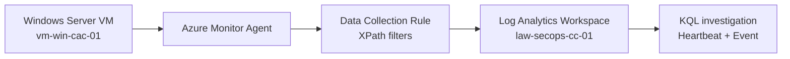

## Reusable KQL queries

The validated queries are also stored as standalone files in the repository root so they can be reused and versioned independently:

- [AMA heartbeat validation](../../kql/ama-heartbeat-validation.kql)
- [Windows account lifecycle](../../kql/windows-security-account-lifecycle.kql)
- [Windows account lifecycle summary](../../kql/windows-security-account-lifecycle-summary.kql)
- [Windows System DCR validation](../../kql/windows-system-dcr-validation.kql)

## Azure resources

| Resource | Name | Purpose |
|---|---|---|
| Resource group | `rg-secops-monitorcanadacentral` | Monitoring resources |
| Log Analytics workspace | `law-secops-cc-01` | Central log storage and KQL analysis |
| Data Collection Rule | `dcr-windows-security-events` | Event selection and delivery |
| Source VM | `vm-win-cac-01` | Windows telemetry source |
| VM resource group | `rg-secops-compute-canadacentral` | Compute resources |
| Region | `Canada Central` | Co-located monitoring and compute |

## 1. Log Analytics workspace

The workspace was created using the pay-as-you-go tier and tagged with `Environment=Lab` and `Project=Azure-SecOps-Lab`.

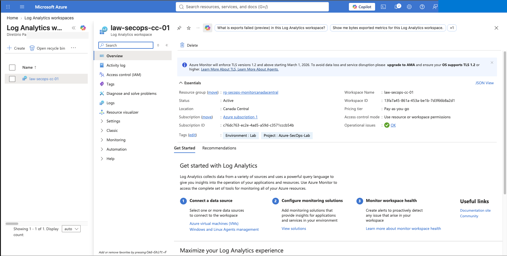

The pricing and ingestion page was reviewed before collection was enabled. Retention was set to 30 days, which is sufficient for this short-lived lab while avoiding unnecessary long-term storage.

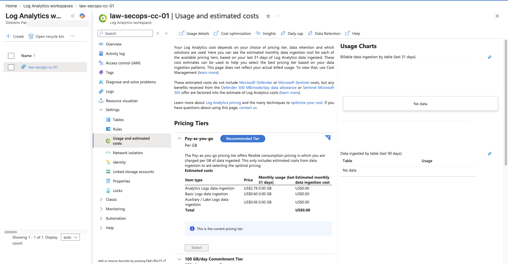

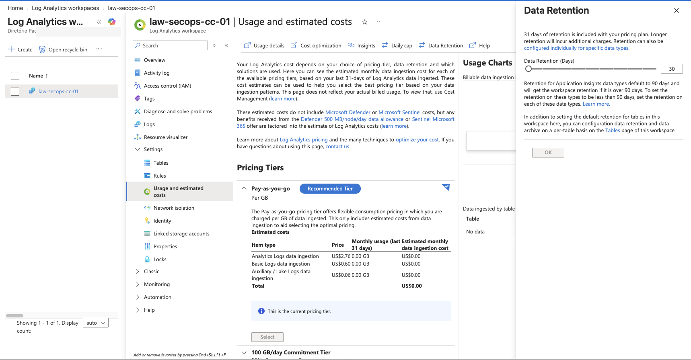

## 2. Data Collection Rule

The DCR targets only `vm-win-cac-01`, rather than the entire resource group. This follows a least-scope approach and prevents accidental onboarding of unrelated machines.

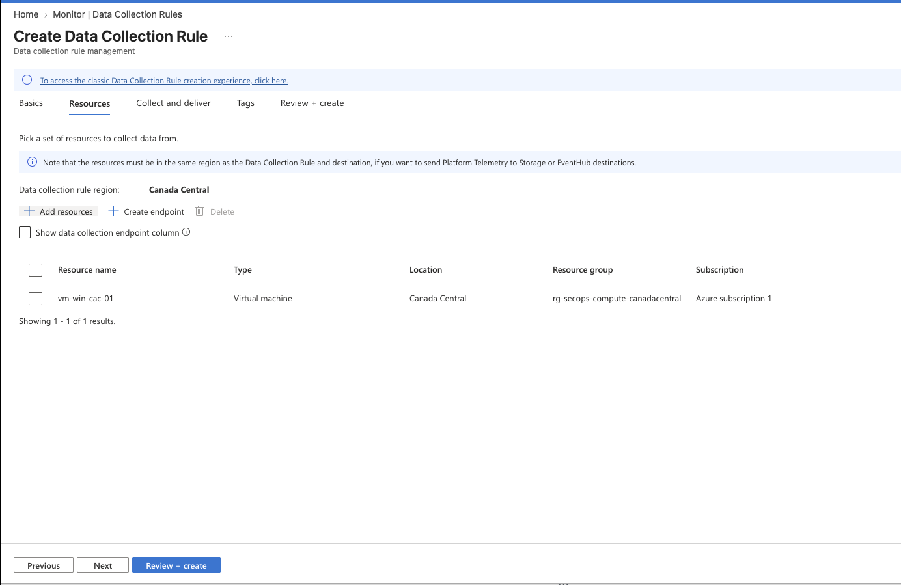

Two XPath filters were configured.

### Security log

```text
Security!*[System[(EventID=4624 or EventID=4625 or EventID=4634 or EventID=4648 or EventID=4672 or EventID=4688 or EventID=4720 or EventID=4726 or EventID=4732 or EventID=4733 or EventID=1102)]]
```

This filter focuses on authentication, privilege use, process creation, account lifecycle, local group membership changes, and audit-log clearing.

### System log

```text
System!*[System[(Level=1 or Level=2 or Level=3)]]
```

This collects only Critical, Error, and Warning events. Informational System events were excluded to reduce noise and ingestion volume.

The destination was configured as `law-secops-cc-01`.

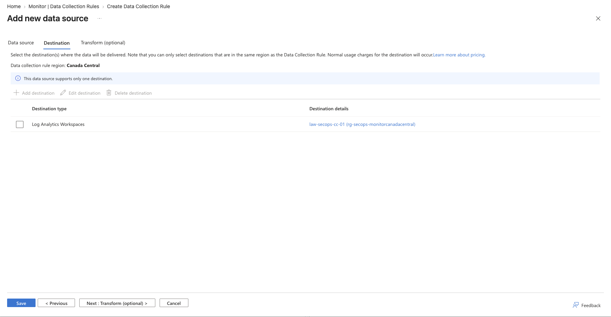

After deployment, the resource association was verified from the DCR.

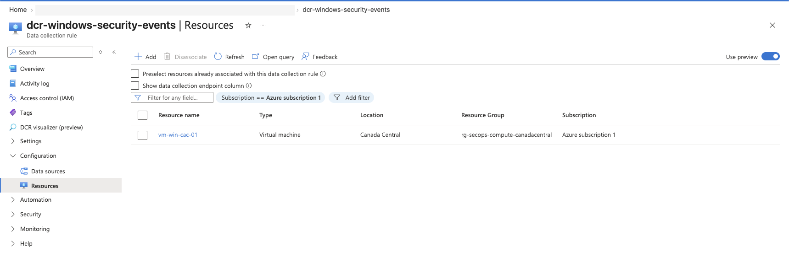

## 3. AMA and association validation

Azure CLI validation confirmed:

- DCR provisioning state: `Succeeded`;
- DCR-to-VM association present;
- `AzureMonitorWindowsAgent` extension installed;
- AMA provisioning state: `Succeeded`;
- Guest Attestation extension operational.

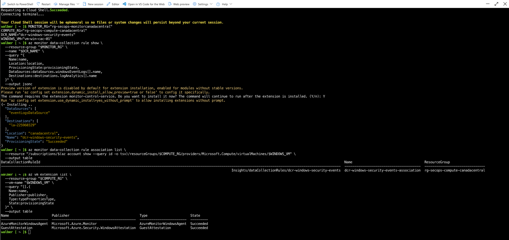

The agent was then validated at the data layer with the `Heartbeat` table:

```kusto
Heartbeat
| where TimeGenerated > ago(1h)
| where Computer startswith "vm-win-cac-01"
| project TimeGenerated, Computer, Category, Version
| order by TimeGenerated desc
```

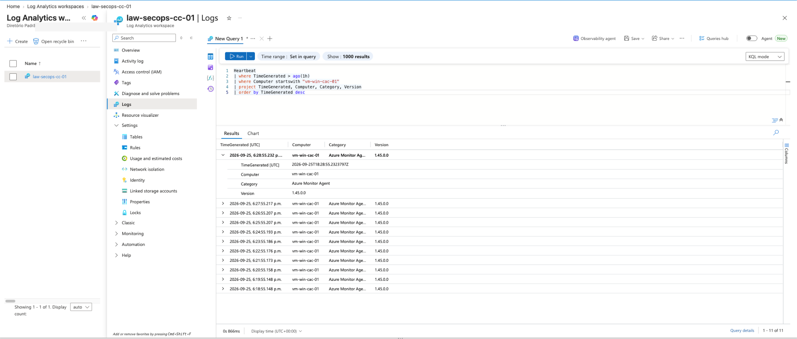

## 4. Controlled Security-event generation

A temporary local Windows account was created, added to the local Remote Desktop Users group, removed from that group, and deleted. Its password was generated in memory and was never displayed or stored. The account did not remain on the VM after the test.

Expected Windows event IDs:

| Event ID | Activity |
|---:|---|
| 4720 | Local user account created |
| 4732 | Member added to a security-enabled local group |
| 4733 | Member removed from a security-enabled local group |
| 4726 | Local user account deleted |

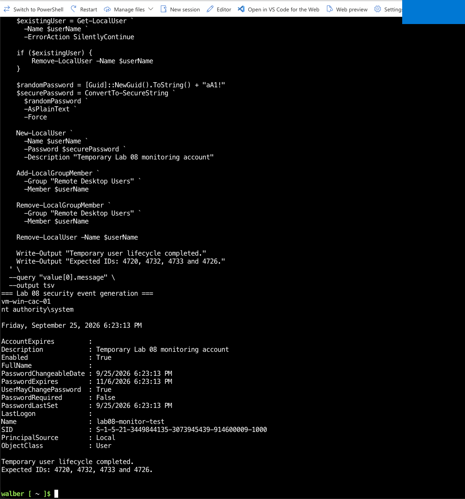

The following query confirmed that all four events reached the `Event` table:

```kusto
Event
| where TimeGenerated > ago(1h)
| where Computer startswith "vm-win-cac-01"
| where EventLog == "Security"
| where EventID in (4720, 4726, 4732, 4733)
| project TimeGenerated, Computer, EventLog, EventID, RenderedDescription
| order by TimeGenerated asc
```

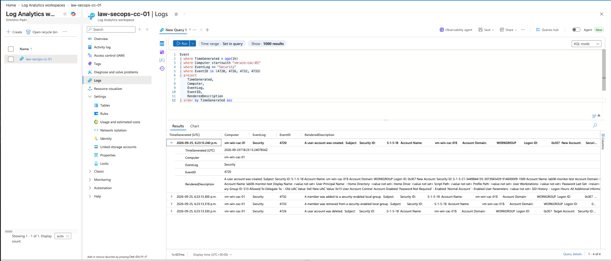

## 5. Analyst-friendly KQL summary

Raw IDs were translated into readable activities and summarized by count and time range:

```kusto
Event
| where TimeGenerated > ago(2h)
| where Computer startswith "vm-win-cac-01"
| where EventLog == "Security"
| where EventID in (4720, 4726, 4732, 4733)
| extend Activity = case(
    EventID == 4720, "Local account created",
    EventID == 4726, "Local account deleted",
    EventID == 4732, "Member added to local group",
    EventID == 4733, "Member removed from local group",
    "Other"
)
| summarize
    EventCount=count(),
    FirstSeen=min(TimeGenerated),
    LastSeen=max(TimeGenerated)
    by EventID, Activity, Computer
| order by FirstSeen asc
```

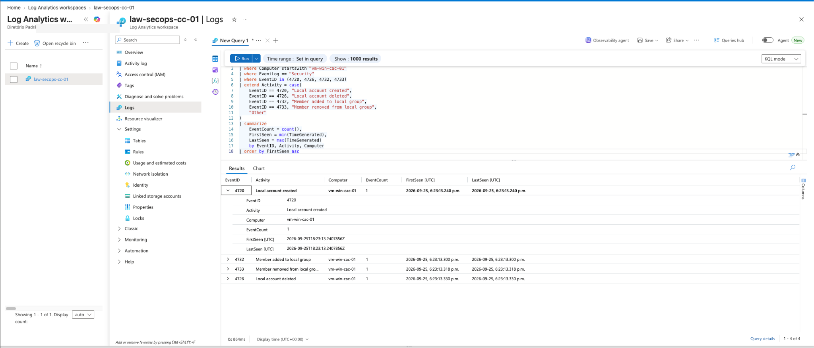

This transforms low-level telemetry into a concise account-lifecycle timeline suitable for triage or investigation.

## 6. System-event filter validation

To test the second XPath independently, a controlled Warning event was written to the Windows System log with source `Lab08Monitor` and event ID `100`.

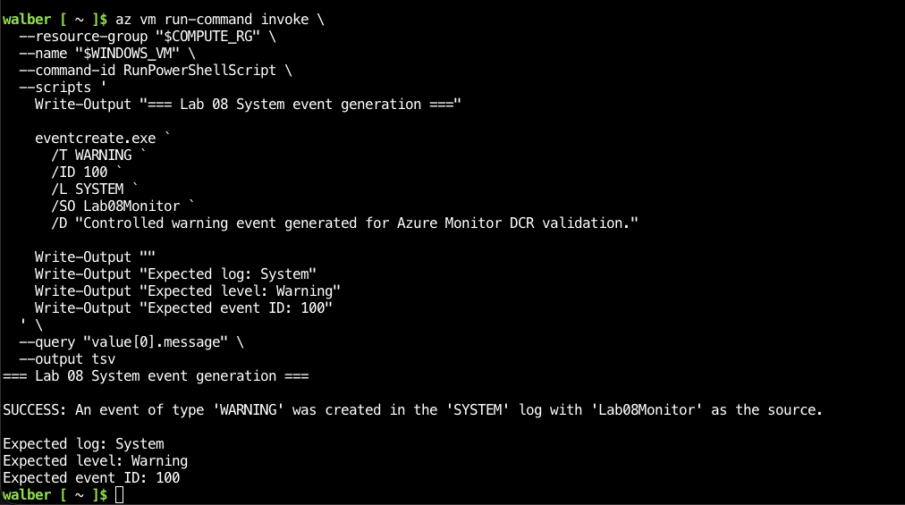

```kusto
Event
| where TimeGenerated > ago(1h)
| where Computer startswith "vm-win-cac-01"
| where EventLog == "System"
| where EventID == 100
| project TimeGenerated, Computer, EventLog,
          EventLevelName, EventID, Source, RenderedDescription
| order by TimeGenerated desc
```

The returned record confirmed the expected log, severity, source, event ID, and description.

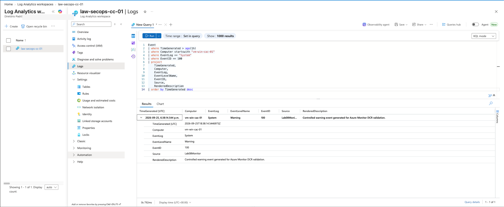

## 7. Final validation and cost control

The final CLI check confirmed:

- workspace state `Succeeded`;
- retention of 30 days;
- DCR state `Succeeded`;
- Windows event-log data source present;
- AMA extension state `Succeeded`.

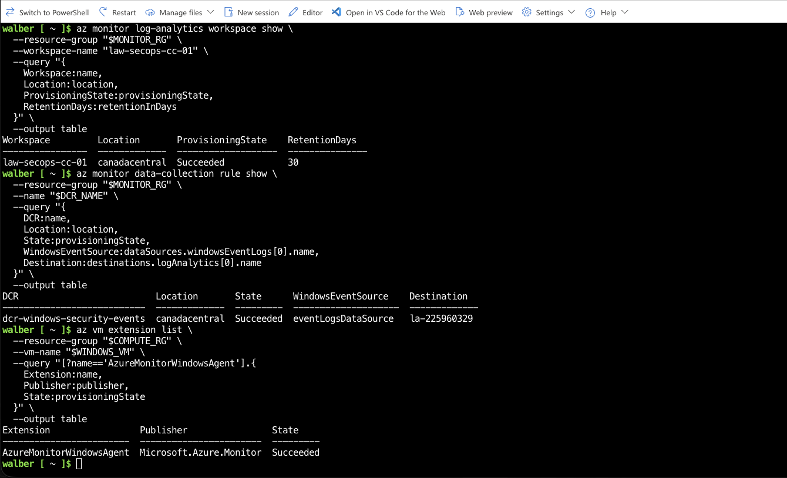

The Windows VM was then deallocated. The workspace and DCR were retained for future Microsoft Sentinel labs.

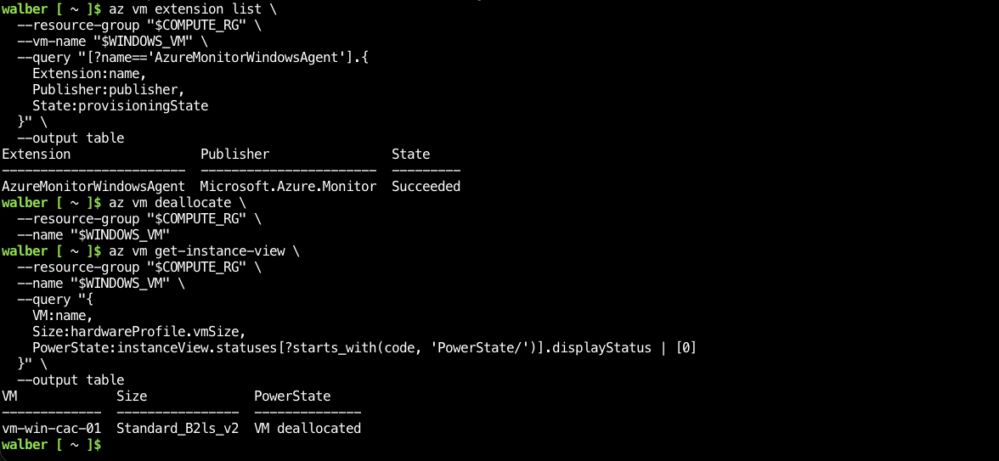

## Key findings

1. A successful AMA extension deployment does not by itself prove telemetry ingestion; the `Heartbeat` table provides data-plane confirmation.
2. A DCR should be validated at three levels: provisioning state, resource association, and expected records in Log Analytics.
3. Narrow XPath filters improve signal quality and cost control compared with collecting every Windows event.
4. Controlled event generation provides repeatable evidence that each collection filter works.
5. Generic Windows Event Logs collected through this DCR are stored in the `Event` table. A later Microsoft Sentinel connector can send Windows security events to the `SecurityEvent` table.
6. KQL can convert raw event IDs into readable investigation timelines using `extend`, `case`, and `summarize`.

## Certification alignment

### SC-200

- Manage and investigate security data in Log Analytics.
- Use KQL operators such as `where`, `project`, `extend`, `case`, `summarize`, `min`, `max`, and `order by`.
- Validate security telemetry before building analytics and incident workflows.
- Understand the monitoring pipeline that Microsoft Sentinel uses as its data foundation.

### AZ-104

- Configure Azure Monitor and Log Analytics workspaces.
- Deploy and validate Azure Monitor Agent.
- Configure Data Collection Rules and resource associations.
- Manage retention, operational validation, and cost-conscious VM lifecycle.

## Evidence index

The `screenshots` directory contains the complete chronological evidence set:

1. Workspace review and creation
2. Workspace deployment completion
3. Workspace overview
4. Usage and estimated costs
5. Data retention
6. VM association during DCR creation
7. Event-log source and destination
8. DCR review and creation
9. DCR deployment completion
10. Deployed resource association
11. DCR, association, and AMA validation
12. Controlled Security-event generation
13. AMA Heartbeat validation
14. Security-event investigation
15. Analyst-friendly KQL summary
16. Controlled System Warning generation
17. System-event investigation
18. Final monitoring-resource validation
19. VM deallocation

## Result

The lab successfully demonstrated an end-to-end, cost-conscious Windows monitoring pipeline with selective event collection, agent and association validation, controlled telemetry generation, and KQL-based investigation. The resulting Log Analytics workspace is ready to support the next stage of the project: Microsoft Sentinel onboarding and security analytics.
