# Lab 09 — Microsoft Sentinel and Azure Activity Connector

## Overview

This lab onboarded the existing Log Analytics workspace to Microsoft Sentinel, connected it to the Microsoft Defender portal, installed the Azure Activity solution, and configured subscription-level Activity Log ingestion.

The implementation was validated end to end through Azure Policy compliance, a subscription diagnostic setting, the `AzureActivity` table, reusable KQL queries, and connector health.

> Configure → Test → Validate → Troubleshoot → Document

## Objectives

- Enable Microsoft Sentinel on the existing Log Analytics workspace.
- Connect the Sentinel workspace to the Microsoft Defender portal.
- Install the Azure Activity solution from Content Hub.
- Configure Azure Activity ingestion through Azure Policy.
- Remediate the existing subscription and deploy its diagnostic setting.
- Generate a controlled administrative event.
- Validate ingestion with KQL and connector status.
- Preserve sanitized evidence for a public portfolio.

## Environment

| Component | Configuration |
| --- | --- |
| Region | Canada Central |
| Log Analytics workspace | `law-secops-cc-01` |
| Monitoring resource group | `rg-secops-monitorcanadacentral` |
| SIEM | Microsoft Sentinel |
| Portal integration | Microsoft Defender portal |
| Content solution | Azure Activity |
| Ingested table | `AzureActivity` |
| Policy effect | `DeployIfNotExists` |
| Retention | 30 days |

## Architecture

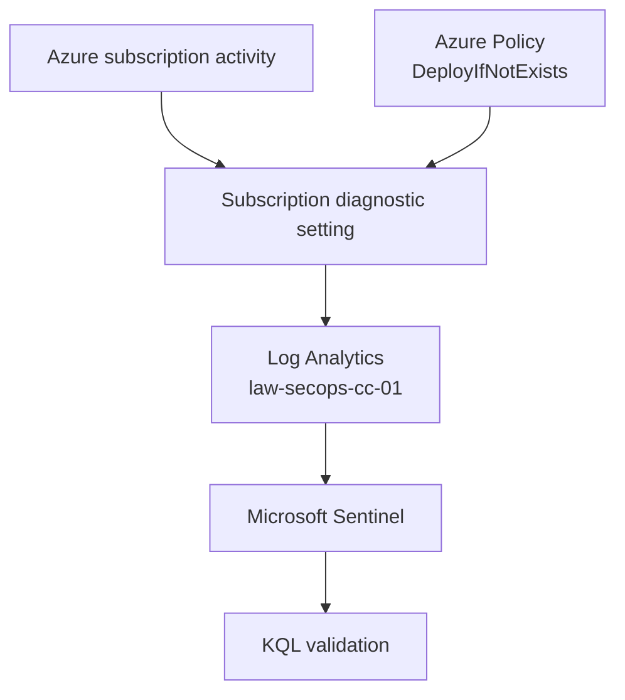

## Implementation and Evidence

### 1. Microsoft Sentinel onboarding

Microsoft Sentinel was enabled on `law-secops-cc-01`, and the workspace entered the Sentinel free-trial period.

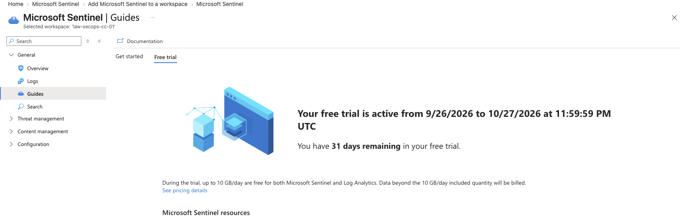

The workspace was connected to the Microsoft Defender portal and identified as the primary SIEM workspace.

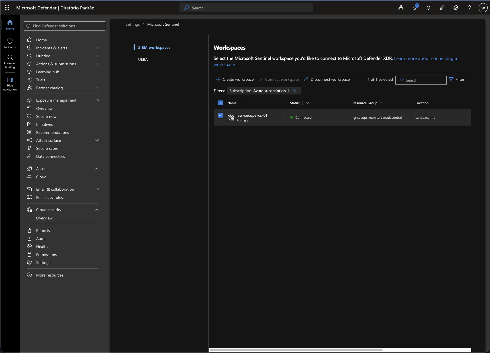

Azure CLI validation confirmed successful workspace provisioning, 30-day retention, and the Sentinel onboarding state.

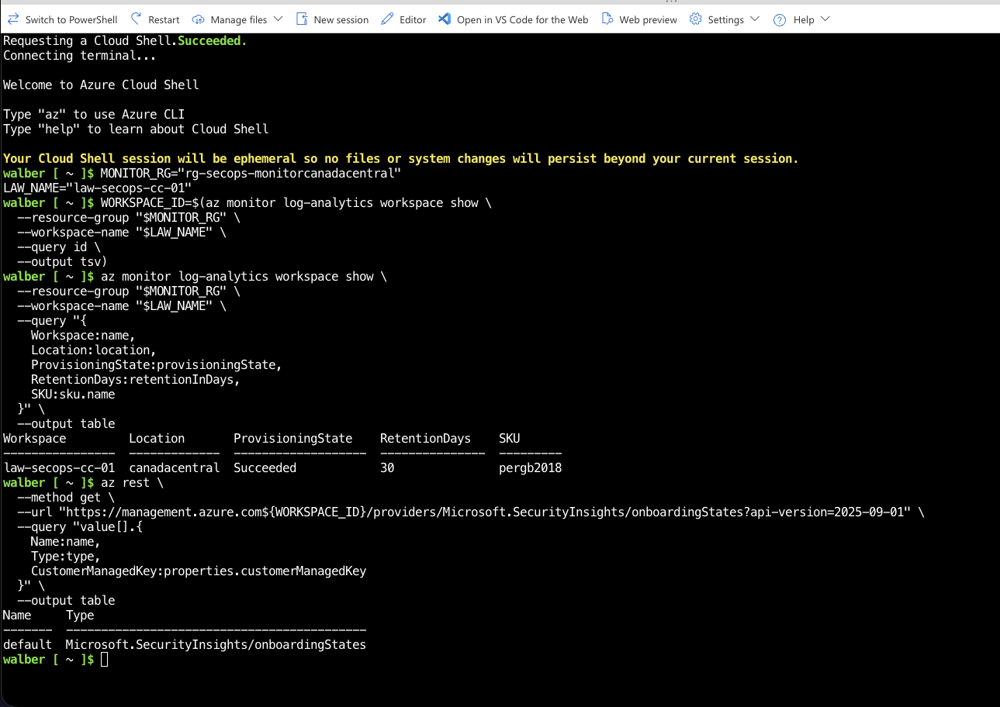

### 2. Azure Activity solution

The Azure Activity solution was installed from Content Hub, making its connector, queries, and analytics-rule templates available.

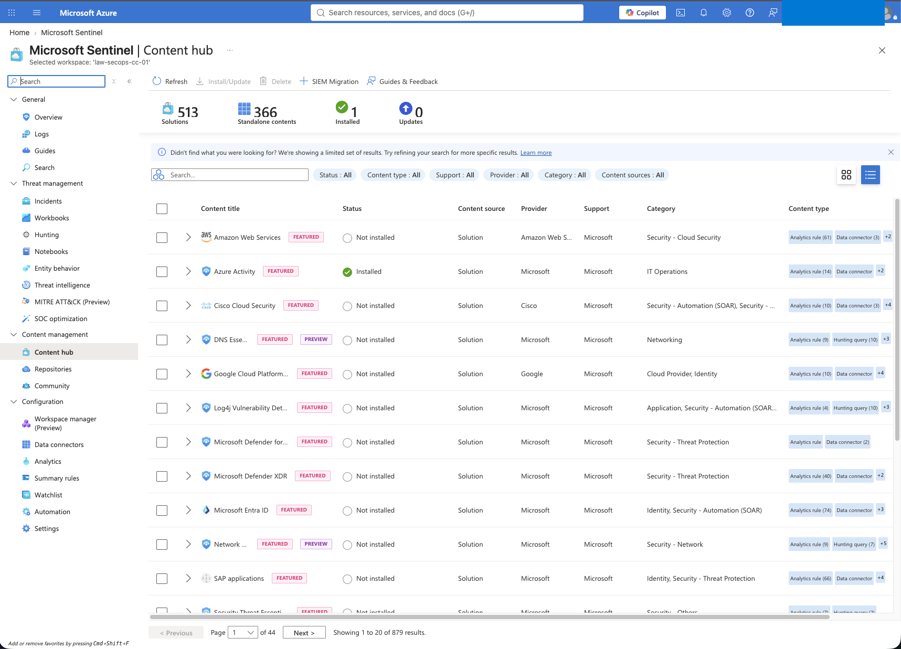

Before configuration, the connector reported `Not connected` and no received events, creating a clear baseline.

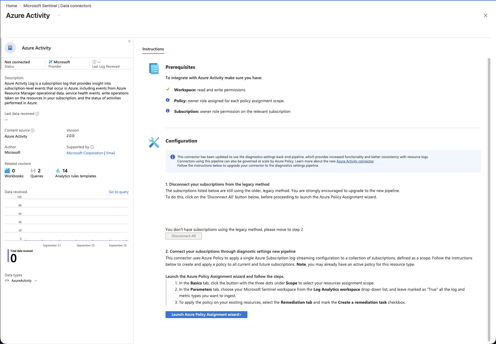

### 3. Subscription-level policy assignment

The connector's diagnostic-settings pipeline was configured with the built-in policy:

```text
Configure Azure Activity logs to stream to specified Log Analytics workspace
```

The assignment used subscription scope, the existing workspace, default enforcement, a system-assigned managed identity, and remediation for the current subscription.

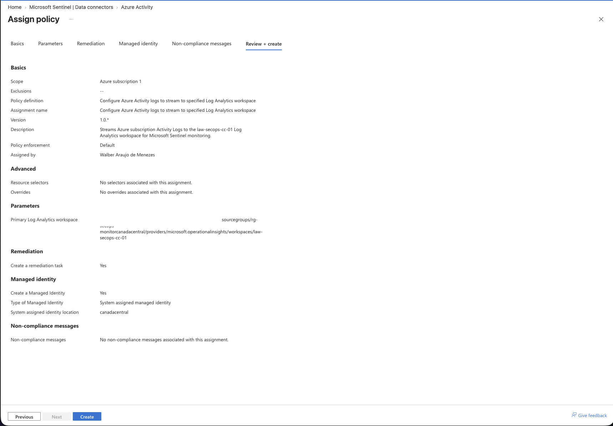

The portal confirmed creation of the policy assignment, role assignments, and remediation task.

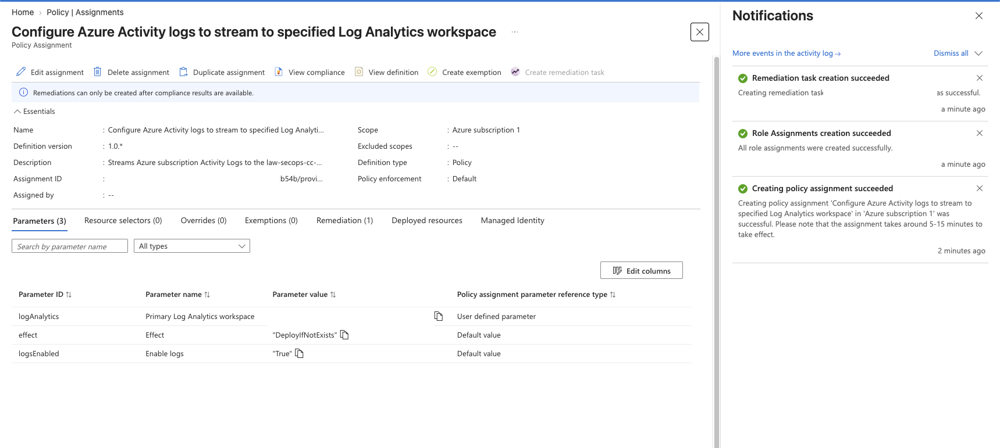

### 4. Remediation and diagnostic setting

Policy operations were asynchronous. The first validation returned no diagnostic setting and the connector remained disconnected. After evaluation and remediation completed, the subscription was remediated successfully.

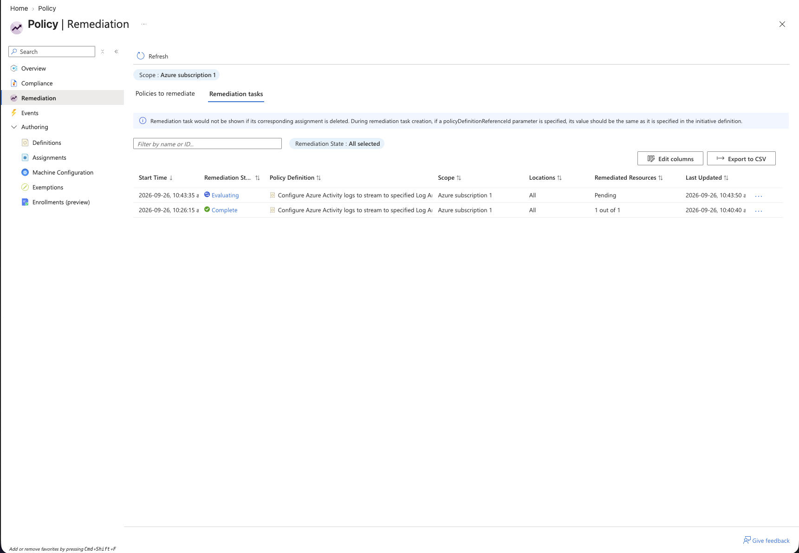

The diagnostic setting and its workspace destination were then confirmed with Azure CLI:

```bash
az monitor diagnostic-settings subscription list \
  --query "value[].{Name:name,Workspace:workspaceId}" \
  --output table
```

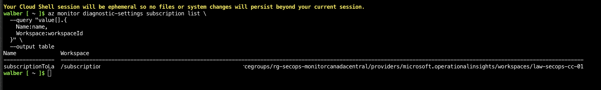

### 5. Controlled event and KQL validation

A controlled resource-tag write generated recognizable Azure Activity events. The detailed query returned `MICROSOFT.RESOURCES/TAGS/WRITE`, policy evaluation, deployment, and diagnostic-setting activity.

```kusto
AzureActivity
| where TimeGenerated > ago(2h)
| project
    TimeGenerated,
    OperationNameValue,
    ActivityStatusValue,
    CategoryValue,
    ResourceGroup
| order by TimeGenerated desc
```

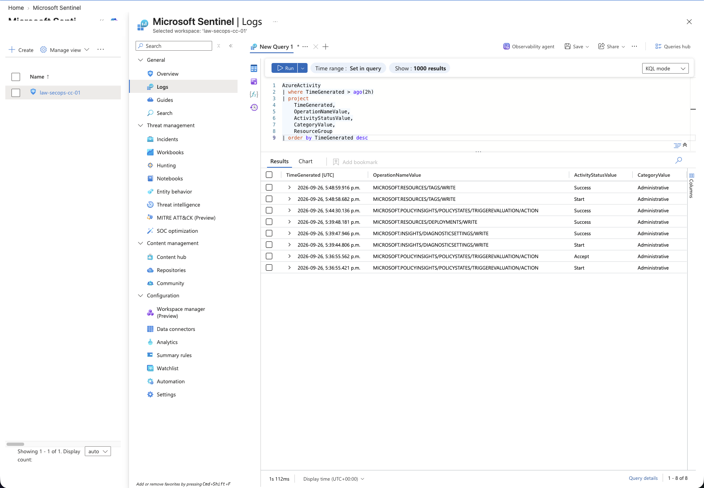

The summary query grouped events by category and status.

```kusto
AzureActivity
| where TimeGenerated > ago(24h)
| summarize
    EventCount = count(),
    FirstSeen = min(TimeGenerated),
    LastSeen = max(TimeGenerated)
    by CategoryValue, ActivityStatusValue
| order by EventCount desc
```

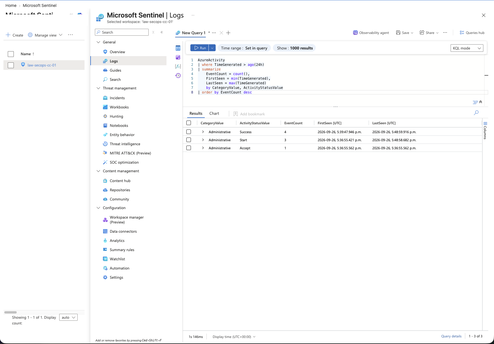

### 6. Final validation

The connector changed to `Connected`, displayed a recent last-log timestamp, and reported eight ingested records.

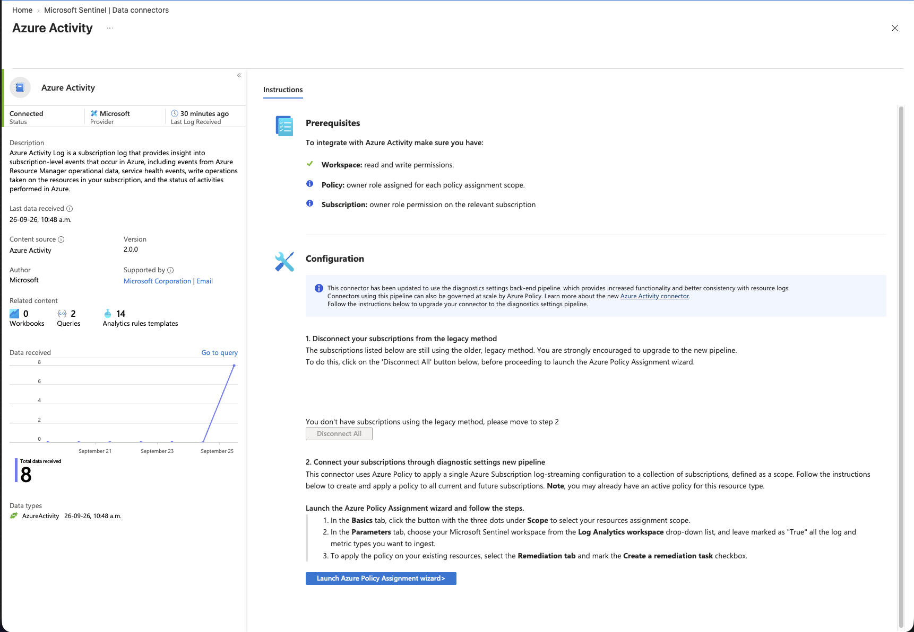

Azure Policy reported 100% compliance for the assignment.

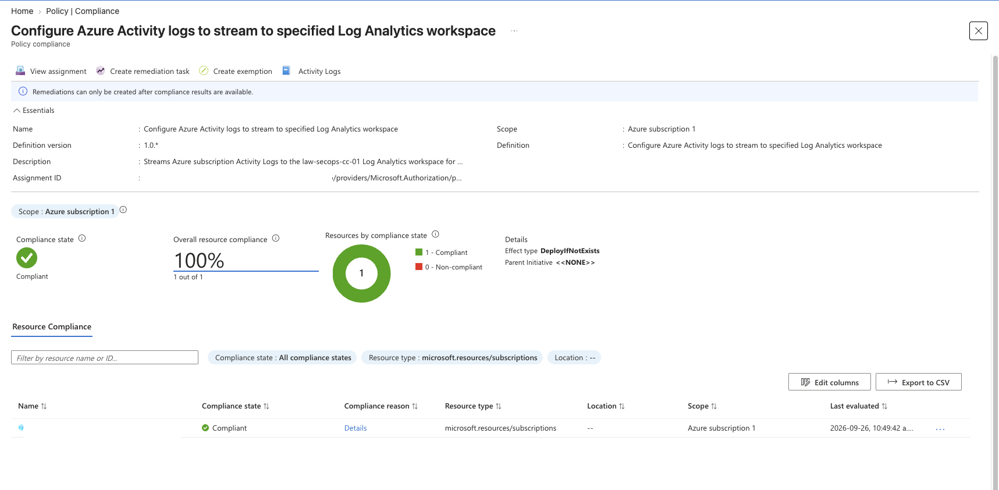

## Validation Results

| Check | Result |
| --- | --- |
| Sentinel onboarding state exists | Passed |
| Workspace connected to Defender | Passed |
| Azure Activity solution installed | Passed |
| Policy assignment created | Passed |
| Remediation completed | Passed |
| Subscription diagnostic setting exists | Passed |
| `AzureActivity` table receives events | Passed |
| Controlled tag-write event observed | Passed |
| Azure Activity connector connected | Passed |
| Policy compliance | 100% |

## Troubleshooting

### Content Hub portal redirection

The Azure portal initially redirected to the Defender portal, while Defender returned to the Sentinel workspace view. A hard reload refreshed Content Hub and displayed the solutions.

### Connector remained disconnected

Creating the assignment did not immediately create the diagnostic setting. A policy scan was triggered, remediation was monitored, and the diagnostic setting was validated before KQL was retried.

### Initial KQL query returned no records

The table had no data while the diagnostic setting was absent. After remediation and propagation, it received policy, deployment, diagnostic-setting, and controlled tag-write events.

## Reusable Artifacts

- [`azure-activity-events.kql`](../../kql/azure-activity-events.kql)
- [`azure-activity-summary.kql`](../../kql/azure-activity-summary.kql)
- [`lab-09-sentinel-data-flow.md`](../../architecture/lab-09-sentinel-data-flow.md)
- [`lab-09-evidence-register.md`](../../docs/lab-09-evidence-register.md)
- [`lab-09-lessons-learned.md`](../../docs/lab-09-lessons-learned.md)

No detection or incident artifact was created because this lab did not yet create an analytics rule or investigate an incident. Those folders will be populated only after validated work exists.

## Skills Practiced

- Microsoft Sentinel onboarding
- Microsoft Defender portal integration
- Sentinel Content Hub and data connectors
- Azure Policy assignment and remediation
- Managed identities and role assignments
- Subscription diagnostic settings
- Log Analytics ingestion validation
- KQL querying and summarization
- SIEM troubleshooting
- Privacy-conscious evidence documentation

## Key Takeaways

- Installing a Content Hub solution does not connect its data source by itself.
- Azure Activity collection uses a subscription diagnostic setting governed by Azure Policy.
- Assignment, evaluation, remediation, deployment, compliance, and data ingestion update independently.
- Direct table queries provide stronger ingestion evidence than connector status alone.
- Controlled administrative activity provides an explainable validation event.

## Outcome

Microsoft Sentinel is operational on the existing Log Analytics workspace and receives subscription-level Azure Activity Logs. The environment is ready for the dedicated KQL, analytics-rule, incident-investigation, and threat-hunting labs.
