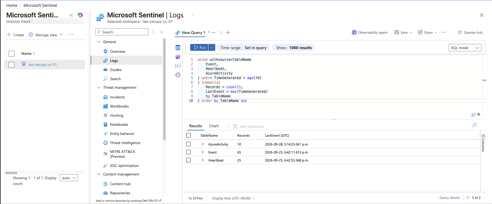
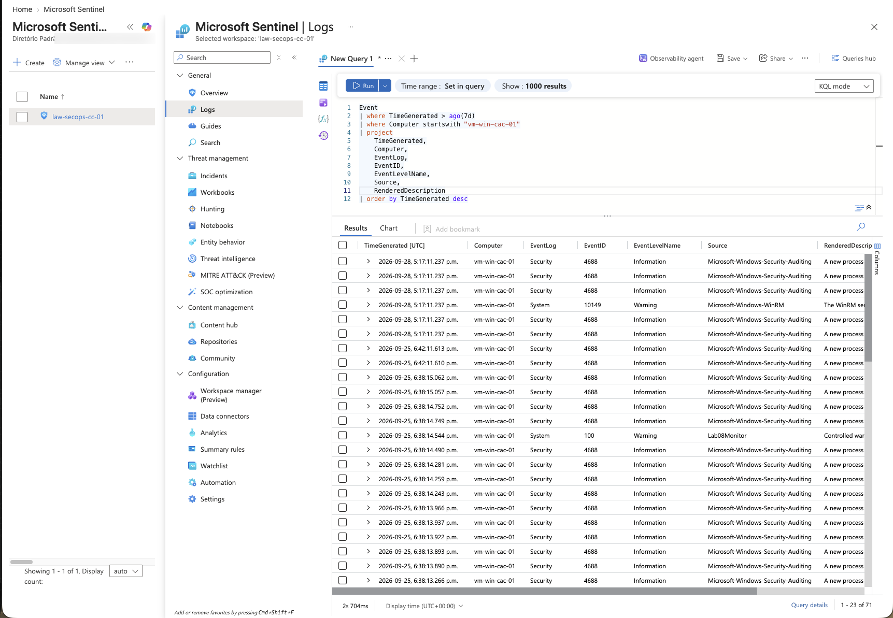
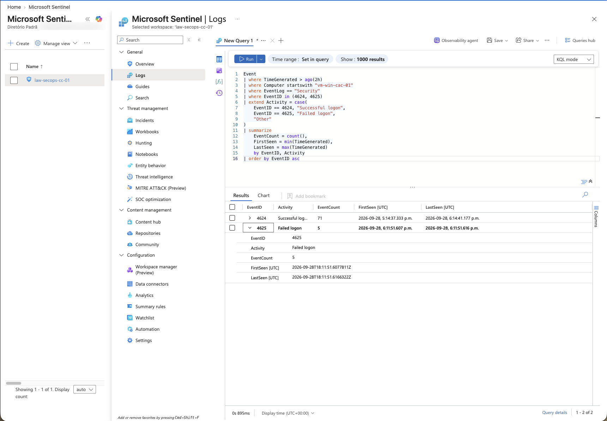
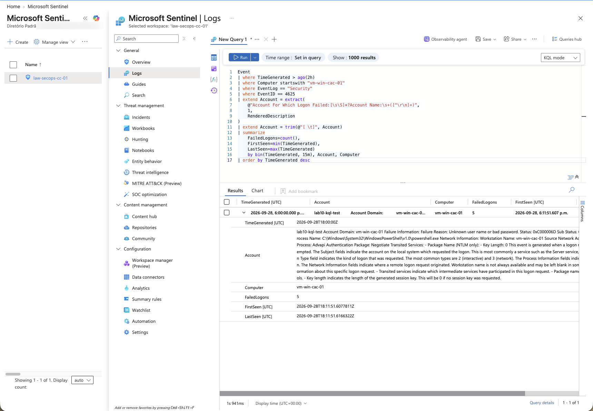
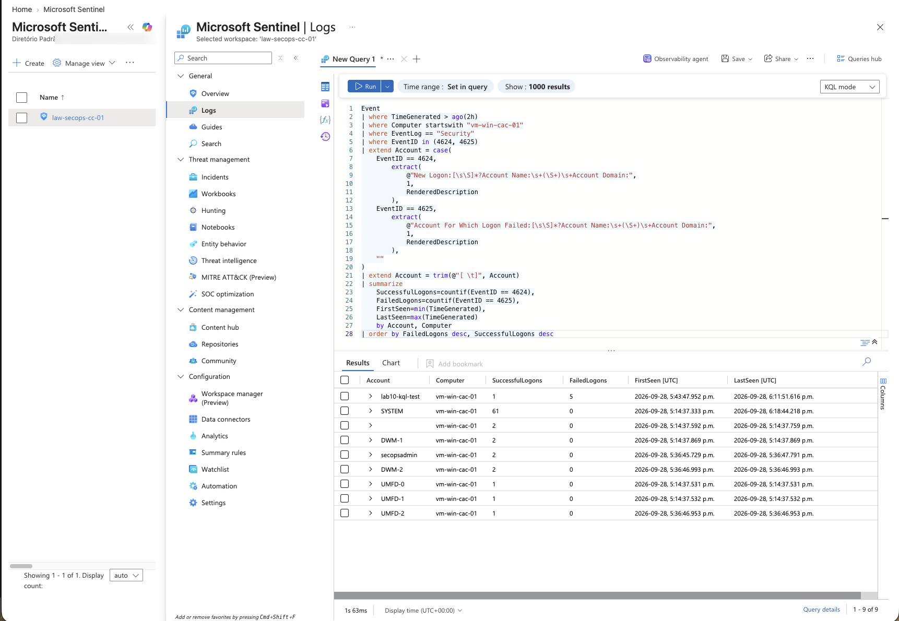
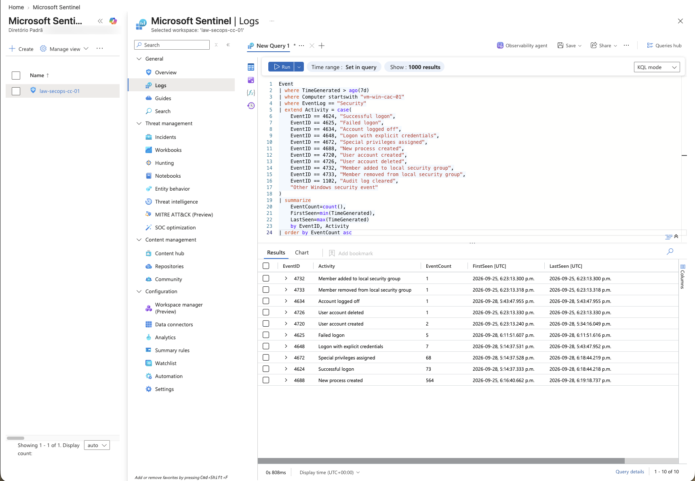
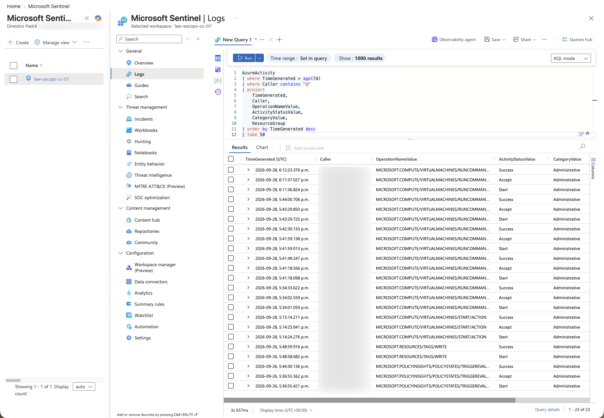
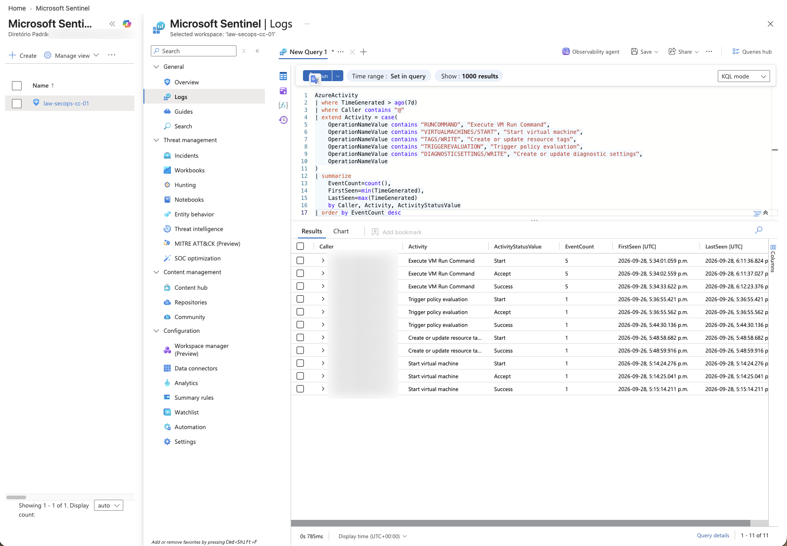
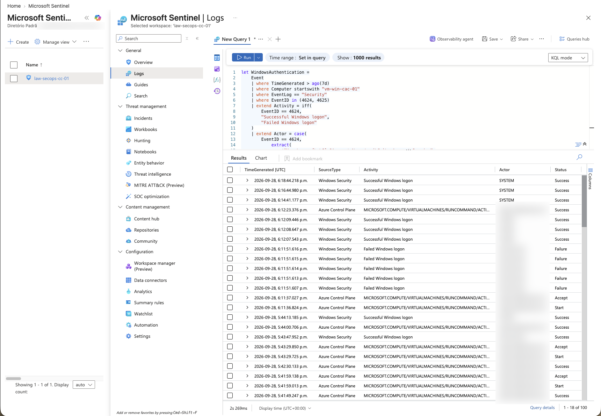
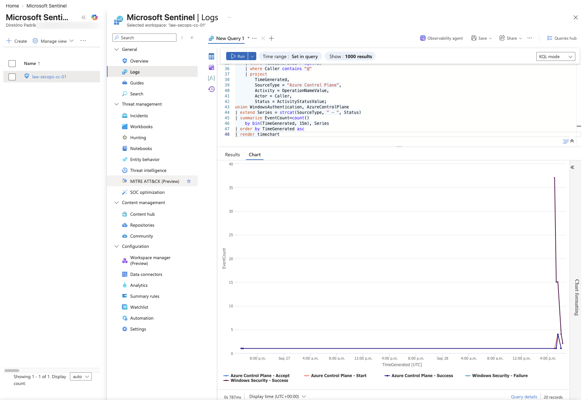

# Lab 10 — KQL Investigation Fundamentals

## Overview

This lab turns the telemetry collected in Labs 08 and 09 into a structured security investigation. The goal was not to write isolated KQL examples, but to follow an analyst workflow: confirm the data is current, understand the Windows baseline, investigate authentication, surface unusual security events, review Azure control-plane activity, and finally correlate both sources on one timeline.

The investigation uses three tables:

- `Heartbeat` to confirm monitoring activity;
- `Event` for Windows Security and System events collected through Azure Monitor Agent and a Data Collection Rule;
- `AzureActivity` for subscription-level control-plane operations ingested by Microsoft Sentinel.

> In this environment, Windows events are stored in `Event`, not `SecurityEvent`. Query design must follow the table and schema actually produced by the DCR.

## Objectives

- Validate that the expected telemetry sources contain recent data.
- Build a readable Windows event baseline.
- Distinguish successful logons (`4624`) from failed logons (`4625`).
- Extract account names from `RenderedDescription` despite different event layouts.
- Identify low-frequency Windows Security event IDs.
- Translate raw Azure operations into readable activities.
- Correlate endpoint authentication and Azure control-plane events.
- Preserve reusable, commented KQL queries for future investigations.

## Investigation flow

| Step | Question | Evidence | Query |
| --- | --- | --- | --- |
| 1 | Is the expected telemetry available and current? | Screenshot 01 | [`lab10-01-data-source-validation.kql`](../../kql/lab10-01-data-source-validation.kql) |
| 2 | What Windows events are being collected? | Screenshot 02 | [`lab10-02-windows-event-baseline.kql`](../../kql/lab10-02-windows-event-baseline.kql) |
| 3 | Are both successful and failed logons visible? | Screenshots 03–05 | [`lab10-03-authentication-investigation.kql`](../../kql/lab10-03-authentication-investigation.kql) |
| 4 | Which security events are rare in this window? | Screenshot 06 | [`lab10-04-rare-windows-security-events.kql`](../../kql/lab10-04-rare-windows-security-events.kql) |
| 5 | What changed in the Azure control plane? | Screenshots 07–08 | [`lab10-05-azure-control-plane-investigation.kql`](../../kql/lab10-05-azure-control-plane-investigation.kql) |
| 6 | How do endpoint and cloud events align in time? | Screenshot 09 | [`lab10-06-unified-security-timeline.kql`](../../kql/lab10-06-unified-security-timeline.kql) |
| 7 | Is a visual time-series useful for this window? | Screenshot 10, optional | [`lab10-07-security-events-timechart.kql`](../../kql/lab10-07-security-events-timechart.kql) |

## 1. Validate the telemetry before investigating

The first query summarized row counts and the most recent event in each table. This immediately confirmed that the workspace contained the three data sources required by the lab and exposed their different ingestion volumes.



This is an important first step: a syntactically correct query can still return misleading results when the source is stale, absent, or being written to a different table.

## 2. Establish the Windows event baseline

The next query filtered the VM and projected only the fields needed for analysis. The result confirmed Security and System events, including process creation (`4688`) and a controlled System warning from the earlier monitoring lab.



The baseline also showed why narrow projection matters. Removing unused columns made the event stream easier to scan while retaining the original rendered message for deeper inspection.

## 3. Investigate Windows authentication

### Controlled test

A temporary local account named `lab10-kql-test` was used to generate a controlled authentication pattern. The intended result was five failed attempts followed by a successful authentication event.

The first attempt to produce the events interactively through Bastion did not behave as expected. `runas` returned `Unable to acquire user password`, which pointed to the secure-input and session context rather than proving that the account password was wrong. A second attempt with `Start-Process -Credential` generated the failed attempts, but the successful process launch returned `Access is denied` because Azure VM Run Command executes in a non-interactive system context.

The reliable method was to:

1. Enable success and failure auditing for the Windows `Logon` subcategory with `auditpol`.
2. Call the native Windows `LogonUser` API through PowerShell and Azure VM Run Command.
3. Submit five intentionally incorrect passwords.
4. Confirm Windows error `1326`, which is expected for an unknown username or bad password.
5. Wait for AMA and the DCR ingestion pipeline before querying the workspace.

### Confirm event availability

The result contained both `4624` and `4625`. Five failed logons appeared in a very narrow time window, matching the controlled test.



### Group failed attempts into 15-minute bins

The failed attempts were grouped by time window, computer, and extracted account. Binning changes the analyst's view from individual records to a pattern that can later support threshold-based detections.



### Compare activity by account

Events `4624` and `4625` store account information in different sections of `RenderedDescription`. The query therefore uses separate regular expressions for `New Logon` and `Account For Which Logon Failed` before summarizing both event types.



The test account produced the expected five failures and one successful logon. Built-in accounts such as `SYSTEM`, `DWM-*`, and `UMFD-*` also appeared, demonstrating why account context is necessary before treating authentication volume as suspicious.

## 4. Hunt for low-frequency Windows Security events

The next query mapped raw event IDs to readable activities and sorted by ascending count. This surfaced rare account and local-group changes before high-volume events such as process creation.



Examples visible in the investigation window included:

- `4720` and `4726` — user account created and deleted;
- `4732` and `4733` — member added to and removed from a local security group;
- `4648` — logon with explicit credentials;
- `4672` — special privileges assigned;
- `4688` — new process created, the highest-volume event in this sample.

Low frequency is not proof of malicious behavior. It is a prioritization technique that helps an analyst decide which events deserve context and validation.

## 5. Review Azure control-plane activity

The raw `AzureActivity` view showed who initiated each operation, its lifecycle state, category, and resource group. Azure commonly records separate `Start`, `Accept`, and `Success` rows for one logical action, so these records should not automatically be interpreted as three independent changes.



The summary query translated long operation names into readable activities. It identified VM Run Command execution, VM start activity, tag changes, policy evaluation, and diagnostic-setting changes.



This translation step makes the result useful beyond the person who wrote the query. An investigation should communicate meaning, not only return raw platform identifiers.

## 6. Build a unified security timeline

Two normalized datasets were created with `let` statements:

- Windows authentication, with `SourceType`, `Activity`, `Actor`, and `Status`;
- Azure control-plane events projected into the same schema.

After `union`, the combined table showed failed logons for the controlled account alongside Azure VM Run Command activity performed by the cloud operator.



This view tells the clearest story in the lab: a cloud-side administrative operation can be placed beside the Windows events it helped generate. The relationship is temporal evidence and useful context, not by itself proof of causation.

## 7. Optional visualization

The same normalized data was summarized into 15-minute intervals and rendered as a time chart.



The chart is retained as optional evidence. Because the observation window was short and most activity occurred close together, it mainly shows one spike. For this lab, the detailed unified timeline is more informative than the visualization.

## Key findings

- Data freshness must be checked before interpreting an empty or incomplete result.
- Audit policy and DCR scope both influence which Windows events reach the workspace.
- Successful and failed logon events require different parsing logic.
- Controlled failed logons became visible only after the audit setting, generation method, and ingestion delay were handled correctly.
- Built-in Windows accounts create expected background activity that must be separated from user behavior.
- Sorting by low event count is useful for triage but does not establish maliciousness.
- Azure Activity records the lifecycle stages of control-plane operations.
- Normalizing multiple sources into a common schema makes cross-layer investigation possible.

## Troubleshooting lessons

| Symptom | Cause or finding | Resolution |
| --- | --- | --- |
| No `4625` events in the first query | Failure auditing or event generation had not produced collectible records | Enabled `Logon` success and failure auditing and generated controlled failures |
| `runas` could not acquire the password | Bastion/console secure-input behavior did not provide a reliable test path | Used a non-interactive native Windows authentication API |
| Correct credential launch returned `Access is denied` | `Start-Process -Credential` ran under the VM Run Command system context | Used `LogonUser` to validate credentials without starting an interactive process |
| Events were not immediately visible | AMA/DCR ingestion is asynchronous | Waited for ingestion and reran the validation query |
| Account parsing returned extra text | `4624` and `4625` have different rendered-message layouts | Applied event-specific regular expressions |
| Chart was less informative than the table | Most events occurred in a short time window | Kept the chart optional and used the unified timeline as primary evidence |

## Cleanup

After validation, remove the disposable test account and deallocate the VM to limit both risk and cost:

```powershell
Remove-LocalUser -Name "lab10-kql-test"
```

```bash
az vm deallocate \
  --resource-group "rg-secops-compute-canadacentral" \
  --name "vm-win-cac-01"
```

Verify the account is absent and the VM power state is `VM deallocated` before considering cleanup complete.

## Evidence and privacy

The screenshots preserve the query logic and technical results while masking the tenant identifier and operator email address. No password, secret, subscription ID, or authentication token is included. Resource names are retained because they are part of the documented lab design.

## Skills demonstrated

- KQL filtering, projection, extraction, aggregation, binning, ordering, and visualization
- Schema-aware Windows event parsing
- Controlled authentication testing
- Windows audit-policy validation
- Rare-event triage
- Azure control-plane analysis
- Cross-source normalization and timeline correlation
- Evidence sanitization and security-focused documentation
