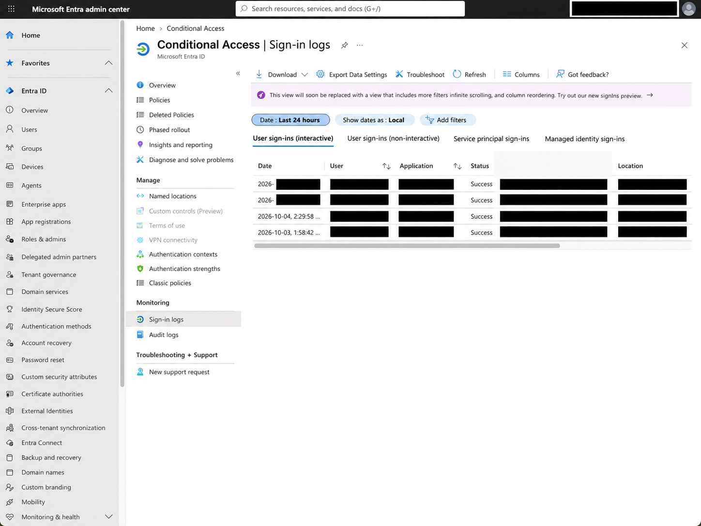

# Lab 14 --- Microsoft Entra ID Conditional Access, Security Defaults & MFA Validation

## Overview

This lab explored identity protection and authentication controls in
Microsoft Entra ID, with a focus on Conditional Access, Security
Defaults, multifactor authentication (MFA), and sign-in investigation.

The original objective was to configure and validate Conditional Access
policies. During the lab, however, the tenant was found not to have the
Microsoft Entra ID Premium licensing required to create Conditional
Access policies.

Rather than treating the licensing restriction as the end of the
exercise, the lab shifted toward understanding the security controls
available in the current tenant.

The investigation covered:

-   Conditional Access licensing requirements
-   Named Locations availability
-   Microsoft Entra sign-in logs
-   Security Defaults
-   MFA registration
-   Microsoft Authenticator
-   Authentication details
-   Authentication policy evaluation
-   Interrupted and successful sign-in events

The final result demonstrated how Security Defaults can enforce MFA
requirements even when custom Conditional Access policies are
unavailable.

------------------------------------------------------------------------

## Objectives

The objectives of this lab were to:

1.  Explore Microsoft Entra Conditional Access capabilities.
2.  Determine whether the tenant could create Conditional Access
    policies.
3.  Identify licensing limitations affecting Conditional Access.
4.  Review available identity protection controls.
5.  Investigate Microsoft Entra sign-in events.
6.  Validate the tenant's Security Defaults configuration.
7.  Register Microsoft Authenticator for a lab user.
8.  Generate and investigate an MFA-protected sign-in.
9.  Correlate authentication requirements with sign-in log evidence.

------------------------------------------------------------------------

## Environment

  Component                      Purpose
  ------------------------------ ------------------------------------------------------
  Microsoft Entra ID             Identity and access management
  Microsoft Entra Admin Center   Identity administration
  Conditional Access             Policy-based access control exploration
  Security Defaults              Baseline identity protection
  Microsoft Authenticator        MFA authentication method
  Sign-in Logs                   Authentication investigation and validation
  Alice Analyst                  Lab identity used for MFA validation
  Azure Portal                   Application used to generate authentication activity

------------------------------------------------------------------------

## 1. Conditional Access Baseline

The lab began by navigating to:

`Microsoft Entra ID → Conditional Access`

The Conditional Access interface was accessible and displayed the
standard policy management options.


The next step was to inspect the **Policies** section.

Microsoft Entra reported that the organization did not have sufficient
licensing to access the Conditional Access policy functionality.


This established an important distinction:

> Access to the Conditional Access interface does not necessarily mean
> that the tenant is licensed to create and enforce custom Conditional
> Access policies.

Because the required licensing was unavailable, no custom Conditional
Access policy was created during this lab.

------------------------------------------------------------------------

## 2. Named Locations Licensing Restriction

Named Locations were also reviewed.

Named Locations are normally used by Conditional Access to represent
network locations that can later participate in access decisions, such
as trusted corporate networks, specific public IP ranges, or geographic
locations.

In the current tenant, no Named Locations existed and the creation
controls were unavailable.


This reinforced the licensing limitation identified during the
Conditional Access policy review.

------------------------------------------------------------------------

## 3. Sign-in Log Investigation

Because custom Conditional Access policies could not be deployed, the
investigation shifted toward understanding the identity controls already
operating in the tenant.

Microsoft Entra **Sign-in logs** were reviewed.



The logs provided visibility into authentication activity including the
user, application, authentication status, source information, sign-in
result, authentication details, and access-control evaluation.

A successful Azure Portal sign-in was selected for deeper investigation.


The event showed a successful authentication and provided the context
required to understand how the identity had accessed Azure resources.

------------------------------------------------------------------------

## 4. Security Defaults Evaluation

The **Conditional Access** tab of the sign-in event showed an important
result:

`Security defaults — Success`


This demonstrated that although custom Conditional Access policies were
unavailable, identity protection was still being applied through
**Security Defaults**.

Security Defaults provide baseline identity security controls without
requiring administrators to design individual Conditional Access
policies.

------------------------------------------------------------------------

## 5. Authentication Details

The **Authentication Details** tab was then inspected.


The authentication event indicated that the authentication requirement
had been **previously satisfied**.

This is important when investigating authentication logs because MFA
does not necessarily generate a new interactive challenge during every
authentication event. Existing authentication state or claims may
satisfy the requirement.

Therefore:

> A successful MFA requirement does not always mean that the user
> entered an MFA approval during that exact sign-in event.

Authentication details should be reviewed together with the broader
sign-in context.

------------------------------------------------------------------------

## 6. Security Defaults Configuration

The tenant configuration was then reviewed directly.

Security Defaults were confirmed as:

`Enabled (recommended)`


This explained why authentication security requirements were appearing
in the sign-in logs despite the inability to configure custom
Conditional Access policies.

The environment therefore had:

``` text
Custom Conditional Access policies
        ↓
Unavailable due to licensing

Security Defaults
        ↓
Enabled

Baseline identity protection
        ↓
Active
```

------------------------------------------------------------------------

## 7. Lab User Authentication Baseline

The next phase focused on the lab user **Alice Analyst**.

Before MFA registration, the user's Authentication Methods page showed
no usable authentication methods.


This provided a clean baseline before registering Microsoft
Authenticator.

------------------------------------------------------------------------

## 8. MFA Registration Requirement

A new authentication attempt was performed using the Alice Analyst
account.

Security Defaults triggered the authentication registration process.

The user was prompted to configure Microsoft Authenticator.


The observed workflow was:

``` text
User attempts authentication
        ↓
Security requirement evaluated
        ↓
Required authentication method missing
        ↓
Registration requested
        ↓
Authentication method configured
```

------------------------------------------------------------------------

## 9. Registration Troubleshooting

During the first registration attempt, the process encountered a
timeout/error condition.


Rather than assuming MFA configuration had failed permanently, the
registration process was repeated.

This provided a practical troubleshooting scenario involving identity
registration rather than policy configuration.

------------------------------------------------------------------------

## 10. Microsoft Authenticator Registration

The subsequent attempt successfully completed Microsoft Authenticator
registration.


The confirmation indicated that Microsoft Authenticator had been added
and could now be used for authentication.

------------------------------------------------------------------------

## 11. Authentication Method Verification

The Microsoft Entra Admin Center was used to verify the change.

The Alice Analyst account now showed:

`Microsoft Authenticator`

as a usable authentication method.


The account also showed Microsoft Authenticator notification as the
default sign-in method.

This created administrative evidence that the authentication method
registration had succeeded.

------------------------------------------------------------------------

## 12. Sign-in State Transition

The sign-in logs were reviewed again after the MFA registration and
authentication activity.

The logs captured the transition from an interrupted authentication
event to successful authentication activity.


This sequence is useful from an investigation perspective. The
interrupted event represents part of the authentication workflow where
additional identity requirements prevented the original sign-in from
immediately completing.

After the required authentication setup was satisfied, the subsequent
authentication completed successfully.

------------------------------------------------------------------------

## 13. MFA Grant Validation

The successful Alice Analyst sign-in was inspected through the
**Conditional Access** view.

The result showed:

-   Policy: `Security defaults`
-   Grant control: Require multifactor authentication
-   Result: `Success`


The observed relationship was:

``` text
Security Defaults
        ↓
Require multifactor authentication
        ↓
Authentication requirement evaluated
        ↓
Requirement satisfied
        ↓
Successful access
```

------------------------------------------------------------------------

## 14. Authentication Evidence

The Authentication Details view provided additional evidence for the
successful sign-in.


The authentication policy section showed Security Defaults and confirmed
that the MFA requirement had been satisfied.

This demonstrates why identity investigations should not rely
exclusively on the high-level `Success` status. Authentication Details
provide additional context about how the authentication requirement was
satisfied.

------------------------------------------------------------------------

## 15. Successful MFA Sign-in

Finally, the Basic Info section of the successful Alice Analyst event
was reviewed.


The event showed:

-   User: Alice Analyst
-   Application: Azure Portal
-   Authentication requirement: Multifactor authentication
-   Status: Success
-   MFA requirement satisfied

This completed the validation workflow.

------------------------------------------------------------------------

## Findings

  Finding                                        Result
  ---------------------------------------------- --------
  Conditional Access portal accessible           Yes
  Custom Conditional Access policies available   No
  Licensing restriction identified               Yes
  Named Locations available for configuration    No
  Security Defaults enabled                      Yes
  Sign-in logs available                         Yes
  Alice initially had an MFA method              No
  MFA registration triggered                     Yes
  Microsoft Authenticator registered             Yes
  Interrupted authentication observed            Yes
  Successful authentication observed             Yes
  MFA requirement visible in logs                Yes
  Security Defaults MFA evaluation validated     Yes

------------------------------------------------------------------------

## Security Analysis

This lab demonstrated that **Conditional Access and Security Defaults
are related identity protection mechanisms but are not equivalent**.

Conditional Access provides granular policy-driven access decisions
based on signals and conditions.

Conceptually, a Conditional Access decision can evaluate:

``` text
Who is requesting access?
        +
What resource are they accessing?
        +
From where?
        +
From which device?
        +
What authentication or risk conditions exist?
        ↓
Access decision
```

Security Defaults provide a simpler baseline security configuration.

In this environment, licensing prevented the creation of custom
Conditional Access policies. However, Security Defaults still provided
identity protection and required MFA in the tested authentication
workflow.

The sign-in logs were essential for proving what actually happened.

Rather than assuming MFA enforcement based only on configuration, the
authentication workflow was validated through actual authentication
telemetry.

------------------------------------------------------------------------

## Troubleshooting Lessons

One of the most important lessons from the lab was that cloud security
exercises do not always proceed exactly as originally designed.

The intended workflow was:

``` text
Create Conditional Access policy
        ↓
Configure conditions
        ↓
Configure grant controls
        ↓
Test authentication
```

The actual environment produced:

``` text
Conditional Access exploration
        ↓
Licensing restriction identified
        ↓
Existing controls investigated
        ↓
Security Defaults identified
        ↓
MFA registration tested
        ↓
Sign-in telemetry investigated
        ↓
MFA enforcement validated
```

The licensing limitation therefore became part of the investigation
rather than simply preventing completion of the lab.

------------------------------------------------------------------------

## Skills Practiced

-   Microsoft Entra ID
-   Identity and Access Management (IAM)
-   Conditional Access concepts
-   Microsoft Entra licensing awareness
-   Security Defaults
-   Multifactor Authentication (MFA)
-   Microsoft Authenticator
-   Authentication method management
-   Sign-in log investigation
-   Authentication troubleshooting
-   Identity telemetry analysis
-   Authentication policy evaluation
-   Access-control validation

------------------------------------------------------------------------

## Key Takeaway

The most important outcome of this lab was not the creation of a
Conditional Access policy.

The tenant licensing did not permit that.

Instead, the lab demonstrated how to recognize that limitation and
investigate the security controls that were actually protecting the
environment.

The complete workflow became:

**Conditional Access exploration → Licensing validation → Security
Defaults discovery → Sign-in investigation → MFA registration →
Authentication validation → Log-based verification**

This reflects an important security operations principle:

> Security controls should not only be configured --- their actual
> behavior should be validated through telemetry.

------------------------------------------------------------------------

## Repository Structure

``` text
lab-14/
├── README-lab-14.md
└── screenshots/
    ├── 01_conditional_access_license_baseline.png
    ├── 02_conditional_access_insufficient_license.png
    ├── 03_named_locations_license_restriction.png
    ├── 04_signin_logs_baseline.png
    ├── 05_signin_event_basic_information.png
    ├── 06_signin_security_defaults_evaluation.png
    ├── 07_authentication_details_previously_satisfied.png
    ├── 08_security_defaults_enabled.png
    ├── 09_alice_no_authentication_methods.png
    ├── 10_security_defaults_mfa_registration_prompt.png
    ├── 11_mfa_registration_timeout_error.png
    ├── 12_microsoft_authenticator_registration_completed.png
    ├── 13_alice_authenticator_registered.png
    ├── 14_alice_signin_interrupted_to_success.png
    ├── 15_security_defaults_mfa_grant_success.png
    ├── 16_authentication_details_mfa_satisfied.png
    └── 17_alice_successful_mfa_signin_details.png
```
