# Lab 15 — Azure Policy Compliance, Remediation & Governance Assessment

## Overview

This lab focused on operational governance with Azure Policy.

Earlier labs established custom Azure Policy definitions and assignments for resource-group tagging. Lab 15 returned to those controls from an operations perspective: reviewing current compliance, identifying configuration drift, correcting a controlled non-compliant resource, triggering an on-demand policy scan, validating the resulting compliance change, and documenting a remaining legacy governance gap.

The exercise intentionally did **not** force every resource into a green state. One older resource group was retained as visible technical debt so the lab could distinguish between remediation, justified exemptions, and simply hiding non-compliance.

---

## Objectives

The objectives of this lab were to:

1. Establish the current Azure Policy compliance baseline.
2. Identify compliant and non-compliant resource groups.
3. Review the logic of the custom Audit policy.
4. Remediate a controlled tagging violation.
5. Trigger an on-demand Azure Policy evaluation.
6. Verify the compliance-state change after remediation.
7. Document a remaining legacy governance gap.
8. Review the Deny policy posture without repeating an already validated creation-block test.
9. Correlate the configuration change and policy rescan through the Activity Log.
10. Review Azure Policy exemptions and make a deliberate decision not to create one.

---

## Environment

| Component | Purpose |
|---|---|
| Azure Policy | Governance and compliance evaluation |
| Azure Resource Manager | Resource-group configuration |
| Audit policy | Detect resource groups missing the required tag |
| Deny policy | Prevent creation of resource groups without the required tag |
| Activity Log | Validate configuration changes and policy-scan operations |
| Azure CLI | Trigger an on-demand policy compliance scan |
| `rg-policy-audit-test-canadacentral` | Controlled resource used for remediation |
| `rg-az900-learning` | Legacy resource retained as documented governance debt |

---

## 1. Compliance Baseline

The lab began at:

`Azure Portal → Policy → Compliance`

The initial dashboard showed:

- Overall resource compliance: **71%**
- **5 compliant**
- **2 non-compliant**
- Two non-compliant policy assignments
- One fully compliant Azure Activity Log policy assignment

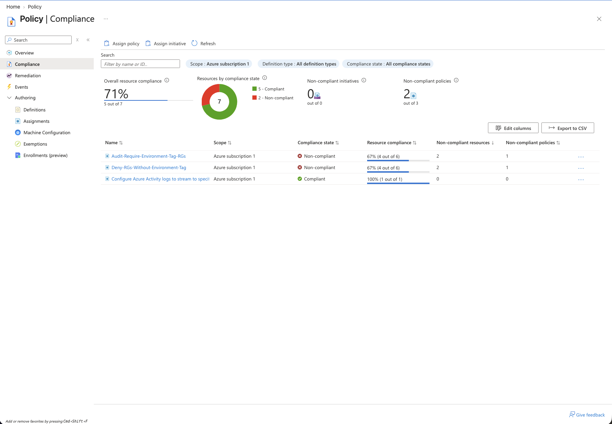

The two tagging assignments were:

- `Audit-Require-Environment-Tag-RGs`
- `Deny-RGs-Without-Environment-Tag`

Both showed **67% resource compliance (4 of 6)**.

---

## 2. Audit Policy — Non-Compliant Resources

The Audit assignment was inspected first because its purpose is to identify existing configuration drift without blocking access to existing resources.

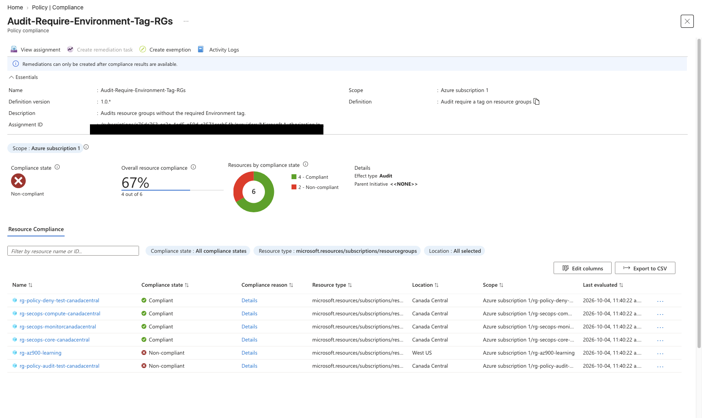

Two non-compliant resource groups were identified:

- `rg-policy-audit-test-canadacentral`
- `rg-az900-learning`

The first was a controlled policy-testing resource. The second was an older resource group from a previous Azure learning environment.

This gave the lab two different governance cases:

```text
Controlled test deviation
        +
Legacy configuration drift
        ↓
Same policy detects both
```

---

## 3. Controlled Resource — Non-Compliant State

The controlled test resource was opened directly from the compliance view.

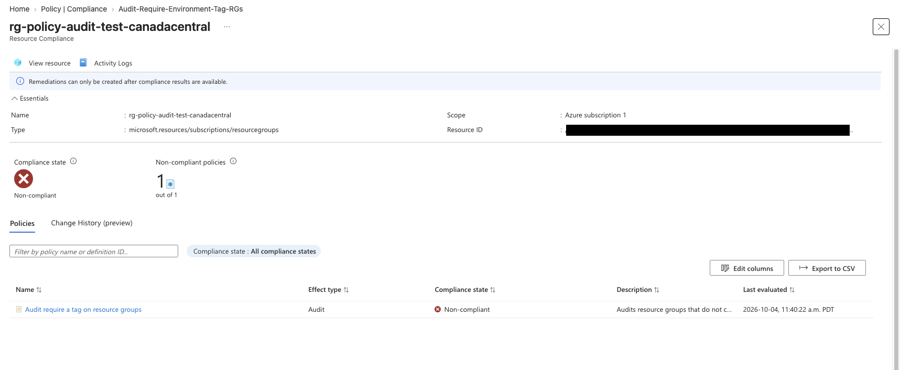

The resource showed:

- Compliance state: `Non-compliant`
- One non-compliant policy
- Policy effect: `Audit`

This confirmed that the controlled resource still violated the current tagging standard.

---

## 4. Audit Policy Logic

The custom policy definition was reviewed in JSON.

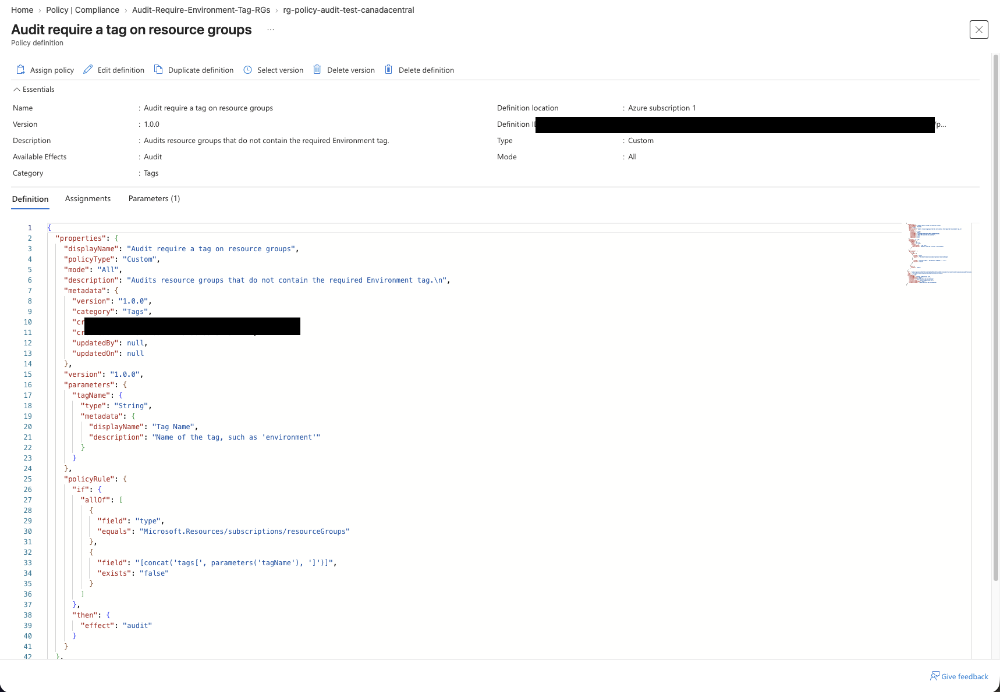

The policy logic applies to:

`Microsoft.Resources/subscriptions/resourceGroups`

and evaluates whether the required tag exists.

Conceptually:

```text
Resource type = Resource Group
        +
Required tag does not exist
        ↓
Audit
```

The assignment uses the `Environment` tag as the governance requirement.

---

## 5. Manual Remediation

Because the policy effect is `Audit`, the policy detects the configuration issue but does not automatically modify the resource.

The controlled resource group was manually corrected by adding:

`Environment = Lab`

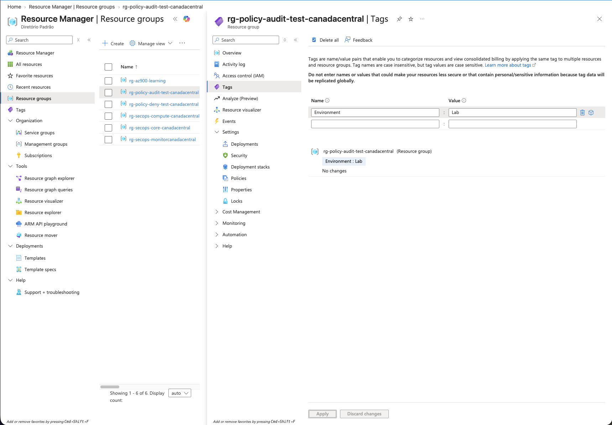

This changed the resource configuration, but Azure Policy compliance does not necessarily update immediately after a resource change.

---

## 6. On-Demand Policy Evaluation

To avoid waiting for the normal evaluation cycle, an on-demand policy scan was triggered for the controlled resource group:

```bash
az policy state trigger-scan --resource-group rg-policy-audit-test-canadacentral
```

After the new evaluation completed, the overall compliance dashboard changed from:

`71% → 86%`

and the number of non-compliant resources changed from:

`2 → 1`

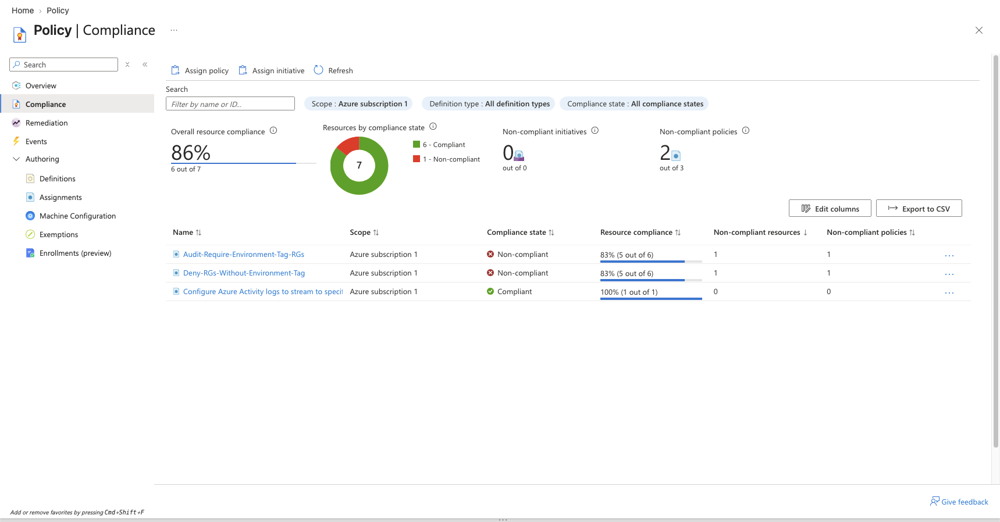

This provided direct evidence that the configuration correction was recognized by Azure Policy.

---

## 7. Audit Assignment After Remediation

The Audit assignment was reviewed again.

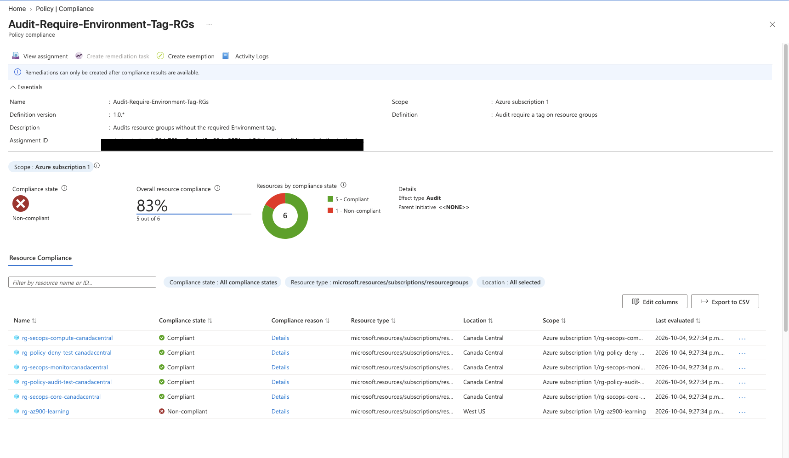

The assignment now showed:

- **83% resource compliance**
- **5 compliant**
- **1 non-compliant**
- `rg-policy-audit-test-canadacentral` → `Compliant`
- `rg-az900-learning` → `Non-compliant`

The controlled test deviation was therefore successfully remediated.

---

## 8. Legacy Governance Gap

The remaining non-compliant resource was inspected separately.

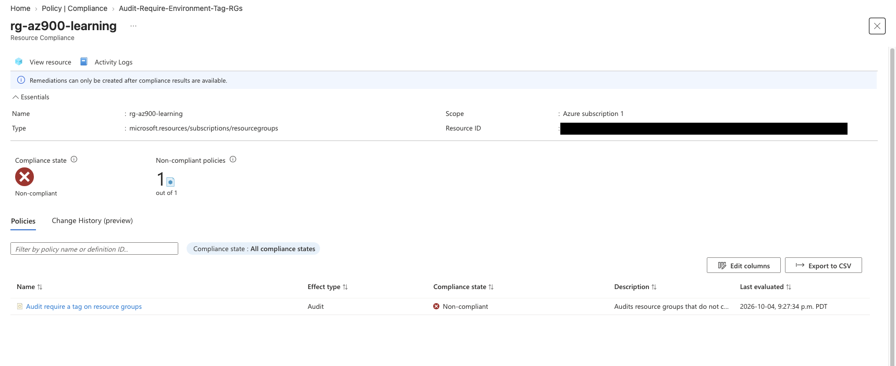

`rg-az900-learning` remained non-compliant under the Audit policy.

This resource was intentionally **not** remediated during the lab.

The decision was to preserve it as documented governance technical debt rather than artificially forcing the compliance dashboard to 100%.

This represents a more realistic governance outcome:

> A known legacy resource can remain visible as non-compliant while its status, context, and remediation decision are documented.

---

## 9. Deny Policy Posture

The Deny assignment was then reviewed.

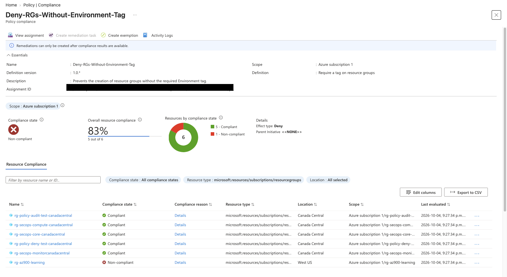

It showed the same remaining legacy resource:

- **83% resource compliance**
- **5 compliant**
- **1 non-compliant**
- Effect type: `Deny`

The Deny behavior itself had already been validated in an earlier lab through controlled resource-group creation testing, so that test was not repeated here.

The distinction remains important:

```text
Audit
  Detects existing non-compliance

Deny
  Prevents new non-compliant resources from being created
```

---

## 10. Activity Log Validation

The controlled resource group's Activity Log was reviewed after the configuration change.

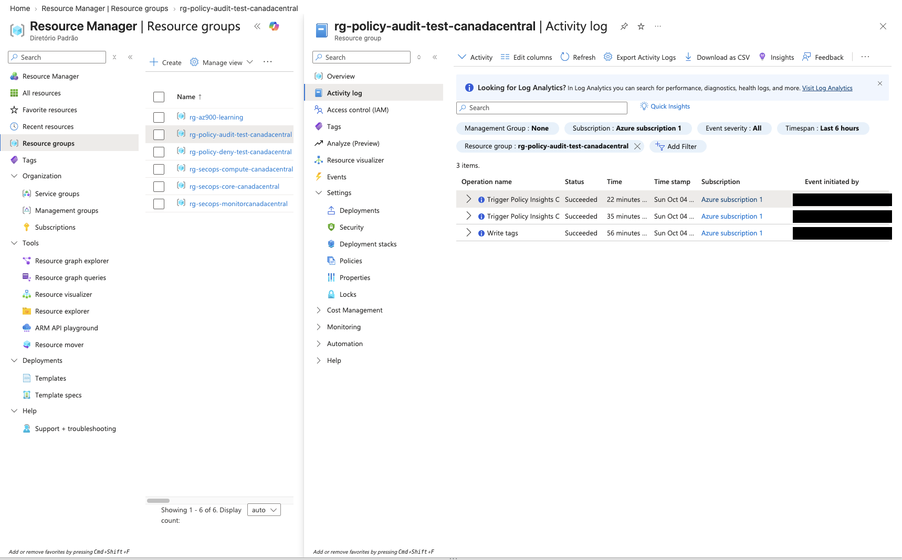

The log showed successful operations for:

- `Write tags`
- `Trigger Policy Insights ...`

This created an operational evidence chain:

```text
Tag configuration changed
        ↓
Policy Insights scan triggered
        ↓
Compliance state refreshed
        ↓
Controlled resource became compliant
```

---

## 11. Exemption Assessment

Azure Policy's exemption workflow was reviewed without creating an exemption.

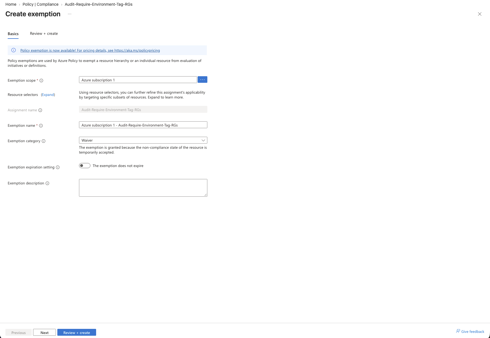

The form exposed governance controls such as:

- Exemption scope
- Assignment
- Exemption name
- Exemption category
- Expiration
- Description / justification

The exemption category displayed `Waiver`, which represents an accepted non-compliant state.

No exemption was created.

The legacy resource did not have a valid business or technical justification for bypassing the policy. Instead, it remained visible as known technical debt.

This distinction is important:

```text
Remediation
  Correct the resource

Exemption
  Formally accept justified non-compliance

Ignoring non-compliance
  Poor governance
```

---

## Findings

| Finding | Result |
|---|---|
| Initial overall resource compliance | 71% |
| Initial compliant resources | 5 |
| Initial non-compliant resources | 2 |
| Controlled tagging violation identified | Yes |
| Legacy tagging violation identified | Yes |
| Audit policy logic reviewed | Yes |
| Controlled resource manually remediated | Yes |
| `Environment = Lab` applied | Yes |
| On-demand policy scan triggered | Yes |
| Overall compliance after remediation | 86% |
| Controlled test resource became compliant | Yes |
| Remaining legacy resource intentionally retained | Yes |
| Audit assignment after remediation | 83% (5 of 6) |
| Deny assignment after remediation | 83% (5 of 6) |
| Activity Log evidence collected | Yes |
| Exemption workflow reviewed | Yes |
| Exemption created | No |

---

## Governance Analysis

This lab demonstrated that compliance management is more than making every dashboard indicator green.

A useful governance workflow is:

```text
Define control
        ↓
Measure compliance
        ↓
Investigate deviation
        ↓
Understand context
        ↓
Choose remediation or justified exception
        ↓
Re-evaluate
        ↓
Document residual risk / technical debt
```

The controlled test resource was appropriate for remediation because its missing tag had no reason to remain.

The legacy resource was treated differently. Its non-compliance was identified, confirmed, and documented. The exemption workflow was reviewed but deliberately not used because no legitimate exception had been established.

That decision keeps the governance gap visible rather than masking it.

---

## Audit vs Deny

The two custom policies represent complementary controls.

### Audit

`Audit-Require-Environment-Tag-RGs`

Detects resource groups that do not meet the tagging standard.

It supports:

- Compliance assessment
- Drift detection
- Investigation
- Governance reporting

### Deny

`Deny-RGs-Without-Environment-Tag`

Prevents new resource groups from being created when they violate the tagging requirement.

It supports:

- Preventive governance
- Standard enforcement
- Reduction of future configuration drift

Together:

```text
Audit → Detect what already exists
Deny  → Prevent new violations
```

---

## Remediation vs Exemption

An important lesson from this lab was the difference between correcting a resource and excluding it from evaluation.

A remediation should be preferred when the resource can reasonably meet the governance requirement.

An exemption should have a documented reason, defined scope, and ideally an expiration when the exception is temporary.

Creating an exemption simply to improve a compliance percentage would hide risk rather than manage it.

---

## Skills Practiced

- Azure Policy
- Cloud governance
- Policy compliance assessment
- Resource tagging
- Audit and Deny effects
- Configuration drift identification
- Manual remediation
- Azure CLI policy evaluation
- Activity Log investigation
- Policy exemptions
- Technical-debt documentation
- Governance decision-making

---

## Key Takeaway

The strongest outcome of this lab was not achieving 100% compliance.

It was demonstrating an operational governance lifecycle:

**Baseline → Detect drift → Investigate → Remediate controlled deviation → Trigger re-evaluation → Validate improved compliance → Document legacy technical debt → Review exemption governance**

The overall compliance state improved from **71% to 86%**, while one known legacy resource remained visible as an intentional governance finding.

That is more representative of real cloud governance than simply hiding every exception.

---

## Repository Structure

```text
lab-15-policy-compliance/
├── README-lab-15.md
└── screenshots/
    ├── 01_policy_compliance_baseline.png
    ├── 02_audit_policy_noncompliant_resources.png
    ├── 03_audit_resource_noncompliant_policy.png
    ├── 04_audit_policy_definition_json.png
    ├── 05_noncompliant_resource_tag_remediated.png
    ├── 06_policy_compliance_after_remediation.png
    ├── 07_remaining_legacy_noncompliant_resource.png
    ├── 08_legacy_resource_noncompliance_documented.png
    ├── 09_deny_policy_compliance_state.png
    ├── 10_activity_log_tag_update_and_policy_rescan.png
    └── 11_policy_exemption_review.png
```
